[ԳԼՈՒԽ 1․ ՎՈՐՈՆՈՎԻ ԴԻԱԳՐԱՄ [2](#գլուխ-1-վորոնովի-դիագրամ)](#գլուխ-1-վորոնովի-դիագրամ)

[1.1 Նախնական հասկացություններ [2](#նախնական-հասկացություններ)](#նախնական-հասկացություններ)

[1.2. Սահմանումը և հիմնական հատկությունները [5](#_Toc224663236)](#_Toc224663236)

[1.3. Վորոնովի դիագրամի հաշվարկ [10](#վորոնովի-դիագրամի-հաշվարկ)](#վորոնովի-դիագրամի-հաշվարկ)

[ԳԼՈՒԽ 2․ ՎՈՐՈՆՈՎԻ ԴԻԱԳՐԱՄԻ ԿԻՐԱՌՈՒԹՅՈՒՆԸ [27](#գլուխ-2-վորոնովի-դիագրամի-կիրառությունը)](#գլուխ-2-վորոնովի-դիագրամի-կիրառությունը)

[2.1. Բարձր կարգի Վորոնովի Դիագրամներ, սահմանում և երկրաչափական հատկություններ [28](#բարձր-կարգի-վորոնովի-դիագրամներ-սահմանում-և-երկրաչափական-հատկություններ)](#բարձր-կարգի-վորոնովի-դիագրամներ-սահմանում-և-երկրաչափական-հատկություններ)

[2.2. k-րդ կարգի Վորոնովի դիագրամի կառուցման ալգորիթմը [37](#k-րդ-կարգի-վորոնովի-դիագրամի-կառուցման-ալգորիթմը)](#k-րդ-կարգի-վորոնովի-դիագրամի-կառուցման-ալգորիթմը)

[2.3. Վորոնովի դիագրամի կիրառումը փակ տարածքում օբյեկտի դիրքի տեղորոշման համար [40](#վորոնովի-դիագրամի-կիրառումը-փակ-տարածքում-օբյեկտի-դիրքի-տեղորոշման-համար)](#վորոնովի-դիագրամի-կիրառումը-փակ-տարածքում-օբյեկտի-դիրքի-տեղորոշման-համար)

[ԳԼՈՒԽ 3․ ԱՌԱՋԱՐԿՎԱԾ ԽՆԴԻՐՆԵՐԻ ԼՈՒԾՈՒՄՆԵՐԸ [53](#գլուխ-3-առաջարկված-խնդիրների-լուծումները)](#գլուխ-3-առաջարկված-խնդիրների-լուծումները)

[ԳԼՈՒԽ 4. ՎՈՐՈՆՈՎԻ ԴԻԱԳՐԱՄԻ ԿԻՐԱՌՈՒՄԸ ՎՏԱՆԳԱՎՈՐ ԳՈՐԾՈՆԻ (ՓՈՇԻ) ԱՂԲՅՈՒՐՆԵՐՈՎ ՓԱԿ ՏԱՐԱԾՔՈՒՄ, ՕԴԱՓՈԽՈՒԹՅԱՆ ՀԱՄԱԿԱՐԳԻ ՕՊՏԻՄԱԼ ԻՐԱԿԱՆԱՑՄԱՆ ՀԱՄԱՐ [68](#գլուխ-4.-վորոնովի-դիագրամի-կիրառումը-վտանգավոր-գործոնի-փոշի-աղբյուրներով-փակ-տարածքում-օդափոխության-համակարգի-օպտիմալ-իրականացման-համար)](#գլուխ-4.-վորոնովի-դիագրամի-կիրառումը-վտանգավոր-գործոնի-փոշի-աղբյուրներով-փակ-տարածքում-օդափոխության-համակարգի-օպտիմալ-իրականացման-համար)

[ԳԼՈՒԽ 5. ՎՈՐՈՆՈՅԻ ԴԻԱԳՐԱՄՆԵՐԻ և ՏԵՍՈՂԱԿԱՆ ՍԱՐՔԵՐԻ ԿԻՐԱՌՈՒՄԸ ԲՆԱՊԱՀՊԱՆԱԿԱՆ ԽՆԴԻՐՆԵՐԻ ԼՈՒԾՄԱՆ ՀԱՄԱՐ [76](#գլուխ-5.-վորոնոյի-դիագրամների-և-տեսողական-սարքերի-կիրառումը-բնապահպանական-խնդիրների-լուծման-համար)](#գլուխ-5.-վորոնոյի-դիագրամների-և-տեսողական-սարքերի-կիրառումը-բնապահպանական-խնդիրների-լուծման-համար)

[ԳՐԱԿԱՆՈՒԹՅԱՆ ՑԱՆԿ [81](#գրականության-ցանկ)](#գրականության-ցանկ)

# ԳԼՈՒԽ 1․ ՎՈՐՈՆՈՎԻ ԴԻԱԳՐԱՄ

## 1.1 Նախնական հասկացություններ {#նախնական-հասկացություններ}

Ենթադրենք, սուպերմարկետների ցանցի զարգացման խորհրդատվական հանձնաժողովի կողմից կան պլաններ նոր խանութ բացել որոշակի վայրում: Կանխատեսելու համար, թե արդյոք նոր խանութը շահութաբեր կլինի, պետք է գնահատել, թե քանի հաճախորդ կգրավի այն: Դա անելու համար պետք է կառուցել պոտենցիալ գնորդների վարքագծային մոդել. ինչպե՞ս է մարդը որոշում, թե որտեղ գնալ գնումների: Նմանատիպ հարց է ծագում սոցիալական աշխարհագրության մեջ, երբ ուսումնասիրվում է երկրի տնտեսական գործունեությունը. ինչպիսինն է քաղաքների առևտրային տարածքը: Ավելի վերացական, մենք ունենք բազմաթիվ սպասարկման կենտրոններ, որոնք առաջարկում են ապրանքներ կամ ծառայություններ, և յուրաքանչյուր սպասարկման կենտրոնի համար մենք ցանկանում ենք իմանալ, թե որտեղ են ապրում այն մարդիկ, ովքեր ապրանքներ կամ ծառայություններ են գնում այդ կենտրոնից: Խնդիրն ուսումնասիրելու համար ներմուծենք հետևյալ պարզեցնող ենթադրությունները.

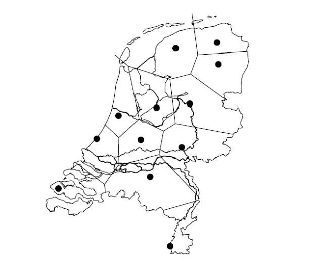{width="3.697674978127734in" height="2.9721270778652666in"}

Նկար 1.1 - Հոլանդիայի տասներկու նահանգների մայրաքաղաքների առևտրային գոտիները, որոնք կանխատեսվել են Վորոնովի մոդելի միջոցով։

- բոլոր կենտրոններն առաջարկում են նույն ապրանքները կամ ծառայությունները

> նույն գնով;

- ապրանքի կամ ծառայության ձեռքբերման արժեքը հավասար է դրա գնին

գումարած դեպի կենտրոն ուղևորության արժեքը;

- մինչև կենտրոն ուղևորության արժեքը հավասար է դրանից էվկլիդեսյան

- հեռավորությանը՝ բազմապատկած միավոր հեռավորության վրա ծախսված ֆիքսված արժեքի գնով;

- գնորդները ձգտում են նվազագույնի հասցնել ապրանքների կամ ծառայությունների գնման ծախսերը:

Սովորաբար, այս ենթադրությունները լիովին բավարարված չեն լինում. որոշ կենտրոններում ապրանքները կարող են ավելի էժան լինել, քան մյուսներում, և մի կետից մյուսը ճանապարհորդության արժեքը պարտադիր չէ, որ համեմատական լինի նրանց միջև էվկլիդեսյան հեռավորությանը: Բայց նկարագրված մոդելը մոտավոր տալիս է կոպիտ մոտարկում դեպի սպասարկման կենտրոնների առևտրային գոտիները։ Այն տարածքները, որտեղ բնակիչների վարքագիծը տարբերվում է մոդելի կողմից կանխատեսածից, կարող է ենթարկվել ավելի սերտ հետազոտության՝ հասկանալու համար, թե որն է շեղումների առաջացման պատճառը: \[1\]

Մեզ հետաքրքրում է այս մոդելի երկրաչափական մեկնաբանությունը: Ձևակերպված ենթադրությունները դրդում են ամբողջ դիտարկվող տիրույթի բաժանումը տարածաշըրջանների՝ սպասարկման կենտրոնների առևտրային գոտիների, այնպես, որ մի շրջանի բնակիչները գնումներ են կատարում նույն կենտրոնում: Մեր ենթադրություններից բխում է, որ մարդն ուղղակի ապրանք է գնում մոտակա կենտրոնում՝ իրավիճակը բավականին մոտ է իրականին։ Սա նշանակում է, որ տվյալ կենտրոնի առևտրային տարածքը բաղկացած է բոլոր կետերից, որոնց համար այս կենտրոնը ցանկացած այլ կենտրոնից ավելի մոտ է: Վերևում պատկերված նկարում սպասարկման կենտրոնները Նիդերլանդների տասներկու նահանգների մայրաքաղաքներն են:

Մոդելը, որում յուրաքանչյուր կետ պատկանում է մոտակա սպասարկման կենտրոնին, կոչվում է Վորոնովի մոդել, իսկ այս մոդելի կողմից առաջացած բաժանումը կոչվում է Վորոնովի դիագրամ կենտրոնների հավաքածուի համար: Վորոնովի դիագրամից մենք կարող ենք տարբեր տեղեկություններ քաղել կենտրոնների առևտրային տարածքների և դրանց փոխհարաբերությունների մասին: Օրինակ, եթե երկու կենտրոնների շրջաններն ունեն ընդհանուր սահման, ապա, ամենայն հավանականությամբ, այդ կենտրոնները մրցում են սահմանամերձ գնորդների համար։

Վորոնովի դիագրամը ամենուր է: Մենք նկարագրեցինք դրա կիրառությունը սոցիալական աշխարհագրության մեջ, սակայն կան կիրառություններ ֆիզիկայի, աստղագիտության, ռոբոտաշինության և շատ այլ առարկաների մեջ: Վորոնովի դիագրամները սերտորեն կապված են մեկ այլ կարևոր երկրաչափական կառուցվածքի՝ Դելոնի եռանկյանացման հետ: Այս գլխում մենք կսահմանափակվենք հարթության վրա մի շարք կետերի Վորոնովի դիագրամի հիմնական հատկություններով և դրանց կառուցումներով:

Ալգորիթմների բարդության, ինչպես նաև խնդիրների լուծման բարդության ստորին գնահատականների համար, օգտագործվում է O -- սիմվոլիկան (\[2\]): Դիցուք$\ g$--ն և $f$--ը ոչ բացասական ամբողջ թվերի բազմության վրա որոշված ոչ բացասական ֆունկցիաներ են: Այդ դեպքում

$$g(n) = O\left( f(n) \right)$$

գրառումը նշանակում է, որ գոյություն ունեն C և N~o~ \> 0 հաստատուններ այնպես, որ $\ \ \ \ \ \ \ \ \ \ \ \ \ \ \ \ \ \ \ \ \ \ \ \ \ \ \ \ \ \ \ \ \ \ \ \ \ \ \ \ \ \ \ \ \ \ \ \ \ \ \ \ \ \ \ \ \ \ \ \ \ \ \ \ \ \ \ \ \ \ \ \ \ \ \ g(n) \leq c \bullet f(n)$

տեղի ունի բոլոր $n \geq N_{0}$համար: O սիմվոլը\` օգտագործվում է ֆունկցիայի աճի արագության վերին գնահատականների համար: Օրինակ\` $an + b = Օ(n)$ ( կարելի է վերցնել $C = a + 1$ և $N_{0} = b$), $g(n) = \Omega\left( f(n) \right)\ $գրառումը նշանակում է, որ գոյություն ունեն $C$ և $N_{0} > 0$ հաստատուներ այնպես, որ

$$g(n) \geq C \bullet f(n)$$

տեղի ունի բոլոր $n \geq N_{0}$ համար: $\Omega$ սիմվոլը օգտագործվում է ֆունկցիայի աճի արագության ստորին գնահատականների համար:

$$g(n) = \theta\left( f(n) \right)$$

գրառումը նշանակում է, որ գոյություն ունեն $C_{1}$,$C_{2}$և $N_{0} > 0$ հաստատուներ այնպես, որ

$$C_{1}f(n) \leq \left| g(n) \right| \leq C_{2}f(n)$$

տեղի ունի բոլոր n ≥ N~0~ համար: Կարելի է ցույց տալ որ g(n) = θ(f(n)) այն և միայն այն դեպքում, երբ g(n) = O(f(n)) և g(n) = Ω(f(n)):

## 1.2. Սահմանումը և հիմնական հատկությունները {#սահմանումը-և-հիմնական-հատկությունները}

Երկու p և q կետերի միջև էվկլիդյան հեռավորությունը նշանակենք dist(p,q):

Հարթության վրա գործում է հետևյալ բանաձևը.

$$dist(p,q) ≔ \sqrt{\left( p_{x}\  - \ q_{x} \right)^{2}\  + \ \left( p_{y}\  - \ q_{y} \right)^{2}}$$

Դիցուք P ≔ {p~1~, p~2~, ... , p~n~} բազմությունը n կետերի բազմություն է հարթության վրա; այդ կետերը կլինեն սպասարկման կենտրոնները։ Սահմանենք P-ի բազմության Վորոնովի դիագրամը՝ որպես հարթության բաժանում n բջիջների՝ մեկական p~i~ - ի յուրաքանչյուր կենտրոնի համար, օժտված այն հատկությամբ, որ q կետը պատկանում է p~i~ կենտրոնին համապատասխանող բջիջին, այն և միայն այն դեպքում, երբ $dist\left( q,\ p_{i} \right) < dist\left( q,\ p_{j} \right)$ ցանկացած $\ p_{i} \in P,\ j \neq i$ կետի համար. P բազմության Վորոնովի դիագրամը կնշանակենք Vor(P)-ով: Արտահայտությունների մեջ թույլատրելով որոշակի ազատություն, երբեմն կօգտագործենք «Vor(P) կամ Վորոնովի գծապատկեր» տերմինը՝ նշելով միայն տրոհման կողերն ու գագաթները: Օրինակ, երբ ասում ենք, որ Վորոնովի դիագրամը կապակցված է, նկատի ունենք, որ կողերի և գագաթների միավորումը կազմում է կապակցված բազմություն։ $p_{i}$ կենտրոնին համապատասխանող Vor(P) բջիջը նշանակվում է V($p_{i}$); մենք այն կանվանենք Վորոնովի բջիջ $p_{i}$ -ի համար (գլխի սկզբում ներկայացված տերմինաբանության մեջ V($p_{i}$) - ն $p_{i}$ -ի կենտրոնի առևտրային գոտին է):

Այժմ ավելի ուշադիր նայենք Վորոնովի դիագրամին: նախ և առաջ ուսումնասիրենք Վորոնովի մեկ բջիջի կառուցվածքը: Հարթության երկու p և q կետերի համար p - ի և q -- ի միջնուղղահայաց է կոչվում $\overline{pq}$ հատվածի միջնակետով անցնող և դրան ուղղահայաց ուղիղը: Միջնուղղահայացը հարթությունը բաժանում է երկու կիսահարթությունների։

Նշանակենք h(p, q) այն բաց կիսհարթությունը,որը պարունակում է p - ն, իսկ h(q, p) - ով բաց կիսհարթությունը, որը պարունակում է q - ն։ Նկատենք, որ r∈ h(p, q) այն և միայն այն դեպքում երբ $dist(r,p) < dist(r,q)$: Սրանից հետևում է հետևյալ դիտողությունը.

**Դիտողություն 1.1***.* $V\left( p_{i} \right) = \cap_{1 \leq j \leq n,\ j \neq i}h\left( p_{i},\ p_{j} \right)$

Այսպիսով, V(p~i~) -ն n - 1 կիսահարթությունների հատումն է, և, հետևաբար, ուռուցիկ բազմանկյուն տիրույթ է (հնարավոր է անսահմանափակ) առավելագույնը n - 1 գագաթներով և առավելագույնը n - 1 կողերով։

{width="2.076388888888889in" height="1.9412685914260717in"}

Նկար 1.2 - Վորոնովի բջջի ստացումը կիսահարթությունների հատումով։

Ի՞նչ տեսք ունի Վորոնովի ամբողջական դիագրամը: Նկար 1.2 - ում տեսանք, որ գծապատկերի յուրաքանչյուր բջիջ ներկայացնում է մի քանի կիսահարթությունների հատում, ուստի Վորոնովի դիագրամը ուղղագիծ կողերով հարթ տրոհում է (տես․Նկար 1.3)։ Որոշ կողեր հատվածներ են, մյուսները՝ ճառագայթեր։ Եթե բոլոր կենտրոնները համագիծ չեն, ապա չեն լինի կողեր, որոնք ամբողջական գծեր են \[1\]:

{width="2.0243055555555554in" height="1.5409722222222222in"}

*Նկար 1.3 - Վորոնովի ամբողջական դիագրամը։*

**Թեորեմ 1.1.** *Դիցուք P - ն հարթության վրա, n կետեր պարունակող բազմություն է (կենտրոններ): Եթե բոլոր կենտրոնները համագիծ են, ապա Վորոնովի դիագրամը բաղկացած է n-1 զուգահեռ ուղիղներից. Հակառակ դեպքում Vor(P) կապակցված է, իսկ դրա կողերը հատվածներ կամ ճառագայթներ են։*

**Ապացույց.** Թեորեմի առաջին մասի ապացույցը հեշտ է, ուստի ենթադրենք, որ ոչ բոլոր կենտրոններն են համագիծ.

Նախ ցույց տանք, որ Vor(P)-ի կողերը կամ հատվածներ են կամ ճառագայթներ: Մենք արդեն գիտենք, որ Vor(P)-ի կողերը ուղիղ գծերի մասեր են, մասնավորապես երկու կենտրոնների միջնուղղահայացներ: Ենթադրենք հակառակը, որ Vor(P) դիագրամի e կողը ամբողջական ուղիղ է: Դիցուք e-ն ընկած է 𝑉(𝑝~𝑖~) և 𝑉(𝑝~𝑗~) Վորոնովի բջիջների սահմանի վրա: Դիցուք 𝑝~𝑘~ ∈ 𝑃 մի կետ է, որը չի գտնվում 𝑝~𝑖~ -ի և 𝑝~𝑗~ -ի հետ նույն ուղղի վրա (Տես․ Նկար 1.4): Բայց այդ դեպքում e -- ի այն մասը, որն ընկած է ℎ(𝑝~𝑘~, 𝑝~𝑗~) -- ի մեջ, չի կարող լինել 𝑉(𝑝~𝑗~) -- ի սահմանի վրա, քանի որ այն ավելի մոտ է 𝑝~𝑘~- ին, քան 𝑝~𝑗~ - ին: Եկանք հակասության:

{width="1.7847222222222223in" height="1.520893482064742in"}

*Նկար 1.4 - Ուղղի ընկնելը երկու բջիջների սահմանի վրա։*

Մնում է ապացուցել, որ Vor(P)-ն կապակցված է։ Եթե դա այդպես չլիներ, ապա գոյություն կունենար Վորոնովի 𝑉(𝑝~𝑖~) բջիջ, որը դիագրամը կբաժաներ երկու մասի: Քանի որ Վորոնովի բջիջները ուռուցիկ են, 𝑉(𝑝~𝑗~) - ն բաղկացած կլինի երկու զուգահեռ ուղիղով սահմանափակված շերտից: Բայց մենք հենց նոր ապացուցեցինք, որ Վորոնովի դիագրամի կողերը չեն կարող լինել ամբողջական ուղիղեր: Եկանք հակասության:

Այժմ, հասկանալով Վորոնովի դիագրամի կառուցվածքը, ուսումնասիրենք դրա բարդությունը, այսինքն՝ գնահատենք գագաթների և կողերի ընդհանուր թիվը: Քանի որ կան n կենտրոններ, և Վորոնովի յուրաքանչյուր բջիջ ունի առավելագույնը n - 1 գագաթ և կող, Vor(P)-ի բարդությունը վատագույն դեպքում քառակուսային է: Այնուամենայնիվ, պարզ չէ, թե արդյոք Vor(P)-ն իսկապես կարող է ունենալ քառակուսային բարդություն. հեշտ է կառուցել օրինակ, որտեղ Վորոնովի բջջի բարդությունը գծային է, բայց կարո՞ղ է պարզվել, որ շատ բջիջներ ունեն գծային բարդություն: Հետևյալ թեորեմը ցույց է տալիս, որ դա այդպես չէ, և որ Վորոնովի բջիջի գագաթների միջին թիվը վեցից պակաս է։

**Թեորեմ 1.2.** *n ≥ 3-ի համար հարթության n կետերի բազմության Վորոնովի դիագրամում գագաթների թիվը չի գերազանցում 2n -- 5 - ը, իսկ կողերի թիվը չի գերազանցում 3n -- 6 - ը։*

**Ապացույց.** Եթե բոլոր կենտրոնները համագիծ են (Տես․Նկ․ 1.5), ապա ապացույցը անմիջապես բխում է 1.2 թեորեմից, ուստի մենք կենթադրենք, որ դա այդպես չէ : Ապացույցի համար կօգտագործենք Էյլերի բանաձևը, ըստ որի՝ 𝑚~𝑣~ գագաթներով, 𝑚~𝑒~ կողերով և 𝑚~𝑓~ նիստերով միացված հարթ գրաֆի համար գործում է հետևյալ կապը.

$$mv - me + mf = 2$$

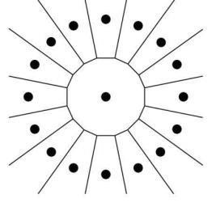{width="1.3381944444444445in" height="1.2826388888888889in"}

*Նկար 1.5 - Համագիծ կենտրոններով Վորոնովի Դիագրամ։*

Մենք չենք կարող ուղղակիորեն կիրառել Էյլերի բանաձևը Vor(P)-ին, քանի որ Vor(P) - ն պարունակում է կիսաանվերջ կողեր և, հետևաբար, իրական գրաֆ չէ: Իրավիճակը շտկելու համար մենք կավելացնենք լրացուցիչ մեկ գագաթ՝ 𝑣~∞~, որը գտնվում է \<\<Անվերջությունում\>\> և Vor(P)-ի բոլոր կիսաանվերջ կողերը միացնենք այդ գագաթին (Տես․Նկար 1.6):

{width="1.5270833333333333in" height="1.9340277777777777in"}

*Նկար 1.6 - Վորոնովի դիագրամով կազմված կապակցված հարթ գրաֆ։*

Այժմ մենք ունենք կապակցված հարթ գրաֆ, որի վրա կարելի է կիրառել Էյլերի բանաձևը. Մենք ստանում ենք հետևյալ կապը 𝑛~𝑣~-ի՝ Vor(P) -- ի գագաթների քանակի, 𝑛~𝑒~ -- ի՝ Vor(P) -- ի կողերի քանակի և n -- ի՝ նիստերի քանակաի միջև.

(𝑛~𝑣~ + 1) − 𝑛~𝑒~ + 𝑛 = 2 (1.1)

Ավելին, ընդլայնված գրաֆի յուրաքանչյուր կող ունի ճիշտ երկու գագաթ, այնպես որ, եթե գումարենք բոլոր գագաթների աստիճանները, կստանաք երկու անգամ ավելի շատ

կողեր: Քանի որ յուրաքանչյուր գագաթի աստիճանը, ներառյալ 𝑣~∞~ -ը, առնվազն երեք է, մենք ստանում ենք.

2𝑛~𝑒~ ≥ 3(𝑛~𝑣~ + 1) (1.2)

(1.1) բանաձևի հետ միասին սա ապացուցում է թեորեմը։

Այս բաժինը եզրափակելու համար ներկայացնենք Վորոնովի դիագրամի կողերի և գագաթների բնութագրիչները: Արդեն նշվել է, որ կողերը հանդիսանում են երկու կենտրոնների միջնուղղահայացների մասեր, իսկ գագաթները՝ դրանք միջնուղղահայացների հատման կետերն են:

Միջնուղղահայացների թիվը քառակուսիորեն է կախված կենտրոնների քանակից, մինչդեռ Vor(P)-ի բարդությունը միայն գծային է: Հետևաբար, ոչ բոլոր միջնուղղահայացներն են սահմանում Vor(P) կողերը, և ոչ բոլոր հատումներն են Vor(P) գագաթները։ Հասկանալու համար, թե որ միջնուղղահայացների և դրանց հատման կետերնեն են կազմում Վորոնովի դիագրամի տարբերակիչ բնութագրերը, տանք հետևյալ սահմանումը. q կետի համար սահմանենք P-ի նկատմամբ ամենամեծ դատարկ շրջանը 𝐶~𝑝~(𝑞), որպես q - ում կենտրոն ունեցող ամենամեծ շրջան, որը իր ներսում չի պարունակում P-ից որևէ կենտրոն: Հաջորդ թեորեմը բնութագրում է Վորոնովի դիագրամի գագաթները և կողերը:

{width="1.9326388888888888in" height="1.632638888888889in"}

*Նկար 1.7 - P-ի նկատմամբ ամենամեծ 𝐶~𝑝~(𝑞) դատարկ շրջանը։*

**Թեորեմ 1.3.** *P կետերի բազմության Վորոնովի Vor(P) դիագրամի համար ճշմարիտ են հետևյալ պնդումները.*

I.  *q կետը Vor(P)-ի գագաթն է, այն և միայն այն դեպքում, երբ նրա ամենամեծ 𝐶~𝑝~(𝑞) դատարկ շրջանի սահմանը պարունակում է երեք կամ ավելի կենտրոններ P-ից:*

II. *𝑝~𝑖~ և 𝑝~𝑗~ կենտրոնների միջնուղղահայացով որոշվում է Vor(P) կողը, այն և միայն այն դեպքում, եթե դրա վրա կա q կետ այնպես, որ 𝐶~𝑝~(𝑞)- ի սահմանը պարունակում է երկու 𝑝~𝑖~ և 𝑝~𝑗~ կենտրոնները, և ոչ մի այլ կենտրոն:*

**Ապացույց.**

I.  Ենթադրենք, որ կա q կետ այնպես, որ 𝐶~𝑝~(𝑞) - ի սահմանը պարունակում է երեք կամ ավելի կենտրոններ: Թող 𝑝~𝑖~, 𝑝~𝑗~ և 𝑝~𝑘~ լինեն երեք այդպիսի կենտրոններ: Քանի որ 𝐶~𝑝~(𝑞)- ի ներսը դատարկ է, q-ն պետք է ընկած լինի 𝑉(𝑝~𝑖~), (𝑝~𝑗~) և 𝑉(𝑝~𝑘~) բջիջներից յուրաքանչյուրի սահմանին, իսկ q-ն պետք է լինի Vor(P) գագաթը:

Մյուս կողմից, Vor(P) դիագրամի յուրաքանչյուր գագաթն ընկած է առնվազն երեք

կողերի, հետևաբար առնվազն երեք Վորոնովի բջիջներում ՝ 𝑉(𝑝~𝑖~), 𝑉(𝑝~𝑗~) և 𝑉(𝑝~𝑘~): q գագաթը պետք է լինի 𝑝~𝑖~-ից, 𝑝~𝑗~-ից և 𝑝~𝑘~-ից հավասար հեռավորությունների վրա, և չի կարող լինել q-ին ավելի մոտ մեկ այլ կենտրոն, այլապես 𝑉(𝑝~𝑖~), 𝑉(𝑝~𝑗~) և 𝑉(𝑝~𝑘~) չեն զուգակցի q -- ում: Հետևաբար, շրջանի ներսը, որի սահմանին ընկած են 𝑝~𝑖~, 𝑝~𝑗~ ը 𝑝~𝑘~, որևէ կենտրոն չի պարունակում:

II. Ենթադրենք, որ գոյություն ունի q կետ, որն ունի թեորեմում նշված հատկությունը: Քանի որ 𝐶~𝑝~(𝑞) շրջանի ներսը որևէ կենտրոն չի պարունակում, և 𝑝~𝑖~ և 𝑝~𝑗~ կենտրոնները

գտնվում են դրա սահմանի վրա, ապա 𝑑𝑖𝑠𝑡(𝑞, 𝑝~𝑖~) = 𝑑𝑖𝑠𝑡(𝑞, 𝑝~𝑗~) ≤ 𝑑𝑖𝑠𝑡(𝑞, 𝑝~𝑘~) ցանկացածի 1 ≤ 𝑘 ≤ 𝑛 համար: Այստեղից հետևում է, որ q-ն ընկած է կողի վրա կամ Vor(P) գագաթն է: Բայց թեորեմի առաջին մասից հետևում է, որ q-ն չի կարող լինել Vor(P) գագաթ։ Այսպիսով, q-ն ընկած է Vor(P) կողի վրա, որը որոշվում է 𝑝~𝑖~-ի և 𝑝~յ~-ի միջնուղղահայացով: Եվ հակառակը, 𝑝~𝑖~-ի և 𝑝~յ~-ի միջնուղղահայացներով որոշվում է Վորոնովի դիագրամի կողը: Այդ կողի ներսի մասի ցանկացած q կետի ամենամեծ դատարկ շրջանի սահմանին պետք է լինեն 𝑝~𝑖~ - ն և 𝑝~𝑗~-- ն, և ոչ մի այլ կենտրոն:

## 1.3. Վորոնովի դիագրամի հաշվարկ {#վորոնովի-դիագրամի-հաշվարկ}

Նախորդ կետում մենք ուսումնասիրեցինք Վորոնովի դիագրամի կառուցվածքը: Հիմա կատարենք դրա հաշվարկը։ Դիտողություն 1.1-ն առաջարկում է դա անելու հեշտ ճանապարհ. յուրաքանչյուր 𝑝~𝑖~ կենտրոնի համար հաշվարկեք ℎ(𝑝~𝑖~,𝑝~𝑗~) կիսահարթությունների հատումը բոլոր 𝑗 ≠ 𝑖 - ի համար, օգտագործելով 4-րդ գլխի ալգորիթմը: Այդ դեպքում մենք կծախսենք 𝑂(𝑛 log 𝑛) ժամանակ Վորոնովի յուրաքանչյուր բջիջի վրա, այսինքն՝ 𝑂(𝑛^2^ log 𝑛) ժամանակ կպահանջվի Վորոնովի ամբողջ դիագրամը հաշվարկելու համար: Հնարավո՞ր է ավելի լավ արդյունքի հասնել: Ի վերջո, Վորոնովի դիագրամի ընդհանուր բարդությունը միայն գծային է: Պատասխանը դրական է. ստորև նկարագրված հարթությունը մաքրելու ալգորիթմը, որը հայտնի է որպես Ֆորչունաի ալգորիթմ (իր հեղինակի անունով), հաշվարկում է Վորոնովի դիագրամը 𝑂(𝑛 log 𝑛)) ժամանակում \[1\]: Ցանկություն է առաջանում գտնել էլ ավելի արագ ալգորիթմ, օրինակ՝ գծային։ Բայց սա արդեն շատ է. n իրական թվերի տեսակավորման խնդիրը կարող է բերվել Վորոնովի դիագրամի հաշվարկման խնդրին, ուստի Վորոնովի դիագրամի հաշվարկման ցանկացած ալգորիթմ ամենավատ դեպքում պետք է պահանջի 𝛺(𝑛 log 𝑛) ժամանակ:

Ալգորիթմում ընդունված մեթոդը՝ դա հարթության մաքրումն է՝ վերևից ներքև իջնող ուղղի միջոցով։ Մաքրման գործընթացում մենք վերահաշվարկում ենք այն ցուցանիշները, որոնք նկարագրում են հաշվարկվող կառուցվածքը: Ավելի ճիշտ, վերահաշվարկվում է կառուցվածքի հետ մաքրման գծի հատման մասին տեղեկատվությունը։ Այս տեղեկատվությունը փոխվում է միայն որոշ կետերում՝ պատահույթների կետերում \[1\]:

{width="1.4659722222222222in" height="1.6993055555555556in"}

*Նկար 1.8 - Հարթության մաքրումը վերևից ներքև իջնող ուղղով։*

Փորձենք այս ընդհանուր ռազմավարությունը կիրառել հարթության մեջ գտնվող կենտրոնների 𝑃 = {𝑝~1~, 𝑝~2~, ... , 𝑝~𝑛~} բազմության Վորոնովի դիագրամի հաշվարկի վրա։ Հարթությունը մաքրելու գաղափարին համապատասխան, մենք հորիզոնական մաքրման 𝑙 գիծը տեղափոխում ենք վերևից ներքև: Այդ ընթացքում մենք պետք է վերահաշվարկենք Վորոնովի դիագրամի հատումը մաքրող գծի հետ: Ցավոք սրտի, սա այնքան էլ պարզ չէ, քանի որ 𝑙-ից վեր գտնվող 𝑉𝑜𝑟(𝑃)-ի մասը կախված է ոչ միայն 𝑙 - ի վերևի կենտրոններից, այլ նաև 𝑙 - ից ներքև գտնվող կենտրոններից:

Այլ կերպ ասած, երբ մաքրող գիծը հասնում է Վորոնովի 𝑉(𝑝~𝑖~) բջիջի ամենավերին գագաթին, այն դեռ չի հանդիպել համապատասխան 𝑝~𝑖~ կենտրոնին: Հետևաբար, մենք չունենք գագաթը հաշվարկելու համար անհրաժեշտ տեղեկատվություն: Այդ պատճառով ստիպված ենք կիրառել հարթությունը մաքրելու գաղափարը մի փոքր այլ կերպ. Վորոնովի գծապատկերի հատումը մաքրող գծի հետ վերահաշվարկելու փոխարեն, մենք կպահպանենք տեղեկատվությունը Վորոնովի դիագրամի այն հատվածի մասին, որը գտնվում է 𝑙 - ից բարձր կենտրոնների համար, որոնք չեն կարող փոխվել 𝑙 - ից ներքև գտնվող կենտրոնների պատճառով:

Նշանակենք 𝑙^+^ այն փակ կիսհարթությունը, որը գտնվում է 𝑙 -- ի վերևում։ Վերևում գտնվող Վորոնովի դիագրամի ո՞ր մասն այլևս չի կարող փոխվել: Այլ կերպ ասած, 𝑞 ∈ 𝑙^+^ ո՞ր կետերի համար մենք ճշգրիտ գիտենք դրանց մոտակա կենտրոնը: Հեռավորությունը 𝑞 ∈ 𝑙^+^ կետից մինչև 𝑙 -- ի տակ գտնվող ցանկացած կենտրոն ավելի մեծ է, քան 𝑞 - ից մինչև 𝑙 հեռավորությունը: Հետևաբար, 𝑞-ին ամենամոտ կենտրոնը չի կարող լինել 𝑙 - ից ցածր, եթե 𝑞 -- ն գտնվում է 𝑝~𝑖~ ∈ 𝑙^+^ -ի որոշ կենտրոնից ոչ ավել քան 𝑙 - ից 𝑞 հեռավորությունն է։ Կետերի տեղը, որոնք գտնվում են ավելի մոտ 𝑝~𝑖~ ∈ 𝑙^+^ կենտրոնին, քան 𝑙 - ին, սահմանափակվում է պարաբոլով: Հետևաբար, կետերի երկրաչափական տեղը, որոնք գտնվում են 𝑙 - ի վերևում ինչ-որ կենտրոնին ավելի մոտ, քան ինքնին 𝑙 - ին, սահմանափակված են պարաբոլների աղեղներով: Պարաբոլների աղեղների այս հաջորդականությունը կանվանենք կոտրվածքների գիծ։ կոտրվածքների գիծը կարելի է պատկերացնել այլ կերպ: Մաքրող գծի վերևում գտնվող յուրաքանչյուր 𝑝~𝑖~ կենտրոն սահմանում է ամբողջական 𝛽~𝑖~ պարաբոլ: Կոտրվածքների գիծը ֆունկցիայի գրաֆիկ է, որը յուրաքանչյուր x կոորդինատի համար ընդունում է մի արժեք, որը համընկնում է, բոլոր այդպիսի պարաբոլների ամենացածր կետին:

**Դիտողություն 1.2.** *Կոտրվածքների գիծը x-մոնոտոն է, այսինքն, յուրաքանչյուր ուղղահայաց գիծ հատում է այդ ուղիղը մեկ կետում:*

{width="1.3680555555555556in" height="1.334461942257218in"}

*Նկար 1.9 - Կոտրվածքների գծի ձևավորումը նոր կենտրոնի հայտնվելիս ։*

Հեշտ է տեսնել, որ մեկ պարաբոլը կարող է մի քանի անգամ հանդիպել կոտրվածքների գծում: Իսկ քանի անգամ կդիտարկենք ավելի ուշ։ Միևնույն ժամանակ նշենք, որ կոտրման կետերը տարբեր պարաբոլների աղեղների միացման տողում, որոնք կազմում են կոտրվածքների գիծը, գտնվում են Վորոնովի դիագրամի կողերի վրա: Եվ սա պատահական համընկնում չէ. կոտրման կետերը ճշգրիտ գծում են Վորոնովի դիագրամը՝ մաքրման գծի ներքև իջնելու հետ մեկտեղ: Կոտրվածքների գծի այս հատկությունները հեշտ է ապացուցել տարրական երկրաչափական մեթոդներով (տես \[1\], \[2\]):

Հետևաբար, նրա փոխարեն, որպեսզի հաշվենք 𝑙 -ի հետ 𝑉𝑜𝑟(𝑃) − ի հատումը, երբ մաքրման գիծը իջնում է ներքև, մենք կհաշվենք կոտրվածքների գիծը: Մենք չենք պահպանի կոտրվածքների գիծը բացահայտ, քանի որ այն անընդհատ փոխվում է, երբ 𝑙 շարժվում է: Մի պահ մի կողմ թողնենք այն հարցը, թե ինչպես կարելի է ներկայացնել կոտրվածքների գիծը, և նախ հասկանանք, թե երբ և ինչպես է փոխվում նրա միացյալ կառուցվածքը։ Դա տեղի է ունենում, երբ հայտնվում է նոր պարաբոլի աղեղ, և երբ հին աղեղը վերածվում է կետի և անհետանում:

Նախ հաշվի առնենք նոր աղեղի հայտնվելու պատահույթը կոտրվածքների գծի վրա:

Առաջին հերթին, դա կարող է տեղի ունենալ, երբ մաքրող 𝑙 գիծը հասնի նոր կենտրոնի: Սկզբնական պահին այդ կենտրոնով որոշված պարաբոլը վերասեռված է և ունի զրոյական լայնություն. այն ուղղահայաց հատված է, որը կապում է նոր կենտրոնը կոտրվածքների գծի հետ։ Մաքրման գծի ներքև իջնելու հետ մեկտեղ, նոր պարաբոլը ընդլայնվում է: Նոր պարաբոլի այն մասը, որը գտնվում է հին կոտրվածքների գծից ներքև, այժմ դառնում է նոր կոտրվածքների գծի մաս: Այս գործընթացը ցույց է տրված Նկ.1.10:

Նոր կենտրոնի հետ մաքրման գծի հանդիպումը կանվանենք կենտրոնային իրադարձություն։

{width="4.652777777777778in" height="1.217988845144357in"}{width="1.6944444444444444in" height="1.2045789588801399in"}

*Նկար. 1.10 - Կոտրվածքների գծի վրա նոր աղեղ է հայտնվում, քանի որ նոր կենտրոն է հանդիպել:*

Ի՞նչ է տեղի ունենում Վորոնովի դիագրամի հետ կենտրոնային իրադարձության պահին: Հիշենք, որ կոտրման կետերը գծում են Վորոնովի դիագրամի կողերը: Կենտրոնային իրադարձության պահին հայտնվում են երկու նոր կոտրման կետեր և սկսում են գծել կողերը :

Սկզբնական պահին այս կոտրման կետերը համընկնում են, այնուհետև շեղվում են տարբեր ուղղություններով՝ գծելով նույն կողը։ Սկզբում այս կողը միացված չէ Վորոնովի դիագրամի մաքրող գծի վերևում գտնվող հատվածին։ Բայց ավելի ուշ, մենք կտեսնենք, թե կոնկրետ երբ է, աճող կողը բախվում մեկ այլ կողին և միանում գծապատկերի մնացած մասերին:

Այսպիսով, մենք հիմա տեսնում ենք, թե ինչ է տեղի ունենում կենտրոնային իրադարձության պահին. նոր աղեղ է հայտնվում կոտրվածքների գծի վրա և սկսվում է Վորոնովի դիագրամի նոր կողի գծագրումը: Կարո՞ղ է այլ կերպ նոր աղեղ առաջանալ կոտրվածքների գծի վրա: Ոչ, չի կարող \[1\]։

**Լեմմա 1.1.** *կոտրվածքների գծի վրա նոր աղեղի հայտնվելու միակ պատճառը կենտրոնային իրադարձությունն է:*

**Ապացույց.** Ենթադրենք հակառակը, որ արդեն գոյություն ունեցող 𝛽~𝑗~ պարաբոլը, որը որոշվում է 𝑝~𝑗~ - ի կենտրոնով, սեղմվում է կոտրվածքների գծի մեջ: Սա կարող է տեղի ունենալ երկու ճանապարհով.

{width="2.8430555555555554in" height="1.625in"}

*Նկար 1.11 - 𝛽~𝑗~* *պարաբոլի* *սեղմվումը կոտրվածքների գծում։*

Առաջին հնարավորությունն այն է, որ 𝛽~𝑗~ - ն սեղմված է ինչ-որ պարաբոլի 𝛽~𝑖~ աղեղի մեջտեղում: Այն պահին, երբ դա տեղի է ունենում, 𝛽~𝑖~ - ն ու 𝛽~𝑗~ - ն շոշափվում են, այսինքն՝ ունենում են ուղիղ մեկ ընդհանուր կետ. Դիցուք 𝑙~𝑦~ - ով նշանակենք մաքրող գծի 𝑦 կոորդինատը շփման պահին: Եթե 𝑝~𝑗~ ≔ (𝑝~𝑗,𝑥~; 𝑝~𝑗,𝑦~), ապա 𝛽~𝑗~ պարաբոլը նկարագրվում է հետևյալ հավասարմամբ՝

$$\beta_{j} ≔ y = \frac{1}{2\left( p_{j,y} - l_{y} \right)} \bullet (x^{2} - 2p_{j,x}x + \ {p_{j,x}}^{2}\ {p_{j,y}}^{2} - {l_{y}}^{2})$$

𝛽~𝑖~ - ի հավասարումը, իհարկե, տրվում է նույն ձևով։ Օգտվելով այն հանգամանքից, որ 𝑝~𝑗,𝑦~ և 𝑝~𝑖,𝑦~ 𝑙~𝑦~ - ից մեծ են, հեշտ է ցույց տալ, որ 𝛽~𝑖~ - ն և 𝛽~𝑗~ - ն չեն կարող ունենալ միայն մեկ հատման կետ: Հետևաբար, 𝛽~𝑗~ պարաբոլը չի կարող սեղմվել մեկ այլ պարաբոլի՝ 𝛽~𝑖~ աղեղի մեջտեղում:

Երկրորդ հնարավորությունն այն է, որ 𝛽~𝑗~ - ն սեղմված է երկու աղեղների միջև:

Ենթադրենք այս աղեղները 𝛽~𝑖~ և 𝛽~𝑘~ պարաբոլների մասեր են: q-ով նշանակենք 𝛽~𝑖~ - ի և 𝛽~𝑘~ - ի հատման կետը, որտեղ 𝛽~𝑗~ - ն նոր է հայտնվում կոտրվածքների գծի վրա, և ենթադրենք, որ 𝛽~𝑖~ - ն գտնվում է q-ից ձախ կողմում կոտրվածքների գծի վրա, 𝛽~𝑘~ - ն՝ qից աջ, ինչպես նկ. 1.12. Հետևաբար գոյություն ունի C շրջան, որը անցնում է 𝑝~𝑖~ , 𝑝~𝑗~ և 𝑝~𝑘~ պարաբոլները սահմանող կենտրոններով: Այս շրջանագիծը շոշափում է ինչ-որ մաքրող 𝑙 գծին: Եթե մենք սկսենք շփման կետից և շարժվենք ժամացույցի սլաքի ուղղությամբ, ապա կետերը կտեղակայվեն C շրջանագծի վրա 𝑝~𝑖~, 𝑝~𝑗~, 𝑝~𝑘~ կարգով, քանի որ մենք ենթադրում էինք, որ 𝛽~𝑗~ -ն սեղմված է 𝛽~𝑖~ և 𝛽~𝑘~ աղեղների միջակայքում: Դիտարկենք մաքրող ուղիղ գծի անսահման փոքր տեղաշարժը դեպի ներքև՝ պահպանելով C շրջանագծի շոշափումը 𝑙 - ի հետ (տես նկ. 1.12): Այդ դեպում չի կարող լինել, որ C-ի ներսում չլինի մեկ կենտրոն, և այն դեռ անցնում է 𝑝~𝑗~ -- ով. կամ 𝑝~𝑖~, կա՛մ 𝑝~𝑘~ կգտնվեն ներսում: Հետևաբար, q-ի բավական փոքր շրջակայքում 𝛽~𝑗~ պարաբոլը չի կարող դառնալ կոտրվածքների գծի մաս, երբ մաքրող գիծն իջնում է, քանի որ կամ 𝑝~𝑖~ - ն կամ 𝑝~𝑘~ - ն ավելի մոտ կլինեն 𝑙 - ին, քան 𝑝~𝑗~ - ին:

{width="5.683333333333334in" height="1.9416666666666667in"}

*Նկար 1.12 - Իրավիճակը անմիջապես այն պահից առաջ, երբ 𝛽~𝑗~-ը պետք է դառնար կոտրվածքների գծի մի մասը, և շրջանի վիճակը, երբ մաքրող ուղիղ գիծն ավելի է իջնում:*

Այս լեմմայից անմիջապես բխում է, որ պարաբոլիկ աղեղների թիվը կոտրվածքների գծում չի գերազանցում 2n - 1-ը. յուրաքանչյուր հանդիպող կենտրոն առաջացնում է մեկ նոր աղեղ և առաջացնում է առավելագույնը մեկ գոյություն ունեցող աղեղի բաժանումը երկուսի, և աղեղը չի կարող հայտնվել որևէ այլ կերպ:

Իրադարձությունների երկրորդ տեսակը հարթության մաքրման ալգորիթմում գոյություն ունեցող աղեղի վերածումն է կետի և հետագա անհետացումը, ինչպես Նկար 1.13. -- ում: Թող 𝛼′-ն լինի անհետացող աղեղը, իսկ 𝛼-ն և 𝛼′′ − ը 𝛼′-ին կից երկու աղեղ՝ դրա անհետացմանը նախորդող պահին: 𝛼 և 𝛼′′ աղեղները չեն կարող լինել նույն պարաբոլի մասեր. այս հնարավորությունը կարող է բացառվել այնպես, ինչպես 1.6-ի ապացույցի առաջին հնարավորությունը: Հետևաբար երեք աղեղները 𝛼, 𝛼′ և 𝛼′′ սահմանվում են 𝑝~𝑖~, 𝑝~𝑗~ և 𝑝~𝑘~ տարբեր կենտրոններով: Այն պահին, երբ 𝛼′-ն անհետանում է, այս կենտրոններով սահմանված պարաբոլները ունեն ընդհանուր q կետ: Այս կետը հավասարահեռ է 𝑙 տողից և երեք կենտրոններից յուրաքանչյուրից: Հետևաբար, 𝑝~𝑖~, 𝑝~𝑗~ և 𝑝~𝑘~ կետերով անցնում է մի շրջանգիծ՝ որի կենտրոնը q-ն է, որի ամենացածր կետը գտնվում է 𝑙-ի վրա: Այս շրջանագծի ներսում չեն կարող լինել Վորոնովի դիագրամի և ոչ մի կենտրոն. այդպիսի կենտրոնը կլիներ q -- ին ավելի մոտ քան q -- ն\` 𝑙 -- ին, իսկ դա հակասում է այն փաստին, որ q -- ն գտնվում է կոտրվածքների գծի վրա։ Սա չպետք է զարմացնի, քանի որ մենք վերևում նշեցինք, որ կոտրվածքների գծի վրա գտնվող կոտրման կետերը գծում են Վորոնովի դիագրամի կողերը: Այսպիսով, երբ աղեղը անհետանում է կոտրցածքների գծից և երկու կոտրման կետերը միանում են, դիագրամի կողերը նույնպես պետք է համընկնեն: Մենք կանվանենք որպես շրջանագծի իրադարձություն այն իրադարձությունը, երբ մաքող գիծը հասնում է շրջանագծի ամենացածր կետին, որն անցնում է երեք կենտրոններով, որոնք սահմանում են հարևան աղեղները կոտրվածքների գծի վրա: Վերևում ասվածից բխում է հետևյալ լեմման.

{width="4.895833333333333in" height="1.7022659667541558in"}

*Նկար 1.13 - Կոտրվածքների գծից աղեղի անհետացումը.*

**Լեմմա1.2.** *Աղեղը կարող է անհետանալ կոտրվածքների գծից միայն շրջանագծի իրադարձության արդյունքում:*

Այսպիսով, այժմ մենք գիտենք, թե երբ և ինչպես է փոխվում կոտրվածքների գծի կոմբինատոր կառուցվածքը. կենտրոնական իրադարձության պահին հայտնվում է նոր աղեղ, իսկ շրջանագծի իրադարձության պահին գոյություն ունեցողը անհետանում է։ Մենք նաև գիտենք, թե ինչպես է դա կապված կառուցված Վորոնովի դիագրամի հետ. կենտրոնական իրադարձության պահին սկսում է աճել նոր կող, իսկ շրջանագծի իրադարձության պահին երկու աճող կողեր հանդիպում են և կազմում գագաթ: Մնում է ընտրել տվյալների հարմար կառուցվածքներ՝ մաքրման գործընթացում անհրաժեշտ տեղեկատվությունը պահելու համար: Մեր նպատակն է հաշվարկել Վորոնովի դիագրամը, ուստի մեզ անհրաժեշտ է կառուցվածք, որը կպահի այն մասը, որն արդեն հաշվարկված է: Անհրաժեշտ կլինի նաև երկու \<\<ստանդարտ\>\> տվյալների կառուցվածքներ, որոնք օգտագործվում են հարթության մաքրման ցանկացած ալգորիթմում. Իրադարձությունների հերթականություն և կառուցվածք, որը ներկայացնում է մաքրող գծի վիճակը: Այս դեպքում երկրորդ կառուցվածքը կպարունակի կոտրվածքների գծի ներկայացումը: Ստորև նկարագրված է տվյալների բոլոր կառուցվածքների իրականացումը:

{width="1.8722222222222222in" height="1.5916666666666666in"}

*Նկար 1.14. Վորոնովի* *կառուցված դիագրամը.*

- Կպահենք Վորոնովի կառուցված դիագրամը (տես. նկար 1.14) սովորական տվյալների կառուցվածքում, որն օգտագործվում է միջնորմների համար՝ կողերի կրկնակի կապակցված ցանկում: Բայց Վորոնովի դիագրամը ճշմարիտ բաժանում չէ նախկինում սահմանված իմաստով. նրա որոշ կողեր ճառագայթներ են կամ ուղիղներ, և անհնար է դրանք ներկայացնել կողերի կրկնակի կապակցված ցանկում: Կառուցման ընթացքում դա խնդիր չէ, քանի որ ստորև նկարագրված կոտրվածքների գծի ներկայացումը թույլ կտա արդյունավետ կերպով հասնել կրկնակի կապակցված ցանկի կարևոր մասերին: Բայց երբ մենք ավարտենք կառուցումը, մենք կցանկանայինք ունենալ իրական կրկնակի կապակցված կողերի ցանկ: Դա անելու համար մենք կավելացնենք պատկերը սահմանափակող մեծ ուղղանկյուն, բավական մեծ, որպեսզի պարունակի Վորոնովի դիագրամի բոլոր գագաթները: Այդ դեպքում վերջնական տրոհումը բաղկացած կլինի սահմանափակող ուղղանկյունից և դրա ներսում գտնվող Վորոնովի դիագրամի մասից \[1,2\]:

- Մենք կներկայացնենք կոտրվածքների գիծը որպես հավասարակշռված երկուական որոնման 𝑇 ծառ; սա լինելու է վիճակի կառուցվածք. Դրա տերևները հաջորդականությամբ համապատասխանում են x-մոնոտոն կոտրվածքների գծի աղեղներին. ձախ տերևը ներկայացնում է ամենաձախ աղեղը, հաջորդ տերևը ներկայացնում է ձախից երկրորդ աղեղը և այլն: Յուրաքանչյուր 𝜇 տերևում պահպանվում է կենտրոն, որը սահմանում է այդ տերևով ներկայացված աղեղը: 𝑇 -ի ներքին հանգույցները ներկայացնում են կոտրման կետերը կոտրվածքների գծում: Կոտրման կետը պահվում է ներքին հանգույցում՝ որպես կենտրոնների դասավորված բազմություն 〈𝑝~𝑖~, 𝑝~𝑗~〉, որտեղ 𝑝~𝑖~-ն որոշում է կոտրման կետից ձախ պարաբոլը, իսկ 𝑝~𝑗~-ն՝ դրանից աջ: Կոտրվածքների գծի այս ներկայացմամբ մենք կարող ենք 𝑂(𝑙𝑜𝑔 𝑛) ժամանակում գտնել նոր կենտրոնի վերևում գտնվող աղեղը: Ներքին հանգույցում մենք պարզապես համեմատում ենք նոր կենտրոնի x-կոորդինատները և կոտրման կետը, վերջինս հաշվարկվում է հաստատուն ժամանակում՝ հաշվի առնելով կենտրոնների դասավորվածությունը և մաքրող գծի դիրքը: Նշենք, որ պարաբոլները բացահայտորեն չեն պահպանվում: 𝑇-ում մենք նաև պահպանում ենք ցուցիչներ դեպի երկու այլ տվյալների կառուցվածքներ, որոնք օգտագործվում են մաքրման գործընթացում: Յուրաքանչյուր տերևային հանգույցում, որը ներկայացնում է 𝑎 աղեղը, պահվում է մեկ ցուցիչ դեպի իրադարձության հերթում եղող հանգույցը, մասնավորապես այն, որը ներկայացնում է շրջանի իրադարձությունը, որի դեպքում 𝑎-ն անհետանում է: Այս ցուցիչը զրոյական է, եթե չկա շրջանի իրադարձություն, որը պետք է անհետանա, կամ եթե այդ իրադարձությունը դեռ տեղի չի ունեցել: Վերջապես, յուրաքանչյուր ներքին v հանգույց պահպանում է ցուցիչը դեպի կիսակող Վորոնովի դիագրամի կողերի կրկնակի կապակցված ցանկում: Ավելի ճիշտ, 𝑣-ն պահում է ցուցիչը կողի կիսակողերից մեկի վրա, որը գծված է 𝑣-ով ներկայացված կոտրման կետով:

- Իրադարձությունների հերթականությունը 𝑄-ն իրականացվում է առաջնահերթ հերթականության միջոցով, որտեղ իրադարձության առաջնահերթությունը նրա 𝑦կոորդինատն է: Հերթականությունը պահպանում է առաջիկա իրադարձությունները, որոնք արդեն հայտնի են: Կենտրոնի իրադարձության դեպքում մենք պարզապես պահում ենք հենց կենտրոնը: Իսկ շրջանագծի իրադարձության համար մենք պահում ենք շրջանագծի ամենացածր կետը և ցուցիչը դեպի 𝑇 -- ի տերևային հանգույց, որը ներկայացնում է այն աղեղը, որը կանհետանա իրադարձության կատարման պահին:

Կենտրոնների բոլոր իրադարձությունները նախապես հայտնի են, շրջանների իրադարձությունները՝ ոչ։ Եվ դա բերում է մնացած վերջին խնդրին\` շրջանի իրադարձությունների հայտնաբերման:

{width="1.8215277777777779in" height="1.4930555555555556in"}

*Նկար 1.15 - Իրավիճակը մաքրող գծի իջեցման ընթացքում.*

Մաքրման գործընթացքում կոտրվածքների գծի տոպոլոգիական կառուցվածքը փոխվում է յուրաքանչյուր իրադարձության հետ: Երբեմն հայտնվում են հարևան աղեղների նոր եռյակներ, երբեմն էլ անհետանում են գոյություն ունեցողները։ Մեր ալգորիթմը պետք է ապահովի, որ կոտրվածքների գծի ցանկացած երեք հարակից աղեղների համար, որոնք սահմանում են շրջանագծի պոտենցիալ՝ իրադարձություն, այդ իրադարձությունը կտեղադրվի 𝑄 հերթականության մեջ: Այստեղ կան երկու նրբություններ: Նախ, կարող են լինել հարևան եռյակներ, որոնց համար երկու կոտրման կետեր չեն համընկնում, այսինքն՝ շարժվում են այնպիսի ուղղություններով, որոնք բացառում են ապագայում հանդիպումը: Դա տեղի է ունենում, երբ կոտրման կետերը շարժվում են հատման կետից հեռու տանող միջնուղղահայացի երկայնքով: Այս դեպքում եռյակը չի սահմանում շրջանագծի պոտենցիալ՝ իրադարձություն: Երկրորդ, նույնիսկ եթե եռակի կոտրման կետերը համընկնեն, համապատասխան շրջանագծի իրադարձությունը կարող է տեղի չունենալ. դա տեղի է ունենում, երբ եռյակը անհետանում է (օրինակ, կոտրվածքների գծի վրա նոր կենտրոնի առաջացման դեպքում) նախքան իրադարձությունը տեղի ունենալը: Նման իրադարձությունը մենք կանվանենք կեղծ ահազանգ։

Այսպիսով, ահա թե ինչ է անում ալգորիթմը: Յուրաքանչյուր իրադարձության ժամանակ այն ստուգում է հարևան աղեղների բոլոր նոր հայտնված եռյակները: Օրինակ՝ կենտրոնական իրադարձության պահին կարող են ձևավորվել երեք նոր եռյակներ՝ մեկում նոր աղեղը գտնվում է ձախ կողմում, մյուսում՝ մեջտեղում, իսկ երրորդում՝ աջ կողմում։ Եթե նման նոր եռյակն ունի կոտրման կետեր, ապա իրադարձությունը տեղադրվում է 𝑄 հերթականության մեջ: Նկատի ունենանք, որ կենտրոնական իրադարձության դեպքում եռյակը, որի մեջտեղում է նոր աղեղը, երբեք չի հանգեցնում շրջանագծի իրադարձության, քանի որ ձախ և աջ եռյակի աղեղները պատկանում են միևնույն պարաբոլին, և, հետևաբար, կոտրման կետերը պետք է տարբերվեն: Հաջորդը, յուրաքանչյուր անհետացող եռյակի համար ստուգվում է, թե արդյոք դրան համապատասխան իրադարձությունը գտնվում է Q հերթականության: Եթե այո, ապա իրադարձությունը կեղծ ահազանգ է և հանվում է հերթից: Դա հեշտ է անել՝ օգտագործելով 𝑇 - ի տերևներում պահված ցուցիչները, որոնք համընկնում են 𝑄 հերթականության համապատասխան իրադարձություններին:

**Լեմմա 1.3.** *Վորոնովի դիագրամի յուրաքանչյուր գագաթ հայտնաբերվում է շրջանագծի իրադարձության միջոցով:*

**Ապացույց.** Վորոնովի դիագրամի q գագաթի համար 𝑝~𝑖~, 𝑝~𝑗~ և 𝑝~𝑘~ - ն այն երեք կենտրոններն են, որոնցով անցնում է 𝐶(𝑝~𝑖~, 𝑝~𝑗~, 𝑝~𝑘~) շրջանագիծը, որի ներսում ոչ մի կենտրոն չի պարունակվում: Ըստ թեորեմ 1.3-ի, գոյություն ունեն այդպիսի շրջանագծի երեք կենտրոններ: Պարզության համար դիտարկենք միայն այն դեպքը, երբ 𝐶(𝑝~𝑖~, 𝑝~𝑗~, 𝑝~𝑘~) շրջանագծի վրա այլ կենտրոններ չկան, և դրա ամենացածր կետը չի համընկնում 𝑝~𝑖~, 𝑝~𝑗~ և 𝑝~𝑘~ կետերից որևէ մեկի հետ: Առանց ընդհանրությունը խախտելու, կարելի է ենթադրել, որ 𝐶(𝑝~𝑖~, 𝑝~𝑗~, 𝑝~𝑘~) -- ի ներքևի կետից ժամացույցի սլաքի ուղղությամբ շարժվելով, մենք կհանդիպենք 𝑝~𝑖~, 𝑝~𝑗~, 𝑝~𝑘~ կենտրոնները հենց այս հերթականությամբ:

{width="2.0284722222222222in" height="1.5777777777777777in"}

*Նկար 1.16 - Շրջանագծի ամենացածր կետի և կետերի փոխդասավորվածությունը*

Մենք պետք է ցույց տանք, որ նախքան մաքրող գիծը կհասնի 𝐶(𝑝~𝑖~, 𝑝~𝑗~, 𝑝~𝑘~) ներքևի կետին, կոտրվածքների գծի վրա կան 𝑎, 𝑎′ և 𝑎′′ աղեղներ, որոնք որոշվում են 𝑝~𝑖~, 𝑝~𝑗~, 𝑝~𝑘~ կենտրոններով: Միայն այս դեպքում տեղի ունի շրջանագծի իրադարձությունը։

Դիտարկենք մաքրող գծի դիրքը 𝐶(𝑝~𝑖~, 𝑝~𝑗~, 𝑝~𝑘~) ներքևի կետից անվերջ փոքր հեռավորության վրա (Նկ 1.16): Քանի որ այլ կենտրոններ չկան ոչ 𝐶(𝑝~𝑖~, 𝑝~𝑗~, 𝑝~𝑘~) շրջանագծի վրա, ոչ էլ դրա ներսում, գոյություն ունի 𝑝~𝑖~ և 𝑝~𝑗~ միջով անցնող շրջանագիծ, որը շոշափում է մաքրող գծին և ներսում ոչ մի կենտրոն չի պարունակում: Հետևաբար, կոտրվածքների գծի վրա կան հարակից աղեղներ, որոնք որոշվում են 𝑝~𝑖~ և 𝑝~𝑗~ կենտրոններով: Նման ձևով, կոտրվածքների գծի վրա կան հարակից աղեղներ, որոնք որոշվում են 𝑝~𝑗~ և 𝑝~𝑘~ կենտրոններով: Հեշտ է տեսնել, որ երկու աղեղները, որոնք որոշվում են 𝑝~𝑗~ կենտրոնով, իրականում համընկնում են, իսկ այստեղից հետևում է, որ կոտրվածքների գծի վրա կան երեք հարակից աղեղներ, որոնք որոշվում են 𝑝~𝑖~, 𝑝~𝑗~ և 𝑝~𝑘~ կենտրոններով: Հետևաբար, շրջանագծի համապատասխան իրադարձությունը եղել է 𝑄ում հենց այն տեղի ունենալուց առաջ, ինչը նշանակում է, որ Վորոնովի դիագրամի վերին մասը որոշվել է:

Այժմ մենք կարող ենք մանրամասն նկարագրել հարթությունը մաքրելու ալգորիթմը։ Նկատի ունենանք, որ բոլոր իրադարձությունները մշակվելուց և 𝑄 հերթականությունը դատարկվելուց հետո կոտրվածքների գիծը դեռ չի անհետացել: Կան կոտրման կետեր, որոնք համապատասխանում են Վորոնովի դիագրամի կիսաանվերջ կողերին։ Ինչպես արդեն նշվեց, կիսաանվերջ կողերը չեն կարող ներկայացված լինել կողերի կրկնակի կապակցված ցանկում, ուստի մենք պետք է ավելացնենք սահմանափակող ուղղանկյուն, որին կարելի է կցել այս կողերը: Ստորև ներկայացված է ալգորիթմի վերին մակարդակի պսեվդոկոդը:

Ալգորիթմ VoroniDiagram(P)

Մուտք. Հարթության կետերի (կենտրոնների) Р ∶= {𝑝~1~, . . . , 𝑝~𝑛~} բազմությունը։

Ելք. Vor(P)-ի Վորոնովի դիագրամը սահմանափակող ուղղանկյան ներսում, որը ներկայացված է որպես «𝐷» կողերի կրկնակի կապված ցանկ:

1.  Նախաձևավորենք իրադարձությունների 𝑄 հերթը, որը պարունակում է կենտրոնների բոլոր իրադարձությունները, նախաձևավորենք դատարկ վիճակի կառուցվածքը 𝑇 և կողերի կրկնակի կապակցված դատարկ ցուցակը:

2.  While 𝑄 դատարկ չէ

3.  do առանձնացնել 𝑄-ից ամենամեծ y-կոորդինատով իրադարձությունը

4.  If այս միջոցառումների կենտրոնը 𝑝~𝑖~ -- ն է

5.  then HandleSiteEvent(𝑝~𝑖~)

6.  else HandleCircleEvent(y), որտեղ y -- ը 𝑇 - ի տերևային հանգույցն է, որը ներկայացնում է անհետացող աղեղը

7.  𝑇-ում մնացած ներքին հանգույցները համապատասխանում են Վորոնովի դիագրամի կիսաանվերջ կողերին։ Հաշվել սահմանափակող ուղղանկյունը, որը պարունակում է Վորոնովի դիագրամի բոլոր գագաթները դրա ներսում, և այս ուղղանկյունը կցել կիսաանվերջ կողեր՝ համապատասխանաբար փոփոխելով կողերի կրկնակի կապակցված ցանկը։

8.  Անցնել կիսակողերը կրկնակի կապակցված ցանկում՝ դրանցից և դրանցում բջիջների մուտքեր և ցուցիչներ ավելացնելու համար:

Իրադարձությունների մշակման ընթացակարգերը սահմանվում են հետևյալ կերպ.

**HandleSiteEvent(pi)**

1.  Եթե 𝑇-ն դատարկ է, ապա մտցնել $p_{i}$ - ն դրա մեջ (այսպես՝ 𝑇-ն բաղկացած կլինի մեկ տերևային հանգույցից, որը պահում է $p_{i}\ $-- ն) և վերադառնալ: Հակառակ դեպքում, հետևել 2-5 քայլերին:

2.  Փնտրեք 𝑇-ում a աղեղ, որը խիստ բարձր է 𝑝~𝑖~-ից: Եթե 𝑎-ն ներկայացնող տերևային հանգույցն ունի 𝑄-ի շրջանագծի իրադարձության ցուցիչ, ապա այդ իրադարձությունը կեղծ ահազանգ է և պետք է հեռացվի 𝑄-ից:

3.  𝑎-ն ներկայացնող տերևային հանգույցը փոխարինեք երեք տերևով ենթածառով: Միջին տերևը պահում է նոր կենտրոնական $p_{i}$-ն, իսկ մյուս երկուսը պահում են կենտրոնական 𝑝~𝑗~- ն , որը նախկինում պահվում էր 𝑎 -- ի հետ: Պահպանեք 〈𝑝~𝑗~, $p_{i}$〉 և 〈$p_{i}$, 𝑝~𝑗~〉

զույգերը, որոնք ներկայացնում են նոր կոտրման կետերը երկու նոր ներքին հանգույցներում: Անհրաժեշտության դեպքում վերաբալանսավորել 𝑇.

4.  Վորոնովի դիագրամը նկարագրող կառուցվածքում ստեղծենք 𝑉(𝑝~𝑖~) և 𝑉(𝑝~𝑗~) բաժանող կողերի համար նոր կիսակողային գրառումներ, որոնք կգծվեն երկու նոր կոտրման կետերով:

5.  Ստուգել հարևան աղեղների եռյակը, որում 𝑝~𝑖~-ին համապատասխանող նոր աղեղը գտնվում է ձախ կողմում, և որոշել, թե արդյոք կոտրման կետերը համընկնում են: Եթե այո, ապա տեղադրել նոր շրջանագծի իրադարձություն 𝑄-ում և ավելացնել ցուցիչներ 𝑇 հանգույցի և Q տարրի միջև: Նույնը անել այն եռյակի համար, որի աջ կողմում նոր աղեղն է:

**HandleCircleEvent(y)**

1.  𝑇-ից հանել y տերևային հանգույցը, որը ներկայացնում է անհետացող 𝑎 աղեղը: Թարմացրել կրկնօրինակը, որոնք ներկայացնում են ներքին հանգույցների կոտրման կետերը: Անհրաժեշտության դեպքում վերաբալանսավորել T-ն: Հեռացնել 𝑄ից 𝑎-ի հետ կապված բոլոր շրջանագծի իրադարձությունները. դրանք կարելի է գտնել՝ օգտագործելով 𝑦-ին նախորդող 𝑇 հանգույցից և դրան հաջորդող ցուցիչները: (Շրջանագծի իրադարձությունը, որում 𝑎-ն միջին աղեղն է, ներկայումս մշակվում է և արդեն հեռացվել է 𝑄-ից):

2.  Իրադարձությունն առաջացրած շրջանագծի կենտրոնը որպես գագաթային մուտք, ավելացնել կրկնակի կապակցված «𝐷» կողերի ցանկին, որում պահվում է կառուցվելիք Վորոնովի դիագրամը: Ստեղծել երկու կիսակողային գրառումներ, որոնք համապատասխանում են կոտրվածքների գծի նոր կոտտրման կետին: Սահմանել ցուցիչներ նրանց միջև: Կցել բոլոր երեք նոր գրառումները տրված գագաթով ավարտվող կիսակողի գրառումներին:

3.  Ստուգել հարևան աղեղենրի նոր եռյակը, որում նախկին ձախ 𝑎 հարևանը միջին աղեղն է, և որոշել, թե արդյոք այս եռյակի երկու կոտրման կետերը համընկնում են: Եթե այո, ապա տեղադրել համապատասխան շրջանագծի իրադարձությունը 𝑄-ի մեջ և ցուցիչներ դնել 𝑄-ի նոր իրադարձության և դրա համապատասխան տերևային հանգույցի միջև: Նույնը անել եռյակի համար, որի միջին աղեղը նախկին աջ հարևանն է:

**Լեմմա1.4.** *Նկարագրված ալգորիթմի իրականացման ժամանակը 𝑂(𝑛 𝑙𝑜𝑔 𝑛) է, իսկ սպառված հիշողության չափը՝ 𝑂(𝑛):*

**Ապացույց.** 𝑇 ծառի և իրադարձությունների 𝑄 հերթի վրա պարզունակ գործողությունները, մասնավորապես տարրի տեղադրումն ու հեռացումը, պահանջում են $O(\log n)$ ժամանակ: Պարզունակ գործողությունները կողերի կրկնակի կապակցված ցանկի վրա պահանջվում է հաստատուն ժամանակ: Իրադարձությունը կարգավորելու համար մենք կատարում ենք նման պարզունակ գործողություններ, ուստի մենք դրա վրա ծախսում ենք $O(\log n)$ժամանակ: Ակնհայտ է, որ ընդհանուր առմամբ կան n կենտրոնային իրադարձություններ: Ինչ վերաբերում է շրջանագծի իրադարձություններին, նշենք, որ յուրաքանչյուր նման մշակված իրադարձություն սահմանում է 𝑉𝑜𝑟(𝑃) գագաթ: Հիշեցնենք, որ կեղծ ահազանգերը մշակելուց առաջ հանվում են 𝑄-ից: Դրանք ստեղծվում և ջնջվում են մեկ այլ՝ իրական իրադարձության մշակման ժամանակ, և դրանց վրա ծախսված ժամանակը հաշվի է առնվում այս իրադարձության մշակման ժամանակում։ Հետևաբար, մշակված շրջանագծի իրադարձությունների թիվը չի գերազանցում $2n - 5$-ը: Ժամանակի և հիշողության չափի գնահատումները ապացուցված են:

Մինչ այս կետի վերջնական արդյունքը նշելը, հարկ է մի քանի խոսք ասել վերասեռված դեպքերի մասին։

Ալգորիթմը մշակում է իրադարձությունները վերևից ներքև, ուստի այն դեպքերը, երբ երկու կամ ավելի իրադարձություններ տեղի են ունենում նույն հորիզոնական գծի վրա, վերասեռված են: Դա տեղի է ունենում, օրինակ, երբ մի քանի կենտրոններ ունեն նույն 𝑦-կոորդինատները: Նման իրադարձությունները կարող են մշակվել ցանկացած հաջորդականությամբ, քանի դեռ դրանց 𝑥կոորդինատները տարբեր են, ուստի նման դեպքերում անորոշությունը կարող է կամայականորեն լուծվել: Բայց եթե դա տեղի է ունենում ալգորիթմի հենց սկզբում, այսինքն, եթե առաջին և երկրորդ կենտրոնական իրադարձությունների 𝑦 կոորդինատները նույնն են, ապա անհրաժեշտ է հատուկ ծրագիր, քանի որ դեռ ոչ մի աղեղ չկա, որը կգտնվի երկրորդ կենտրոնից վերև: Հիմա ենթադրենք, որ իրադարձությունների կետերը համընկնում են։ Օրինակ, շրջանագծի մի քանի համընկնող իրադարձություններ տեղի են ունենում, երբ նույն շրջանագծի վրա ընկած են չորս կամ ավելի կենտրոններ և այնպիսին, որ այդ շրջանագծի ներսում կենտրոն չկա: Այս շրջանագծի կենտրոնը Վորոնովի դիագրամի գագաթն է՝ որի աստիճանը առնվազն 4 է: Նման վերասեռված դեպքերը լուծելու համար հնարավոր կլիներ գրել հատուկ ծրագիր, բայց դա ամենևին էլ անհրաժեշտ չէ: Ի՞նչ կլինի, եթե թույլ տանք, որ ալգորիթմը վերամշակի նման իրադարձությունները կամայական կարգով: 4-րդ աստիճանի գագաթ առաջացնելու փոխարեն, այն պարզապես նույն կետում կառաջացնի 3 աստիճանի երկու գագաթ և նրանց միջև զրոյական երկարությամբ կող: Ցանկության դեպքում, նման վերասեռված կողերը կարող են հեռացվել հետմշակման փուլում:

Բացի իրադարձությունների մշակման կարգի ընտրության հետ կապված վերասեռվածությունից, մենք պետք է հաշվի առնենք նաև իրադարձությունների մշակման վերասեռվածությունը: Դա տեղի է ունենում, երբ մշակվող 𝑝~𝑖~ կենտրոնը գտնվում է կոտրվածքների գծի կոտրման կետի տակ: Այս դեպքում ալգորիթմը բաժանում է երկու հարևան աղեղներից մեկը և ստացված կտորների միջև տեղադրում 𝑝~𝑖~ - ին համապատասխան աղեղը, որոնցից մեկի երկարությունը զրոյական է։ Այս զրոյական երկարությամբ հատվածն այժմ եռյակի միջին աղեղն է, որը սահմանում է շրջանագծի իրադարձությունը: Այս շրջանագծի ամենացածր կետը համընկնում է 𝑝~𝑖~ − ի հետ: Ալգորիթմը ներդրում է այս շրջանագծի իրադարձությունը իրադարձությունների 𝑄 հերթի մեջ, քանի որ կոտրվածքների գծի վրա կան երեք հարևան աղեղներ, որոնք սահմանում են այն: Շրջանագծի այս իրադարձությունը մշակման պահին ճիշտ է ստեղծում Վորոնովի դիագրամի գագաթը, իսկ զրոյական երկարությամբ աղեղը կարելի է ջնջել ավելի ուշ։ Մեկ այլ վերասեռված դեպք տեղի է ունենում, երբ երեք հարակից աղեղները կոտրվածքների գծի վրա սահմանվում են երեք համագիծ կենտրոններով: Այս կենտրոնները չեն սահմանում ոչ շրջանագիծ, ոչ էլ շրջանագծի իրադարձություն:

{width="2.0in" height="1.7618055555555556in"}

*Նկար 1.17 - Առաջացած 3 աստիճանի երկու գագաթ և նրանց միջև զրոյական երկարությամբ կողի տեսքը։*

Այսպիսով, մենք գալիս ենք այն եզրակացության, որ ալգորիթմը ճիշտ է վերարտադրում վերասեռված դեպքերը:

**Թեորեմ 1.4.** *Հարթության n կետերի բազմության Վորոնովի դիագրամը կարելի է հաշվարկել՝ օգտագործելով հարթության մաքրման ալգորիթմը 𝑂(𝑛 𝑙𝑜𝑔 𝑛) ժամանակում՝ 𝑂(𝑛) հիշողության ծավալով:*

# ԳԼՈՒԽ 2․ ՎՈՐՈՆՈՎԻ ԴԻԱԳՐԱՄԻ ԿԻՐԱՌՈՒԹՅՈՒՆԸ

Վորոնովի դիագրամի ընդհանրացումներից է բարձր կարգի Վորոնովի դիագրամը։ Դիցուք տրված է $P = \left\{ p_{1},p_{2},\ \ldots,\ p_{n} \right\}$ կետերի վերջավոր բազմություն: Ներմուծենք Վորոնովի բջջի հասկացությունը P բազմության ինչ-որ T ենթաբազմության համար։ Վորոնովի բջիջ $T \subset P$ համար կանվանենք՝

$$Vor(T) = \left\{ s \in E^{2}:\ \forall p_{i}\  \in T,\ \forall p\  \in P\backslash T,\ d\left( p_{i},s \right) \leq d(p,s) \right\}$$

Այդ դեպքում k-րդ կարգի Վորոնովի դիագրամը կանվանենք Վորոնովի այն բոլոր բջիջների համախումբը, որոնք կառուցվում են k տար պարունակող ենթաբազմություններով (տես Նկ. 2.1 և 2.2)։

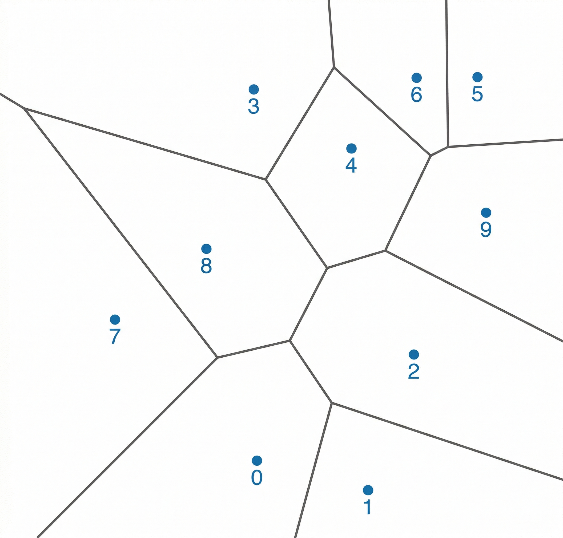{width="2.559834864391951in" height="2.4434787839020125in"}

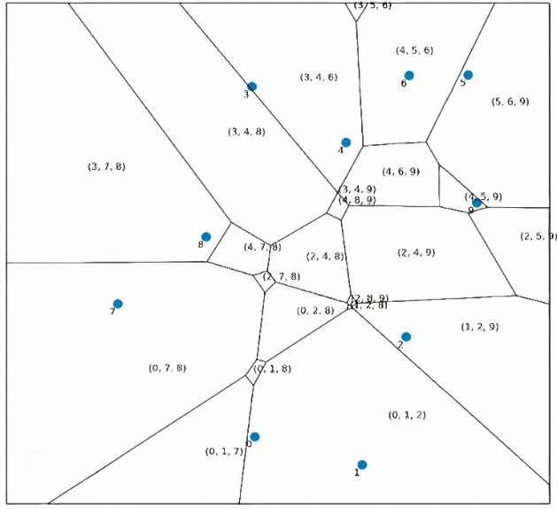{width="3.3666666666666667in" height="3.0805555555555557in"}{width="3.1590277777777778in" height="3.0861111111111112in"}*Նկար 2.1 - Վորոնովի Դիագրամը, որպես բջիջների համախումբ.*

## 2.1. Բարձր կարգի Վորոնովի Դիագրամներ, սահմանում և երկրաչափական հատկություններ {#բարձր-կարգի-վորոնովի-դիագրամներ-սահմանում-և-երկրաչափական-հատկություններ}

Դիցուք $R^{2}$ հարթության մեջ տրված է N նմուշային $S = \{ q_{1},\ q_{2},..,q_{N}\}$ բազմությունը, որտեղ յուրաքանչյուր $q_{i}$ կետ ներկայացված է, որպես կարգավորված զույգ՝ ($x_{i},\ y_{i}$), որտեղ $i = 1,\ 2,\ \ldots N$: Երկու՝ $q_{i}$ և $q_{j}$ կետերի միջև հեռավորությունը Lₚ մետրիկայում սահմանվում է $d_{p}\left( q_{i},\ {\ q}_{j} \right) = \left( \left| x_{i} - x_{j} \right|^{p} + \left| y_{i} - y_{j} \right|^{p} \right)^{\frac{1}{p}}\ $, իսկ $d_{\infty} = \left( q_{i},\ q_{j} \right) = max(|x_{i} - x_{j}|,\ |y_{i} - y_{j}|)$։ Մենք կդիտարկենք միայն Էվկլիդեսյան մետրիկան, այսինքն՝ L₂ մետրիկան:

Սովորական Վորոնովի դիագրամում յուրաքանչյուր բազմանկյուն ասոցացվում է մեկ կետի հետ, այսինքն՝ $V(i)$-ն ասոցացվում է $q_{i}$-ի հետ: Այժմ մենք ընդլայնում ենք այս հասկացությունը՝ դիտարկելով կետերի $H$ ենթաբազմության հետ ասոցացված $V(H)$ Վորոնովի բազմանկյունը: Այսինքն՝ $V(H)$-ն այն կետերի երկրաչափական տեղն է, որոնք ավելի մոտ են $H$-ի բոլոր կետերին, քան $H$-ին չպատկանող ցանկացած այլ կետի: Կամ, համարժեքորեն, $V(H) = \bigcap_{q_{i} \in H,\ q_{j} \in S - H}^{}{h(q_{i},q_{j})},$որտեղ$S$-ը նշանակում է կետերի ամբողջական բազմությունը: Պարզության համար կօգտագործենք$\bigcap_{}^{}{h(H,\ S - H)}$՝ նշանակելու համար $\bigcap_{q_{i} \in H,\ q_{j} \in S - H}^{}{h(q_{i},q_{j})}$- ը: Քանի որ $H$-ը կարող է լինել $S$-ի $2^{N}$ հնարավոր ենթաբազմություններից ցանկացածը, ապա $V(H)$-ը, բնականաբար, կարող է և գոյություն չունենալ: Մենք կսահմանափակվենք այն դեպքով, երբ դիտարկվող $H$ ենթաբազմության տարրերի քանակը k է: Մենք սահմանում ենք k-րդ կարգի Վորոնովի դիագրամը, որը նշանակվում է $V_{k}(S)$-ով, որպես $S$-ի բոլոր k-ենթաբազմությունների Վորոնովի բազմանկյունների հավաքածու, այն է՝ $V_{k}(S) = \cup \left\{ V(H):H \subset S,\ |H| = k \right\}$ \[4\]: Քանի որ $V(H)$ բազմանկյուններից մի քանիսը կարող են դատարկ լինել, $V_{k}(S)$-ում բազմանկյունների ընդհանուր քանակը կախված է տրված $N$ կետերի դիրքերից: Ինչպես ցույց կտանք ստորև, այդ թիվը $O(k(N - k))$ է: Նախքան առաջ շարժվելը, մենք կկատարենք հետևյալ դիտարկումները, որոնք հանդիսանում են $V_{1}(S)$-ից $V_{k}(S)$ իտերատիվ կառուցման հիմքը:

Մենք ենթադրում ենք, որ տրված $S\ $բազմության 3-ից ավելի կետեր նույն շրջանագծի վրա չեն գտնվում:

Ենթադրենք, որ $V_{1}(S)$-ը արդեն որոշված է: Թեստային կետը դիագրամում տեղորոշելուց հետո մենք կարող ենք պարզել նրա ամենամոտ հարևանին: Երկրորդ ամենամոտ հարևանը կարող է լինել միայն այն կետերից մեկը, որոնց հետ ասոցացված Վորոնովի բազմանկյունները հարակից են այն բազմանկյանը, որում գտնվում է թեստային կետը: Այսպիսով, եթե մենք կարողանանք որևէ կերպ «տրոհել» այն Վորոնովի բազմանկյունը, որտեղ գտնվում է թեստային կետը, մի շարք ենթատիրույթների, որոնցից յուրաքանչյուրը հարակից է իրեն շրջապատող Վորոնովի բազմանկյուններից մեկին, ապա ենթատիրույթներում թեստային կետի դիրքը կպարզի նրա երկրորդ ամենամոտ հարևանին:

Եթե մենք «տրոհում» իրականացնենք $V_{1}(S)$-ի յուրաքանչյուր Վորոնովի բազմանկյան վրա, արդյունքում կստանանք $V_{2}(S)$-ը: Նմանապես, տրոհելով $V_{2}(S)$-ը, մենք կստանանք $V_{3}(S)$-ը, և այդպես շարունակ: Այսպիսով, այս ընթացակարգի k-1 իտերացիաների արդյունքում մենք կարող ենք $V_{1}(S)$-ից ստանալ k-րդ կարգի Վորոնովի դիագրամը՝ $V_{k}(S)$: Տրված կետի k ամենամոտ հարևանները կարելի է որոշել՝ պարզապես տեղորոշելով թեստային կետը $V_{k}(S)$-ում: Նշենք, որ վերջնական $V_{k}(S)$-ը օգտակար է միայն ֆիքսված k-ի դեպքում, որը հայտնի է նախապես:

Այժմ դիտարկենք հետևյալ օրինակը։ Նկար 2.3-ում ցույց է տրված ութ կետերի վրա կառուցված 1-ին կարգի Վորոնովի դիագրամ: Ենթադրենք, որ q թեստային կետը գտնվում է $V(5$)-ում: Դրա ամենամոտ հարևանը $q_{5}$-ն է: Նրա երկրորդ ամենամոտ հարևանին գտնելու համար մենք կարող ենք արհեստականորեն «ջնջել» $q_{5}$-ը և լուծել ամենամոտ հարևանի խնդիրն այնպես, կարծես կա ընդամենը յոթ կետ: Այդ դեպքում մնացած յոթ կետերի վրա կառուցված Վորոնովի դիագրամը կբաժանի $V(5)$ բազմանկյունը վեց ենթատիրույթների, ինչպես ցույց է տրված Նկար 2․3-ի հաստ գծերով, և այն ենթատիրույթին ասոցացված կետը, որտեղ գտնվում է q-ն, հանդիսանում է երկրորդ ամենամոտ հարևանը: Նկար 2.4-ը ցույց է տալիս$\ V_{2}(S)$-ի վերջնական կառուցված, երբ ձևափոխությունն իրականացվում է բոլոր ութ բազմանկյունների վրա: Նկար 2.5-ում պատկերված է $V_{3}(S)$-ը կետերի նույն բազմության վրա:

Եթե մենք վերադրենք $V_{2}(S)$-ը, իսկ այնուհետև $V_{3}(S)$-ը սկզբնական $V_{1}(S)$ դիագրամի վրա, որոնք համապատասխանաբար ցույց են տրված Նկար 2.6-ում և Նկար 2.7-ում, կտեսնենք, որ ընդհանրացված Վորոնովի դիագրամում հիմնականում առկա է երկու տիպի բազմանկյուն:

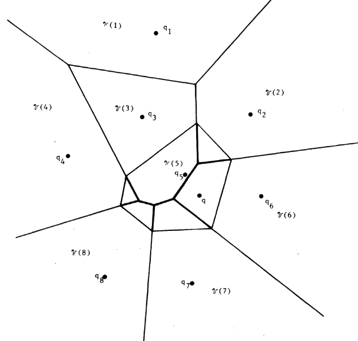{width="3.0833562992125985in" height="2.9318186789151355in"} 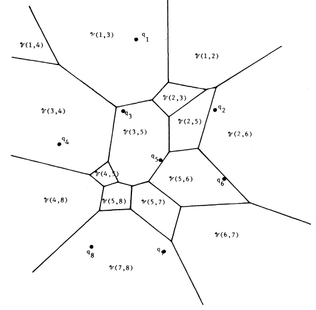{width="3.103480971128609in" height="3.045670384951881in"}

Նկար 2.4 -- 8 կետերի վրա կառուցված երկրորդ կարգի Վորոնովի դիագրամ։

> 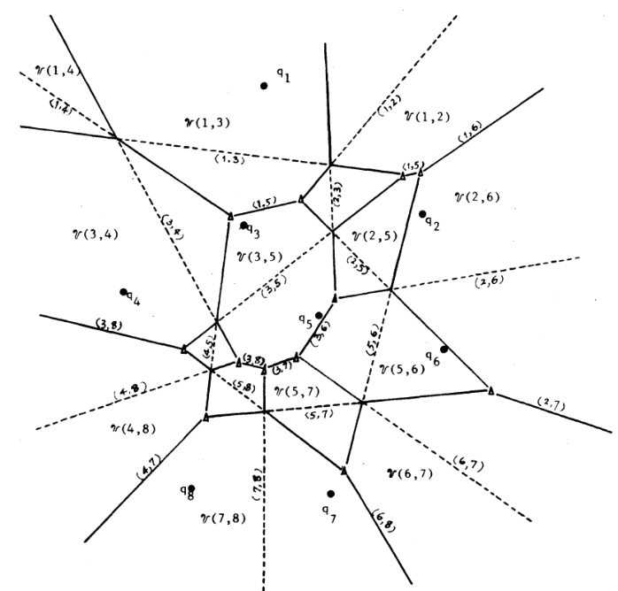{width="3.2694444444444444in" height="3.120138888888889in"}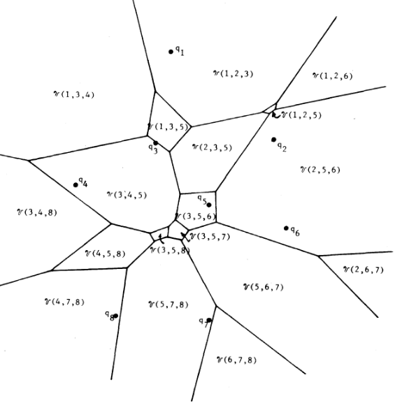{width="3.0555555555555554in" height="3.0694444444444446in"}

Առաջին տեսակի տիրույթները, որոնք կոչվում են I տիպի տիրույթներ, պարունակում են մեկ աստիճանով ավելի ցածր կարգի Վորոնովի դիագրամի մեկ կող: Երկրորդ տեսակի տիրույթները, որոնք կոչվում են II տիպի տիրույթներ, պարունակում են Վորոնովի կետ, որը գոյություն է ունեցել նախորդ երկու ավելի ցածր կարգի Վորոնովի դիագրամներում: Մասնավորապես, եթե տրված է 1-ին կարգի Վորոնովի դիագրամ $G_{1} = (I_{1},\ E_{1})$, որտեղ $I_{1}$-ը Վորոնովի կետերի բազմությունն է, իսկ $E_{1}$-ը՝ կողերի բազմությունը, ապա պարզվում է, որ 2-րդ կարգի Վորոնովի դիագրամը հանդիսանում է $G_{2} = (I_{2},\ E_{2})$-ը, որտեղ $I_{2}$ = $I_{1} \cup \ I_{2}'$-ը «հին» $I_{1}$ և «նոր» $I_{2}'$ բազմությունների միավորումն է, իսկ $E_{2}$-ը ստացվում է $G_{1}$-ի $E_{1}$-ից՝ նախկինում նկարագրված ձևափոխության միջոցով: $E_{2}$-ի այն կողը, որը միացնում է երկու նոր կետեր $I_{2}'$- ում, կոչվում է *նոր կող*: Այսպիսով, $E_{2}$ բազմությունը բաղկացած է նոր կողերից և այն կողերից, որոնք կից են $I_{1}$-ի «հին» կետերին: Նկար 2.6-ում նոր կետերը նշանակված են $\bigtriangleup$-ով: Յուրաքանչյուր կողի հետ ասոցացված $(i,\ j)$ ինդեքսների զույգը նշանակում է, որ այդ կողը $q_{i}$-ի և $q_{j}$-ի միջնուղղահայացի մի հատվածն է: Այնտեղ, որտեղ տարածությունը թույլ է տալիս, յուրաքանչյուր տիրույթ ներկայացված է $V(i,\ j)$-ով՝ ի ցույց դնելով 2 ասոցացված $q_{i}\ $և $q_{j}$ կետերը: Հետևողական լինելու համար՝ տիրույթը պետք է նշանակվեր որպես $V(\{ i,\ j\})$: Շփոթությունից խուսափելու համար հետագա քննարկումներում մենք բաց կթողնենք բազմության $\{\ $} նշանը: Ինչպես և բազմություններում, ինդեքսների հերթականությունը էական չէ: Նկար 2.6-ում պատկերված $V_{2}$-ում կան միայն մեկ տիպի՝ մասնավորապես I տիպի տիրույթներ, քանի որ $V_{1}\ $յուրաքանչյուր կող նոր է:

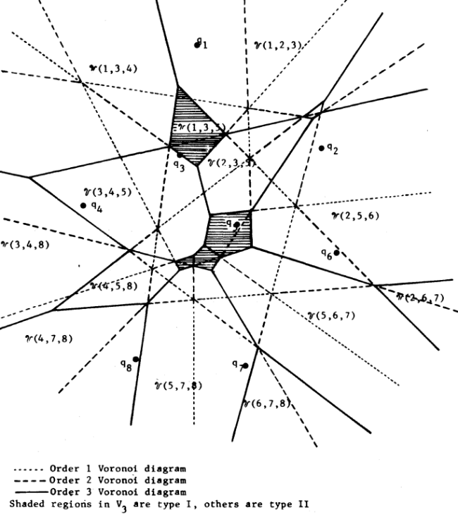{width="3.3076924759405073in" height="3.687645450568679in"}

**  
**

Մյուս կողմից, $V_{3}$-ում (Նկար 2.7) կան երկու տիպի տիրույթներ, որոնցից յուրաքանչյուրն ասոցացված է 3 ինդեքսների հետ: Օրինակ՝ $V(1,\ 3,\ 5)$-ը I տիպի է և պարունակում է նոր կող, իսկ V(3, 4, 5)-ը II տիպի է և պարունակում է Վորոնովի կետ, որը գոյություն ուներ $V_{1}$-ում և $V_{2}$-ում:

Այժմ ապացուցենք $k$-րդ կարգի Վորոնովի դիագրամների որոշ հատկություններ: Նախ ներմուծենք որոշ նշանակումներ:

$I = \{ 1,2,\cdots,n\}$ ինդեքսների բազմության վրա $\oplus$ բինար ասոցիատիվ գործողությունը սահմանվում է հետևյալ կերպ: Դիցուք $A$-ն և $B$-ն $I$-ի երկու ենթաբազմություններ են: $A \oplus B$-ն սահմանվում է որպես $\left( A - B) \cup (B - A \right)$, որտեղ "$-$"-ը բազմությունների տարբերությունն է: ($A \oplus B$-ն սովորաբար անվանում են $A$ և $B$ բազմությունների սիմետրիկ տարբերություն:) Հարմարության համար $q_{i}$ կնշանակենք պարզապես $i$-ով: Այսպիսով, $\mathcal{V}\left( q_{i_{1}},q_{i_{2}},\cdots,q_{i_{k}} \right)\ $Վորոնովի բազմանկյունը կնշանակվի $\mathcal{V(}i_{1},i_{2},\cdots,i_{k})$: Քանի որ դիագրամի կողերը երկու կետերի միջնուղղահայացների մասեր են, $\bar{B}(i,j)$-ով կնշանակենք $B(i,j)$ միջնուղղահայացի այն հատվածը, որը հանդիսանում է կող: Ասում ենք, որ $(i,j)$ ինդեքսների զույգը ասոցացված է $\bar{B}(i,j)$ կողի հետ: Դիցուք $\mathcal{V}_{k}(H,I)$-ն նշանակում է $V_{k}(I)$ Վորոնովի դիագրամի $\mathcal{V}_{k}(H)$ բազմանկյունը: Հետագայում մենք $I = \{ 1,\ 2,\ \ldots,\ n\}$բազմությունը կօգտագործենք կետերի $S = \{ q_{1},q_{2},\cdots,q_{n}\}$ բազմությանը համարժեք։

**Լեմմա 2.1․***Տրված է կետերի բազմություն և I բազմության* $H = \{ i_{1},\ i_{2},\ \ldots,i_{k}\}$ *ենթաբազմությունը, որտեղ* $k > 1$*: Եթե *$H_{s} = H - \{ j_{s}\}$*, որտեղ* $j_{s} \in H,s = 1,2,\cdots,m$ *և* $m\  \geq \ k$

*արժեքների համար, H-ի միակ ենթաբազմություններն են, որոնց համար գոյություն ունի  *$\mathcal{V}_{k - 1}(H_{s},I)$*, ապա *$\mathcal{V}_{k}(H,I)$*-ն կարելի է ներկայացնել որպես․*

$$\cup_{s = 1}^{m}(\mathcal{V}_{k - 1}(H_{s},I) \cap \mathcal{V}_{1}(j_{s},I - H_{s}))$$

**Ապացույց.** Դիտարկենք $k - 1$ կարգի $V_{k - 1}(I)$ դիագրամը և $\mathcal{V}_{k}(H,I)$-ի ու $V_{k - 1}(I)$-ի հատումը: Նկատենք, որ $\mathcal{V}_{k}(H,I) \cap \mathcal{V}_{k - 1}(H^{'},I) = \varnothing$, եթե $H^{'} \neq H_{s}$ որևէ $s = 1,2,\cdots,m$-ի համար, հակառակ դեպքում մենք կարող ենք հատման մեջ գտնել այնպիսի $q$ կետ, որի $\left( k-1 \right)$ ամենամոտ հարևանների բազմությունը $q$-ի $k$ ամենամոտ հարևանների բազմության խիստ ենթաբազմություն չէ, ինչն անհնար է: Հետևաբար, ունենք՝

$$\mathcal{V}_{k}(H,I) = \mathcal{V}_{k}(H,I) \cap (\cup_{s = 1}^{m}\mathcal{V}_{k - 1}(H_{s},I)) = \cup_{s = 1}^{m}(\mathcal{V}_{k}(H,I) \cap \mathcal{V}_{k - 1}(H_{s},I))$$

Վերհիշենք, որ $\mathcal{V}_{k}(H,I) = \  \cap h(H,I - H)$։

Մենք ունենք՝

$$\mathcal{V}_{k}(H,I) \cap \mathcal{V}_{k - 1}(H_{s},I) = ( \cap h(H,I - H)) \cap ( \cap h(H_{s},I - H_{s}))$$

$$= ( \cap h(j_{s},I - H) \cap ( \cap h(H_{s},I - H))) \cap ( \cap h(H_{s},I - H_{s}))$$

$$= ( \cap h(j_{s},I - H)) \cap ( \cap h(H_{s},I - H) \cap ( \cap h(H_{s},I - H_{s})))$$

$$= \mathcal{V}_{1}(j_{s},I - H_{s}) \cap ( \cap h(H_{s},I - H) \cap ( \cap h(H_{s},I - H_{s})))$$

Քանի որ

$$\cap h\left( H_{s},I - H_{s} \right) = \  \cap h\left( H_{s},I - H \right) \cap \left( \cap h\left( H_{s},j_{s} \right) \right) \subseteq \  \cap h\left( H_{s},I - H \right),$$

ապա

$\cap h\left( H_{s},I - H \right) \cap \left( \cap h\left( H_{s},I - H_{s} \right) \right) = \  \cap h(H_{s},I - H_{s}) = \mathcal{V}_{k - 1}(H_{s},I)$։

Հետևաբար կստանանք՝

$\mathcal{V}_{k}(H,I) = \cup_{s = 1}^{m}(\mathcal{V}_{k - 1}(H_{s},I) \cap \mathcal{V}_{1}(j_{s},I - H_{s}))$:

**Լեմմա 2.2.** *Տրված է *$k$*-րդ կարգի *$V_{k}(I)$* Վորոնովի դիագրամը: Եթե* $q$*-ն *$V_{k}(I)$*-ի* $\bar{B}(i,j)$* կողի կետ է, ապա *$q$*-ի *$k$*-րդ ամենամոտ հարևանը կամ *$i$*-ն է, կամ *$j$*-ն:*

**Ապացույց.** Այն ակնհայտ է, երբ $k = 1$։ Որպես ինդուկցիայի քայլ՝ դիտարկենք ցանկացած $\mathcal{V}_{k - 1}(H,I)$ բազմանկյուն և $V_{1}(I - H)$ դիագրամը, այսինքն՝ ամենամոտ հարևանի դիագրամը, որտեղից հեռացված է կետերի $H$ բազմությունը։ Դիցուք $q$-ն $\mathcal{V}_{k - 1}(H,I) \cap V_{1}(I - H)$ հատման կետ է այնպես, որ $q$-ն ընկած է $V_{1}(I - H)$-ի $\bar{B}(i,j)$ կողի վրա։ Այսինքն՝ $q \in \mathcal{V}_{1}(i,I - H)$ և $q \in \mathcal{V}_{1}(j,I - H)$։ Համաձայն Լեմմա 2.1-ի$q \in \mathcal{V}_{k}(H \cup \{ i\},I)$ և $q \in \mathcal{V}_{k}(H \cup \{ j\},I)$, ինչը նշանակում է, որ $q$-ն գտնվում է $V_{k}(I)$-ի $\bar{B}(i,j)$-ի վրա։ Քանի որ $q \in \mathcal{V}_{k - 1}(H,I)$, $H$-ը $q$-ի $\left( k-1 \right)$ ամենամոտ հարևանների բազմությունն է։ Ավելին, $q$-ի ամենամոտ հարևանը կետերի $I - H$ բազմությունում կամ $i$-ն է, կամ $j$-ն, որտեղից հետևում է, որ $q$-ի $k$-րդ ամենամոտ հարևանը կամ $i$-ն է, կամ $j$-ն։ 

**Լեմմա 2.3.** *Տրված է *$k$*-րդ կարգի *$V_{k}(I)$* Վորոնովի դիագրամը: *$q$*-ն *$V_{k}(I)$*-ի *$\bar{B}(i,j)$* կողի կետ է այն և միայն այն դեպքում, երբ *$q$* կենտրոնով և *$d(q,i) = d(q,j)$* շառավղով շրջանն իր ներսում պարունակում է *$k - 1$* կետ:*

**Ապացույց.** Եթե $q$-ն $V_{k}(I)$-ի $\bar{B}(i,j)$-ի կետ է, ապա պնդումը ճիշտ է համաձայն Լեմմա 2-ի: Հակառակն ապացուցելու համար դիտարկենք $q$-ի $N(q,\delta)$ շրջակայքը, այսինքն՝ $q$ կենտրոնով և $\delta$ շառավղով շրջան: Քանի որ $q \in B(i,j)$ և գոյություն ունի $q$ կենտրոնով և $d(q,i) = d(q,j)$ շառավղով $K$ շրջան, որը պարունակում է $k - 1$ կետ, հեռավորության մետրիկայի անընդհատությունից ելնելով, մենք կարող ենք $N(q,\delta)$-ում գտնել $q^{'}$ կետ և $q^{'}$ կենտրոնով ու $d(q^{'},i) = d(q^{'},j)$ շառավղով $K^{'}$ շրջան այնպես, որ $K^{'}$-ը նույնպես պարունակի նույն $k - 1$ կետերը: Դիցուք $H$-ը նշանակում է $K$-ում (և $K^{'}$-ում) պարունակվող $k - 1$ կետերի բազմությունը: Քանի որ $q^{'} \in B(i,j)$-ն ցանկացած կետ է $N(q,\delta)$-ում, ապա գոյություն ունի $B(i,j)$-ի մի հատված, որն ընկած է $N(q,\delta)$-ում, այնպես, որ $B(i,j)$-ի այդ հատվածի ցանկացած $u$ կետի համար $u$-ի $k$ ամենամոտ հարևանների բազմությունը $H \cup \{ i\}$ կամ $H \cup \{ j\}$ է: Սա նշանակում է, որ $B(i,j)$-ի այդ հատվածը պետք է ընդհանուր լինի $\mathcal{V}_{k}(H \cup \{ i\})$-ի և $\mathcal{V}_{k}(H \cup \{ j\})$-ի համար $V_{k}(I)$-ում:

Այսպիսով, $q$-ն $V_{k}(I)$-ի $\bar{B}(i,j)$ կողի կետ է: 

**Լեմա 2.4.** *Տրված է n կետերից բաղկացած բազմությունը n-1 կարգի* $V_{n - 1}(I)$ *Վորոնովի դիագրամի n-1 կողերը կազմում են ծառ, այսինքն՝ կողերի վրա գտնվող ցանկացած երկու կետերի համար գոյություն ունի դրանք միացնող միակ ճանապարհ։*

**Ապացույց.** Այն բխում է այն փաստից, որ $V_{n - 1}(I)$-ը ամենահեռու կետի Վորոնովի դիագրամն է, և որ ամենահեռու կետերի Վորոնովի դիագրամի բոլոր բազմանկյուններն անսահմանափակ են \[4\]:

**Լեմմա 2.5.** *Դիցուք *$\mathcal{V}_{k}(H)$*-ը *$u_{1},u_{2},\cdots,u_{i}$* գագաթներով Վորոնովի սահմանափակ բազմանկյուն է, որտեղ *$i \geq 3$*: Եթե բոլոր *$u_{1},u_{2},\cdots,u_{i}$* Վորոնովի կետերը նոր են, ապա *$k$*-ն պետք է լինի *$1$*: Եթե *$k > 1$*, ապա այս *$i$* Վորոնովի կետերից առնվազն 2-ը պետք է լինեն հին:*

**Ապացույց.** Ենթադրենք, որ $\mathcal{V}_{k}(H_{1}),\mathcal{V}_{k}(H_{2}),\cdots,\mathcal{V}_{k}(H_{i})$ բազմանկյունները հարակից են $\mathcal{V}_{k}(H)$-ին այնպես, որ $u_{j}$-ն ընդհանուր է $\mathcal{V}_{k}(H_{j}),\mathcal{V}_{k}(H_{j + 1})$ և $\mathcal{V}_{k}(H)$-ի համար $j = 1,2,\cdots,i - 1$ դեպքերում, իսկ $u_{i}$-ն ընդհանուր է $\mathcal{V}_{k}(H_{i}),\mathcal{V}_{k}(H_{1})$ և $\mathcal{V}_{k}(H)$-ի համար:

1)  Ենթադրենք, որ $u_{1},u_{2},\cdots,u_{i}$-ն նոր են և $k \neq 1$: Քանի որ $H$-ը և $H_{j}$-ն կարող են ներկայացվել, որպես $H = H_{0} \cup \left\{ a \right\},\ \ H_{j} = H_{0} \cup \left\{ a_{j} \right\},j = 1,2,\cdots,i,$ $\mid H_{0} \mid = k - 1$,$\ $ իսկ  $\bar{B}\left( a,a_{j} \right)$ $j = 1,2,\cdots,i$ հանդիսանում են $\mathcal{V}_{k}(H)$-ի կողեր, ապա $a$ կետը պետք է գտնվի $\mathcal{V}_{k}(H)$-ի ներսում: Դիտարկենք $\mathcal{V}_{k}(H)$-ի կողի վրա գտնվող $q$ կետը: Դիցուք $q^{'}$-ը $q$-ով և $a$-ով անցնող ուղղի և $\mathcal{V}_{k}(H)$-ի եզրագծի հատման կետն է: Դիցուք $x$-ը ցանկացած կետ է $H_{0}$-ում: Քանի որ $a$ կետը, ըստ Լեմմա 2.2-ի, $q$-ի և $q^{'}$-ի $k$-րդ ամենամոտ հարևանն է, ապա $d(q,x) < d(q,a)$ և $d(q^{'},x) < d(q^{'},a)$։

Այսպիսով,

$d(q,x) + d\left( q^{'},x \right) < d(q,a) + d(q^{'},a) = d(q,q^{'})$,

ինչը հակասում է եռանկյան անհավասարությանը

$d(q,x) + d(q^{'},x) \geq d(q,q^{'})$:

2)  Ենթադրենք, որ $k > 1$ և միայն մեկը, օրինակ՝ $u_{i}$-ն է հին Վորոնովի կետ: Քանի որ $u_{1},u_{2},\cdots,u_{i - 1}$-ը նոր են, ապա ունենք $H = H_{0} \cup \{ a\},H_{j} = H_{0} \cup \{ a_{j}\},j = 1,2,\cdots,i$: Բայց սա ենթադրում է, որ $u_{i}$-ն, որն ընդհանուր է $H,H_{1}$ և $H_{i}$-ի համար, պետք է լինի նոր, ինչը հակասություն է: 

Այս լեմման ենթադրում է, որ $k > 1$ կարգի Վորոնովի դիագրամի ոչ մի նոր կետ երբեք չի կազմում Վորոնովի բազմանկյուն: Համանման դատողություններով ունենք հետևյալը.

**Հետևանք 2.** *Ոչ մի սահմանափակ *$k$*-րդ կարգի Վորոնովի բազմանկյուն չունի գագաթներ, որոնք բոլորը հին են:*

**Թեորեմ 2.1.** $V_{i + 1}(S)$* Վորոնովի դիագրամը կարելի է ստանալ *$V_{i}(S)$*-ից և *$V_{1}(S - H)$*-ից՝ վերցնելով *$\mathcal{V}_{i}(H)$*-ի և *$V_{1}(S - H)$*-ի հատումները բոլոր այն *$H \subseteq S$* բազմությունների համար, որոնց դեպքում *$\mathcal{V}_{i}(H)$*-ը դատարկ չէ:*

**Լեմմա 2.6.** *Եթե *$\mathcal{V}_{i}(H)$*-ն իր ներսում պարունակում է *$V_{i - 1}(S)$*-ի *$m$* հին Վորոնովի կետեր, ապա այն պարունակում է նաև *$V_{i - 1}(S)$*-ի *$2m + 1$* հին կողեր:*

**Ապացույց.** Դիտարկենք $\mathcal{V}_{i}(H)$-ի և $V_{i - 1}(S)$-ի հատումը: Համաձայն Լեմմա 2.1-ի. 

$$\mathcal{V}_{i}(H,S) = \cup_{s = 1}^{t}(\mathcal{V}_{i - 1}(H_{s},S) \cap \mathcal{V}_{1}(j_{s},S - H_{s}))$$

որտեղ $H_{s} = H - \left\{ j_{s} \right\}$ և $j_{s} \in H$ բոլոր $s = 1,2,\cdots,t$ արժեքների համար: Սա նշանակում է, որ $\mathcal{V}_{i}(H,S)$-ը $t$ տիրույթների միավորում է, որտեղ յուրաքանչյուր տիրույթն իրենից ներկայացնում է այն կետերի երկրաչափական տեղերի հատումը,որոնց $i - 1\ $ամենամոտ հարևանները $H_{s}$-ի կետերն են, և այն կետերի երկրաչափական տեղը, որոնց $i$-րդ ամենամոտ հարևանը $j_{s}$-ն է: Այլ կերպ ասած, յուրաքանչյուր տիրույթ այն կետերի երկրաչափական տեղն է, որոնց $i$ ամենամոտ հարևանները գտնվում են $H_{s} \cup \left\{ j_{s} \right\} = H$ բազմության մեջ, իսկ $i$-րդ ամենամոտ հարևանը $j_{s}$-ն է: Այժմ դիտարկենք $V_{i - 1}(H)$ դիագրամը: Քանի որ $V_{i - 1}(H)$-ը $\mathcal{V}_{i}(H,S)$ բազմանկյունը տրոհում է ճշգրտորեն այն տիրույթների, որոնցից յուրաքանչյուր $R_{j_{s}}$-ը այն կետերի երկրաչափական տեղն է, որոնց $i$ ամենամոտ հարևանները $H$-ի կետերն են, իսկ $i$-րդ ամենամոտ հարևանը $j_{s}$-ն է, ապա յուրաքանչյուր $R_{j_{s}}$ տիրույթ նույնական է $\mathcal{V}_{i - 1}\left( H_{s},S \right) \cap \mathcal{V}_{1}\left( j_{s},S - H_{s} \right)$-ին: Համաձայն Լեմմա 2.4-ի՝ $\mathcal{V}_{i}(H,S)$-ը տրոհող կողերը կազմում են ծառ: Հետևաբար, եթե կա $m$ կետ, ապա գոյություն ունի $2m + 1$ կող:

**Լեմմա 2.7*.**** *$V_{k}(S)$*-ում նոր Վորոնովի կետերի քանակն է՝*

$$I_{k}^{'} = 2k(N - 1) - k(k - 1) - \sum_{i = 1}^{k}\mathcal{S}_{i}.$$

## 2.2. k-րդ կարգի Վորոնովի դիագրամի կառուցման ալգորիթմը {#k-րդ-կարգի-վորոնովի-դիագրամի-կառուցման-ալգորիթմը}

Այս բաժնում մենք կներկայացնենք $1$-ին կարգի $V_{1}(S)$ Վորոնովի դիագրամի մեկ առանձին Վորոնովի բազմանկյան, դիցուք՝ $\mathcal{V(}q_{m})$-ի տրոհման ալգորիթմը: Ենթադրենք, որ $\mathcal{V(}q_{0}\mathcal{),\cdots,V(}q_{n - 1})$ բազմանկյունները հարակից են $\mathcal{V(}q_{m})$ բազմանկյանը: Մենք ցանկանում ենք $\mathcal{V(}q_{m})$-ը տրոհել $n$ ենթատիրույթների այնպես, որ յուրաքանչյուր $r_{i}$ ենթատիրույթ լինի այն կետերի երկրաչափական տեղը, որոնք ավելի մոտ են $q_{i}$-ին, քան ցանկացած այլ կետի, բացառությամբ $q_{m}$-ի, որտեղ $i = 0,1,\cdots,n - 1$ (տե՛ս Թեորեմ 1): Ինչպես նշվեց 2.1 ենթագլխում, $\mathcal{V(}q_{m})$-ի տրոհումն ըստ էության համարժեք է $q_{m}$-ի արհեստականորեն հեռացմանը և մնացած $q_{0},q_{1},\cdots,q_{n - 1}$ կետերի համար Վորոնովի դիագրամի կառուցմանը: $q_{m}$-ի հեռացման հետևանքը բազմանկյան եզրագծի վերացումն է և $\mathcal{V(}q_{m})$-ի գագաթներում հատվող կողերի շարունակումը դեպի $\mathcal{V(}q_{m})$-ի ներս, ինչի արդյունքում $\mathcal{V(}q_{m})$ բազմանկյունը տրոհվում է: Դիցուք $\mathcal{V(}q_{m})$-ի գագաթները նշանակված են որպես $I_{0},I_{1},\cdots,I_{n - 1}$ և պահվում են որպես կապակցված ցուցակ։ Բազմանկյան յուրաքանչյուր $(I_{i},\ I_{i + 1})$ կող հանդիսանում է $B(q_{i},q_{m})$ միջնուղղահայացի մի հատված և ներկայացվում է $(i,m)$ ինդեքսների զույգով: Ըստ ենթադրության՝ յուրաքանչյուր $I_{i}$ գագաթ երեք կողերի հատման կետ է, որոնք ներկայացվում են $\left( i,m),(i - 1,m \right)$ և $(i,i - 1)$ զույգերով: Նկատեք, որ երեք կողերի ինդեքսների զույգերը բավարարում են $(a,b) \oplus (b,c) \oplus (c,a) = \varnothing$ հատկությանը: Դիցուք $\text{IND}(I_{i})$-ով նշանակում ենք այն կողը, որը հարակից է $I_{i}$-ին և չի գտնվում $\mathcal{V(}q_{m})$ բազմանկյան եզրագծի վրա: Եթե երկու եզրային կողերը, որոնք հարակից են $I_{i}$-ին, ներկայացվում են $(a,b)$-ով և $(a,\ c)$-ով, ապա $\text{IND}(I_{i}) = (a,b) \oplus (a,c) = (b,c)$: Նկ. 2.8-ը ցույց է տալիս տիպիկ $\mathcal{V}(10)$ Վորոնովի բազմանկյուն, որը պետք է տրոհվի:

Մենք այս խնդիրը կլուծենք «բաժանիր և տիրիր» ալգորիթմով։ Նախ մենք ստանում ենք Վորոնովի դիագրամները 3-ական կետերից բաղկացած բազմությունների համար՝ համապատասխանաբար $\left\{ q_{n - 1},\ q_{0},\ q_{1} \right\},\ \ \left\{ q_{2},\ q_{3},q_{4} \right\}\ldots$ երկարացնելով $\left\{ IND\left( I_{0} \right),\ IND\left( I_{1} \right) \right\},$

$\ \left\{ IND\left( I_{3} \right),\ IND\left( I_{4} \right) \right\}$ և այլ կողերի հետ ասոցացված կողերը դեպի $\nu(q_{m})$ -- ի ներս։

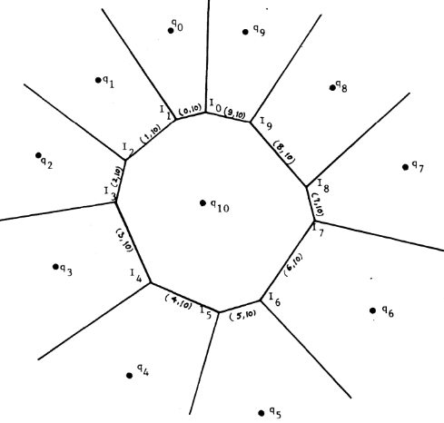{width="2.0in" height="1.9035094050743657in"}

Նկար 2.8 -- 11 կետերի վրա կառուցված առաջին կարգի Վորոնովի դիագրամ

Միաձուլելով 3-ական կետերից բաղկացած երկու հարակից Վորոնովի դիագրամներ՝ մենք ստանում ենք Վորոնովի դիագրամներ 6 կետանոց բազմությունների համար: Կրկնելով միաձուլման այս գործընթացը $\left\lceil {\log}_{2}n/3 \right\rceil$ անգամ՝ մենք կստանանք Վորոնովի դիագրամ $n$ կետերի համար: Դիագրամի այն կողերը, որոնք գտնվում են $\mathcal{V(}q_{m})$-ի ներսում, կտրոհեն $\mathcal{V(}q_{m})$-ը $n$ ենթատիրույթների:

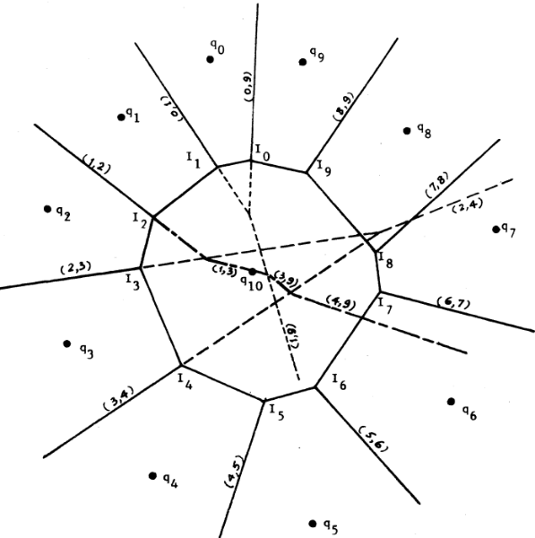{width="2.713888888888889in" height="2.7291666666666665in"}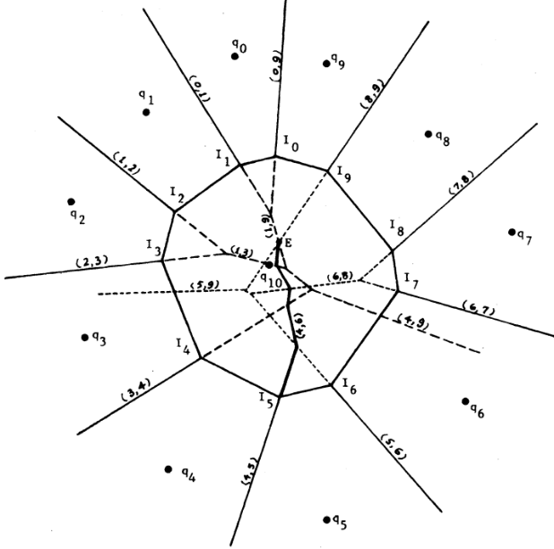{width="2.80255905511811in" height="2.7829888451443567in"}

Նկար 2․10 - Երկու Վորոնովի դիագրամների միաձուլման վերջնական պատկերը։

Նկար 2.9-ը ցույց է տալիս երկու Վորոնովի դիագրամների միաձուլման գործընթացը $\left\{ q_{9},q_{0},q_{1} \right\}$-ի և $\left\{ q_{2},q_{3},q_{4} \right\}$-ի համար, իսկ Նկ. 2.10-ը ցույց է տալիս երկու Վորոնովի դիագրամների միաձուլման վերջնական գործընթացը $\left\{ q_{9},q_{0},q_{1},\cdots,q_{4} \right\}$-ի և $\left\{ q_{5},q_{6},\cdots,q_{9} \right\}$-ի համար: Նկ. 2.10-ում միաձուլման գործընթացը սկսվում է $\text{IND}(I_{5})$-ի, այսինքն՝ $(4,\ 5)$ միջնուղղահայացի շարունակմամբ և ավարտվում է $E$ կետում, ինչպես ցույց է տրված: Նկարագրենք Վորոնովի կետերի այն բազմության նույնականացման մեթոդը, որի վրա պետք է կիրառվի «բաժանի՛ր և տիրի՛ր» ալգորիթմը:

Նկատեք, որ Լեմմա 2.5-ի արդյունքը վճռորոշ է միաձուլման ալգորիթմի ճշտության

համար, քանի որ այն ապահովում է, որ միաձուլման գործընթացում «միաձուլման գծերը» երբեք ցիկլեր չկազմեն:

Ենթադրենք, որ մենք ստացել ենք $i$-րդ կարգի $V_{i}(S)$ Վորոնովի դիագրամը, որտեղ $k > i \geq 1$: Վերհիշենք, որ կան երկու տիպի Վորոնովի կետեր՝ հին կետեր, որոնք գոյություն ունեին $V_{i - 1}(S)$-ում, և նոր կետեր, որոնք նոր են ստեղծվել: Հիմնվելով նախորդ քննարկումների վրա՝ միայն Վորոնովի նոր կետերի բազմությունն է անհրաժեշտ $V_{i + 1}(S)$ դիագրամը կառուցելու համար: Ինդուկցիայի սկզբունքով ենթադրենք, որ յուրաքանչյուր $\mathcal{V}_{i}(H_{j})$ Վորոնովի բազմանկյուն ասոցացված է $i$ կետերի հետ, այսինքն՝ $\mathcal{V}_{i}(H_{j})$-ն այն կետերի երկրաչափական տեղն է, որոնք ավելի մոտ են այդ $i$ կետերին, քան $S$-ի մնացած կետերին, իսկ նրա գագաթները ներկայացված են որպես երկկողմանի կապակցված շրջանաձև ցուցակ: Քանի որ $\mathcal{V}_{i}(H_{j})$-ի գագաթներից մի քանիսը հին Վորոնովի կետեր են, իսկ որոշները՝ նոր Վորոնովի կետեր, միայն այդ նոր Վորոնովի կետերն են լրացուցիչ կերպով կապակցված միմյանց հետ՝ օգտագործելով լրացուցիչ ցուցիչ: Նկատեք, որ $V_{1}(S)$-ի բոլոր գագաթները նոր Վորոնովի կետեր են: Այժմ $\mathcal{V}_{i}(H_{j})$-ն տրոհելու համար մենք նախ ստանում ենք նոր Վորոնովի կետերի բազմությունը, որոնցից յուրաքանչյուրն ասոցացված է $\text{IND}(I_{j})$-ով ներկայացվող կողի հետ, որտեղ $I_{j}$-ն $\mathcal{V}_{i}(H_{j})$-ի նոր Վորոնովի կետ է, այնուհետև կիրառում ենք հենց նոր նկարագրված «բաժանի՛ր և տիրի՛ր» եղանակը: Յուրաքանչյուր Վորոնովի բազմանկյուն տրոհելուց հետո մեզ անհրաժեշտ է միմյանց շղթայել յուրաքանչյուր նոր ստեղծված Վորոնովի բազմանկյան գագաթները, այն ասոցացնել $i + 1$ կետերից բաղկացած նոր բազմության հետ, և միևնույն ժամանակ, երբ մենք ձևավորում ենք յուրաքանչյուր բազմանկյան գագաթների ցուցակը, մենք կապակցում ենք բազմանկյան նոր գագաթները՝ ցուցակ ձևավորելով: Այս եղանակով մենք կարող ենք ստանալ $i + 1$ կարգի $V_{i + 1}(S)$ դիագրամը:

Այժմ վերլուծենք ալգորիթմի աշխատանքի ժամանակը: Ենթադրենք, որ տրոհման ենթակա $\mathcal{V}_{i}(H)$ բազմանկյունն ունի Վորոնովի $s$ նոր կետեր՝ $I_{1},I_{2},\cdots,I_{s}$: $\mathcal{V}_{i}(H)$-ի տրոհման գործընթացը համարժեք է $s$ կետերից բաղկացած բազմության համար 1-ին կարգի Վորոնովի դիագրամի կողերի որոնմանը , որոնց ինդեքսները հանդիսանում են $\text{IND}(I_{i}),i = 1,2,\cdots,s$ կողերին ասոցացված ինդեքսների միավորումը, և հետևաբար այն պահանջում է $O(s\log s)$ ժամանակ: Քանի որ $V_{i}(S)$-ում կան $N_{i}$ Վորոնովի բազմանկյուններ և $O(iN)$ նոր Վորոնովի կետեր (Լեմմա 2.6), անհրաժեշտ գործողությունների ընդհանուր քանակը կազմում է՝

$$\sum_{j = 1}^{N_{i}}{O(}s_{j}\log s_{j}) = O(iN\log N)$$

Հիշողության պահանջվող ծավալը կազմում է $O(N_{i + 1}) = O((i + 1)(N - (i + 1)))$: Քանի որ $k$-րդ կարգի Վորոնովի դիագրամ ստանալու համար պահանջվում է $k - 1$ իտերացիա, ամբողջ աշխատանքը կազմում է $\sum_{i = 1}^{k - 1}{O(iN\log N) = O(}k^{2}N\log N)$: Հիշողության պահանջվող ծավալը $O(k \cdot N_{k})$ է, որը հավասար է $O(k^{2}(N - k))$, քանի որ կան $O(N_{k})$ տիրույթներ, և յուրաքանչյուր տիրույթ ասոցացված է $k$ կետերի հետ:

## 2.3. Վորոնովի դիագրամի կիրառումը փակ տարածքում օբյեկտի դիրքի տեղորոշման համար {#վորոնովի-դիագրամի-կիրառումը-փակ-տարածքում-օբյեկտի-դիրքի-տեղորոշման-համար}

BLE (Bluetooth Low Energy) -- սա անլար կապի տեխնոլոգիա է, որը կիրառում են ոչ մեծ ծավալի տվյալների տեղափոխման համար՝ ծախսելով շատ քիչ էներգիա։ Այս տեխնոլոգիայով տվյալները, որպես կանոն հնարավոր է լինում տեղափոխել 10-30 մետր։ BLE-ն օգտագործում են ֆիտնես շղթաներում, անլար սենսորներում, փակ տարածքում օբյեկտի դիրքի տեղորոշման bluetooth - տվիչներում և բժշկական որոշ սարքավորումներում \[3\]:

RSSI (Received Signal Strength Indicator) - թվային արժեքներով ներկայացվող ցուցանիշ է, որը ցույց է տալիս, թե որքան ուժեղ է ընդունված ազդանշանը։ Սովորաբար այն ներկայացվում է բացասական թվերով (օր․ -30 dBm; -70 dbm): Որքան թիվը ավելի մոտ է 0-ին, այնքան ազդանշանը ուժեղ է։

Դիտարկենք մոտեցում՝ կապված BLE տեխնոլոգիաների կիրառմամբ։ Փակ տարածքում օբյեկտի տեղորոշման համար օգտագործված է ֆիքսված ընդունիչ սարքեր, որոնք ստանում են օբյեկտի հետ նույնացված տվիչի RSSI պարամետրերի մասին ինֆորմացիա։ Տվիչի արձակած ազդանշանների հաճախությունը կարող է փոխվել կախված օգտագործվող սարքավորումից։ Եվս մեկ անգամ նշենք, որ RSSI-ը համարվում է անկայուն և նրա արժեքի վրա կարող է մեծ ազդեցություն ունենալ ցանկացած խոչընդոտ, որն առկա է ազդանշանի տարածման ճանապարհին և նույնիսկ կարող է ազդել տարածքի կառուցվածքը։ Դա կապված է ազդանշանի հզորության շատ արագ մարումով, որը կախված է միջավայրի գործոններից և RSSI-ի արժեքների հեռավորության էքսպոնենցիալ կախվածությունից։

Հետևաբար ընտրվել է համեմատական մոտեցում՝ օգտագործելով RSSI արժեքների համեմատությունը տարբեր ընդունիչների միջև, այլ ոչ թե նրանց բացարձակ արժեքները։ Բոլոր ընդունիչ սարքերից ընտրում ենք 2-3 ամենաբարձր RSSI արժեքներ ունեցողները։ Ընտրված («հուսալի») ընդունիչ սարքերի քանակը կախված է օգտագործվող մոդելի RSSI սահմանային արժեքով, և մոդելի այլ պարամետրերից։ Վստահելի ընդունիչ սարքերի հավաքածուի որոշման համար, իդեալական պայմաններում, կնշանակեր որ նրանցից յուրաքանչյուրի հեռավորությունը տվիչից ավելի փոքր է, քան հեռավորությունը տվիչի մնացած այլ ընդունիչ սարքերից։

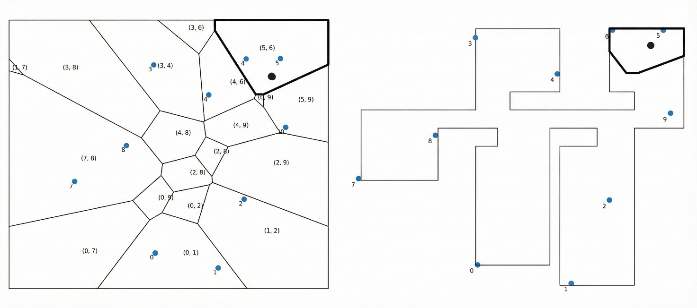{width="6.6930555555555555in" height="2.7083333333333335in"}*Նկար 2.11 - Վորոնովի դիագրամի համապատասխան բջջին պատկանելիության որոշում։*

Յուրաքանչյուր ընդունիչ դիտարկենք որպես կետ հարթության վրա։ Դիցուք P-ն բոլոր այդ կետերի բազմությունն է․ այդ կետերի բազմության հիման վրա կարելի է կառուցել 2-րդ կամ 3-րդ կարգի Վորոնովի դիագրամ, կախված հուսալի ընդունիչների քանակից։ Օբյեկտի դիրքը որոշվում է՝ Վորոնովի դիագրամի ըստ այն բջջի, որին այն պատկանում է (տես․ Նկար 2.11)։

Թեստավորման արդյունքները ցույց են տվել, որ նույնիսկ փոքր և քիչ խտությամբ ցանցի դեպքում մեթոդը ապահովում է մոտավորապես 80% ճշգրտություն։ Օբյեկտի դիրքի որոշման սխալի չափը գնահատվում է համապատասխան Վորոնովի բջջի տրամագծով։ Ակնհայտ է, որ ճշգրտությունը կարելի է բարձրացնել՝ մեծացնելով ընդունիչների քանակը և օպտիմալացնելով նրանց փոխադարձ տեղակայումը \[3\]:

Դիցուք տրված են $P_{1},\ P_{2},\ldots,P_{n} \in R^{2}$ տվիչների կոորդինատները և պետք է գնահատել $X = (x,y)$ օբյեկտի դիրքը։ Վորոնովի դիագրամով տիրույթը տրոհվում է մասերի (բջիջների)։ Օբյեկտը բոլոր տվիչներից ընդունում է ազդանշանը։

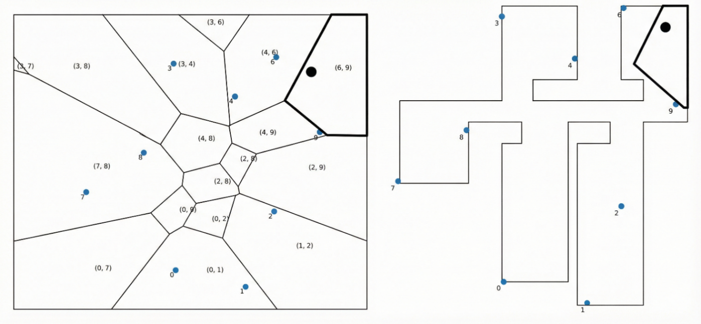{width="6.347222222222222in" height="2.8120603674540683in"}*Նկար 2.12 - Բջջի կառուցման ճշգրտված տարբերակ։*

Ընտրվում է մեծագույն հզորությամբ ազդանշանով (RSSI) տվիչը։ Այդ դեպքում օբյեկտը գտնվում է այդ տվիչը որպես կենտրոն ունեցող Վորոնովի դիագրամի բիջիջում (ենթադրվում է, որ բոլոր տվիչների հզորությունները նույնն են) ։

Դիտարկենք հետևյալ խնդիրները՝

**Խնդիր 1.** Դիցուք $10 \times 10$ (մ) սենյակում տվիչները գտնվում են $P_{1} = (2,\ 2),\ P_{2} = (8,\ 2),\ \ P_{3} = (5,\ 8)$ կետերում:

Վորոնովի դիագրամը սենյակում է տրոհում է երեք մասի (Նկար 2.13): Օբյեկտի ընդունած ազդանշանների ցուցանիշներն են\`

$${RSSI}_{1} = - 60;\ {RSSI}_{2} = - 80;\ {RSSI}_{3} = - 73$$

Քանի որ $\max{RSSI} = - 60$, ուստի օբյեկտը գտնվում է $P_{1}$ կենտրոնով Վորոնովի բջիջում։

Կոնկրետ կիրառական խնդիրներ լուծելիս հաճախ օգտվում են $RSSI$ լոգարիթմական մոդելից: Դա ազդանշանի մարման մոդել է․

> $RSSI = A - 10*nlgd$ , (2.1)

որտեղ

ա) A-ն դա տվիչից 1 մետր հեռավորության դեպքում ազդանշանի թվային ցուցանիշն է (դրան անվանում են արագաչափական արժեք), որի արժեքը ստացվում է փորձարկում անելով։ Այն կախված է տվիչի հզորությունից և սովորաբար ունի $A \approx - 40\ldots 70dBm$ արժեքներ։

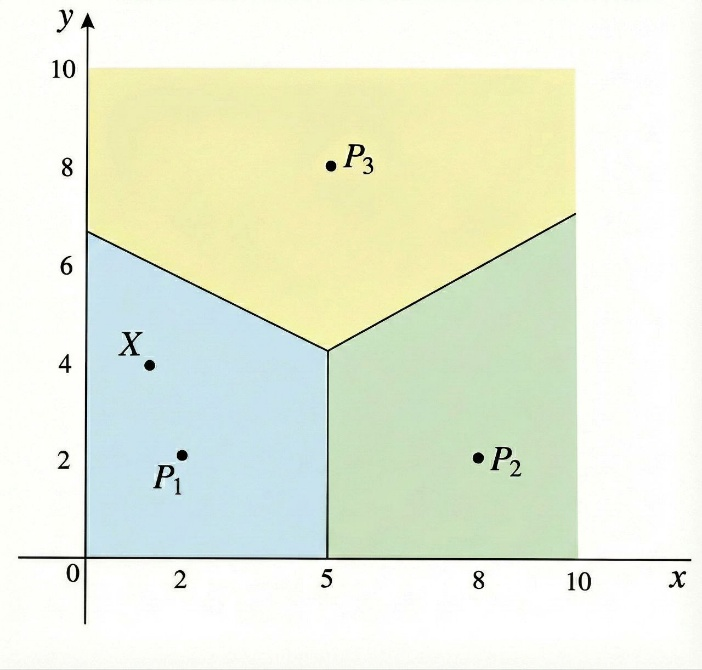{width="3.3680555555555554in" height="3.6230785214348207in"}

*Նկար 2.13 - Սենյակի տրոհումը երեք մասի Վորոնովի Դիագրամի կիրառմամբ։*

բ) n -- տվյալ միջավայրում ազդանշանի մարման գործակիցն է, այն ցույց է տալիս, թե հեռավորության մեծացմանը զուգընթաց ազդանշանը ինչ արագությամբ է նվազում։ n-ի արժեքների համար հայտնի է 2.1 աղյուսակը։ Որքան շատ են արգելքները, այնքան մեծ է n-ը և, հետևաբար RSSI-ը արագ է թուլանում։

գ) d-ն տվիչից մինչև օբյեկտ հեռավորությունն է (մետրերով)։

Օրինակ\` եթե տվյալ տվիչի՝ BLE А=-59dBm, միջավայրը օֆիսային է\` n=3, իսկ RSSI = -70dB, ապա.

$$d = 10^{\frac{A - RSSI}{10n}} = 10^{\frac{11}{30}} \approx 2.32մ$$

| Միջավայր                            | n        |
|-------------------------------------|----------|
| Բաց տարածություն                    | 1.6 -- 2 |
| Փակ տարածք առանց միջնապատերի        | 2 -- 3   |
| Օֆիս, միջնապատերը գիպսակարտոն       | 3 - 4    |
| Բետոնային միջնապատեր, շատ արգելքներ | 4 - 6    |

*Աղյուսակ 2.1 Միջավայրից ստացված ազդանշանի մարման գործակիցները:*

Այժմ դիտարկենք հետևյալ խնդիրը․

**Խնդիր 2։** $12 \times 8$ (մ) չափերով առանց միջնապատերի սենյակում տվիչները ՝ $P_{1}(2;\ 2),\ P_{2}(10;\ 2),\ \ P_{3}(6;6)$, իսկ օբյեկտի դիրքն է՝ X(4; 2): Որպես RSSI-ի մոդել վերցնենք պարզ լոգարիթմական մոդելը։

Ունենք՝ $P_{1}X = 2;\ P_{2}X = 6;\ P_{3}X = 2\sqrt{5} \approx 4.47$: Վորոնովի Էվկլիդյան դիագրամից պարզ է դառնում, որ X օբյեկտը գտնվում է այն տվիչի բջիջում, որից Էվկլիդյան հեռավորությունն ամենափոքրն է, այսինքն գտնվում է $P_{1}$ կենտրոնով բջիջում։ Վերցնելով A=-40dBm և կատարելով (2.1) բանաձևով հաշվարկներ, կստանանք (n=2):

${RSSI}_{1} = - 46dBm;\ {RSSI}_{2} \approx - 55.56dBm;\ {RSSI}_{3} = - 53dBm$։

Ամենամեծ ազդանշանը $P_{1}$-ից է, և նորից ստանում ենք նույն բջիջը։ Այժմ նկարագրված խնդրում ավելացնենք ուղղահայաց պատ (5; 0) կետից մինչև (5; 5)։ Հաշվարկներն էլ ավելի ճշգրտության համար (2.1) բանաձևի փոխարեն օգտվենք․

> $RSSI = A - 10*nlgd - \sum_{k = 0}^{n}W_{k}$, (2.2)

որտեղ $W_{k}$-ն ազդանշանի կորուստն է k-րդ արգելքի վրա։ Ստորև տրված է այդ գործակցի արժեքների 2.1 աղյուսակը:

| Պատ (արգելք) | Կորուստ dB |
|--------------|------------|
| Գիպսակարտոն  | 2-4        |
| Փայտ         | 4-6        |
| Աղյուս       | 8-15       |
| Երկաթբետոն   | 15-25      |
| Մետաղ        | 20-30      |

*Աղյուսակ 2.2 գործակցի արժեքների աղյուսակը:*

$XP_{3}\ և\ XP_{2}$ ճառագայթները հատում են պատը, իսկ $XP_{1}$ -- ը՝ ոչ։ Պարամետրերի արժեքները վերցնենք A = -40dBm, n = 2, W = 12dB (աղյուս):

Արժեքները տեղադրելով (2.2)-ի մեջ, կստանանք\`

${RSSI}_{1} \approx - 46dBm$ (առանց փոփոխության, քանի որ $P_{1} \rightarrow X$ ճանապարհին պատ չկա),

> ${RSSI}_{2} \approx - 67.56dBm$,
>
> ${RSSI}_{3} \approx - 65dBm$։

Այսպիսով, կրկին ստանում ենք, որ X-ը գտնվում է $P_{1}$կենտրոնով Վորոնովի բջիջում (Նկար 2.14)։

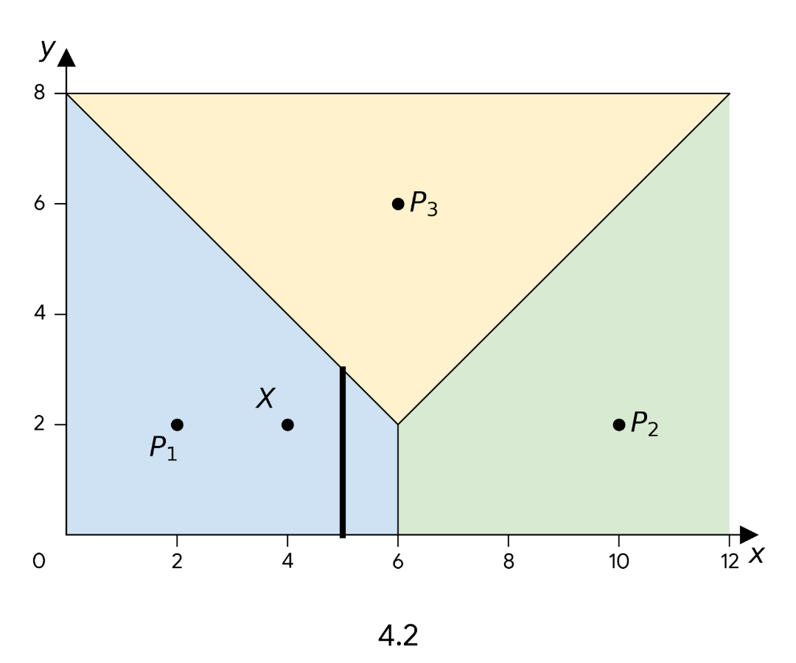{width="4.340972222222222in" height="3.2597867454068243in"}

*Նկար 2.14 - Վորոնովի Դիագրամի պատկերումը X կետով ։*

Դիտարկենք հաջորդ խնդիրը։

**Խնդիր 3:** Դիցուք այժմ նույն $12 \times 8$ սենյակում ունենք $P_{1}(2;\ 2),\ P_{2}(10;\ 2),\ \ P_{3}(6;6),\ $

$P_{4}(2;6)$, տրված է x=5, $0 \leq y \leq 5$ պատ և հայտնի են ${RSSI}_{1} = - 46dBm,\ {RSSI}_{4} = - 53dBm,\ $

${RSSI}_{3} = - 61dBm,\ {RSSI}_{2} = - 63dBm\ $:

Ըստ RSSI-ի տվյալների ունենք․

$P_{1} \prec P_{4} \prec P_{3} \prec P_{2}$,

որտեղ $\prec$ - սիմվոլը նշանակում է, որ «$պետք\ է\ լինի\ մոտ$» ։

Եթե $P_{5}$-ով նշանակենք պատը որոշող հատվածը, ապա $G = \left\{ (x;y) \right|0 \leq x \leq 12;0 \leq y \leq 8\}$ տիրույթում $P_{1},\ \ P_{2},\ \ P_{3},\ \ P_{4},\ \ P_{5}\ $օբյեկտների Վորոնովի 2-րդ կարգի դիագրամի յուրաքանչյուր $V_{\left( P_{k},P_{m}\  \right)}$ -- բջիջ սահմանվում է․

$V_{\left( P_{k},P_{m}\  \right)} = \left\{ M(x;y)\ \epsilon\ G \right|\ \rho\left( M;P_{j} \right) \leq \rho\left( M;P_{i} \right);\ j = m;k;m < k;i \neq j;\ i,j,m,k = 1,2,3,4,5\}$, որտեղ $\rho(M;P)$-ն M կետի հեռավորությունն է P օբյեկտից։

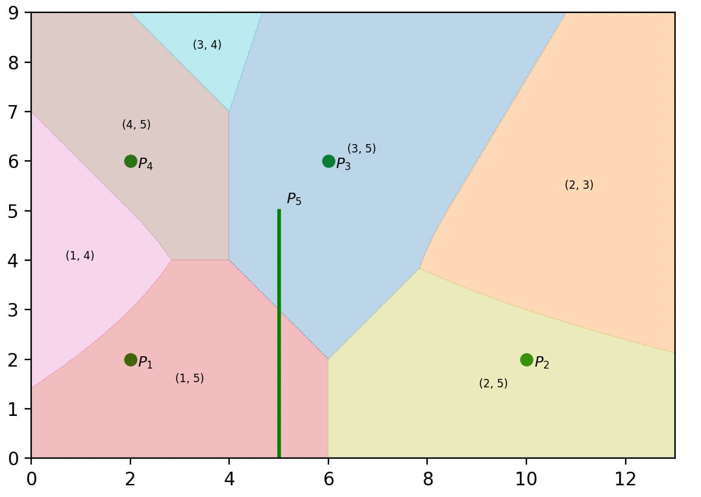{width="5.034882983377078in" height="3.571120953630796in"}

*Նկար 2.15 -- Երկրորդ կարգի Վորոնովի Դիագրամի պատկերումը խոչընդոտների դեպքում։*

Ունենք $A = - 40dBm$, n=2, պատը տալիս է $8dBm$: Ըստ (2.2) բանաձևի հեռավորությունը կհաշվենք\`

$$d = 10^{\frac{A - RSSI - W}{10n}}$$

բանաձևով։

$P_{1}$-ի համար՝ $d_{1} = 10^{\frac{- 40 + 46}{20}} = 1.995մ$,

$P_{4}$-ի համար՝ $d_{2} = 10^{\frac{- 40 + 53}{20}} = 4.47մ$,

$P_{3}$-ի համար՝ $d_{3} = 10^{\frac{- 40 + 61 - 8}{20}} = 4.47մ$,

$P_{2}$-ի համար՝ $d_{4} = 10^{\frac{- 40 + 63 - 8}{20}} = 5.62մ$։

Դիտարկենք $P_{1}$ կենտրոնով և $d_{1}$ շառավղով շրջանագիծը

${(x - 2)}^{2} + {(y - 2)}^{2} = {d_{1}}^{2}$։

$P_{4}$ կենտրոնով և $d_{4}$ շառավղով շրջանագծի համար կունենանք

$${(x - 2)}^{2} + {(y - 6)}^{2} = {d_{4}}^{2}$$

Այդ շրջանագծերի հատումից կստանանք․

$\left\{ \begin{array}{r}
{(x - 2)}^{2} + {(y - 2)}^{2} = {d_{1}}^{2} \\
{(x - 2)}^{2} + {(y - 6)}^{2} = {d_{4}}^{2}
\end{array} \right.\  = > (0;2)\ կամ\ (4;2)$։

Ստուգենք (4; 2) կետը։ $P_{3}$ կետից դրա հեռավորությունը կլինի $\sqrt{{(4 - 6)}^{2} + {(2 - 6)}^{2}} \approx 4.47$ համնկնում է $d_{3}$ հետ։ Տեսնենք (4; 2) և (6; 6) կետերն իրար միացնող ուղիղը հատում է պատը։ Պարզագույն հաշվարկով ուղիղը հատում է (5; 4) կետում, ուստի 8dBm տուգանային արժեքը ճիշտ է վերցնել։ $P_{2}$ կետից հեռավորությունը ՝ $\sqrt{{(4 - 10)}^{2} + {(2 - 2)}^{2}} = 6$, շատ մոտ է $d_{2}$-ին։

(0; 2) կետի դեպքում հեռավորությունը $P_{3}$-ից՝ $\sqrt{36 + 16} \approx 7.2$, բայց պետք է լինի 4.47 ուստի այս դեպքը չի դիտարկվի։

Այսպիսով օբյեկտի հնարավոր դիրքը՝ (4; 2) - ն է։ (նկար 2.16)

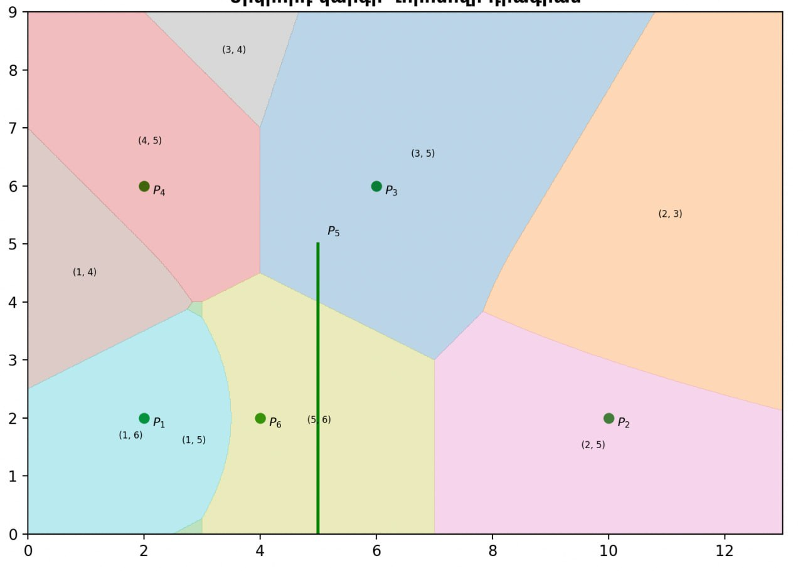{width="5.125in" height="3.611570428696413in"}

Նկար 2.16 -- Երկրորդ կարգի Վորոնովի դիագրամի պատկերումը նոր օբյեկտի հնարավոր դիրքով։

Բարձր կարգի Վորոնովի դիագրամները հաճախ օգտագործվում են այնպիսի իրավիճակներում, երբ մի քանի դրոններ պետք է համատեղ վերահսկեն կամ սպասարկեն տարածք կամ օբյեկտներ։ Սա կիրառվում է որոնողական գործողություններում, հրդեհների մոնիթորինգում, սահմանների հսկման մեջ և այլն։

Ներկայացնենք կոնկրետ կիրառական խնդիր՝ կորած մարդու որոնում մի քանի դրոններով։ Դիցուք տրված է որոնման տարածք.

$$\Omega \in \ R^{2}$$

oրինակ՝ անտառ կամ լեռնային տարածք։ Կան k հատ որոնող դրոններ․

$D_{1},\ D_{2},\ \ldots,\ D_{k}$:

Պետք է որոնումը կազմակերպել այնպես, որ․

ա) ամբողջ տարածքը ստուգվի հնարավորինս արագ,

բ) դրոնները չկրկնեն նույն աշխատանքը,

գ) որոնումը լինի հավասարաչափ։

Տվյալ պահին կառուցվում է $D_{i}$ դրոնների (որպես $R^{2}$-ի կետերի) երրորդ կարգի Վորոնովի դիագրամ։ Այդ դիագրամի կամայական բջջի յուրաքանչյուր կետ հսկվում է(ստուգվում է) երեք դրոններով։ Այդ պահին պետք է հաշվարկվի յուրաքանչյուր բջջի (որը բազմանկյուն է) կենտրոնը: Եթե այդ բազմանկությունը ունի

$$\left( x_{1},\ y_{1} \right),\ \left( x_{2},\ y_{2} \right),\ \ldots\ \left( x_{n},\ y_{n} \right)$$

գագաթներ, ապա դրա մակերեսը՝

$A = \frac{1}{2}\ \sum_{i = 1}^{n}{(x_{i}y_{i + 1} - x_{i}y_{i + 1})}$,

իսկ կենտրոնը ՝

$$C_{x} = \frac{1}{6A}\sum_{i = 1}^{n}{(x_{i} + x_{i + 1})(x_{i}y_{i + 1} - x_{i}y_{i + 1})}$$

$$C_{y} = \frac{1}{6A}\sum_{i = 1}^{n}{(y_{i} + y_{i + 1})(x_{i}y_{i + 1} - x_{i}y_{i + 1})}$$

(որտեղ $x_{n + 1} = x_{1}$, $y_{n + 1} = y_{1}$):

Յուրաքանչյուր բջիջ համապատասխանում է երեք դրոններին։ Սա նշանակում է որ մի դրոն սովորաբար մասնակցում է մի քանի 3-րդ կարգի բջիջների կառուցվածքում։ Օրինակ՝ $D_{i}$-ն կարող է մասնակցել $V_{3}\left( D_{i},\ D_{j},\ D_{k} \right),\ V_{3}\left( D_{i},\ D_{j},\ D_{l} \right),\ V_{3}(D_{i},\ D_{k},\ D_{l})$ բջիջների կառուցվածքում։ Եթե այդ բջիջների կենտրոնները՝

$C_{ijk},\ C_{ijl},\ C_{jkl}$:

$D_{i}$ դրոնի շարժման նպատակակետը վերցվում է դրանց միջինը․

$$T_{i} = \frac{C_{ijk} + C_{ijl} + \ C_{jkl}}{3}$$

Դրոնի շարժման հետագիծը կտրվի

$\dot{D_{i}}$ $= k(T_{i} - D_{i})$

Բանաձևով, որտեղ $(T_{i} - D_{i})$ վեկտորը ցույց է տալիս ուղղությունը դեպի նպատակակետը, k\>0 արագության գործակից, $\dot{D_{i}}$-դրոնի արագության վեկտորն է, որը ցույց է տալիս, թե ինչ արագությամբ և որ ուղղությամբ պետք է շարժվի դրոնը։ $i$-րդ դրոնի տեղը (դիրքը) ժամանակի t պահին՝ $D_{i}(t)$:

$$D_{i}(t) = T_{i} + (D_{i}(0) - \ T_{i})e^{- kt}$$

Սկզբնական փուլում $k = 0.3$: Այն պահին, երբ դրոններից մեկը (կամ մի քանիսը) հայտնաբերում են փնտրվողին (որն այդ պահին ինչ-որ բջիջում է), ապա այն 3 դրոնները, որոնք պատասխանատու են տվյալ բջիջի համար, կտրուկ մեծացնում են իրենց k-ն (օրինակ՝ k=1.5), իսկ մնացած դրոններից կարող են փոքրացնել իրենց k-ն, որպեսզի խնայեն էներգիան և չխանգարեն հիմնական խմբին։

**Խնդիր 4:** $2000 \times 2000$մ քառակուսի տարածքում 10 դրոնների օգնությամբ իրականցնել կորած մարդու որոնում (դրոնների թռնում են միևնույն կետից, պատահական ձևով բաշխվում են տարածքում և ինչ-որ պահից սկսած համակարգը սկսում է աշխատել)։

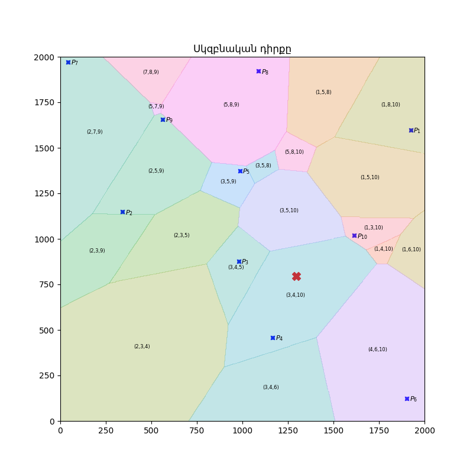{width="5.444582239720035in" height="5.313953412073491in"}

Նկար 2.17 -- Դրոնների սկզբնական դիրքով երրորդ կարգի Վորոնովի դիագրամի կառուցումը։

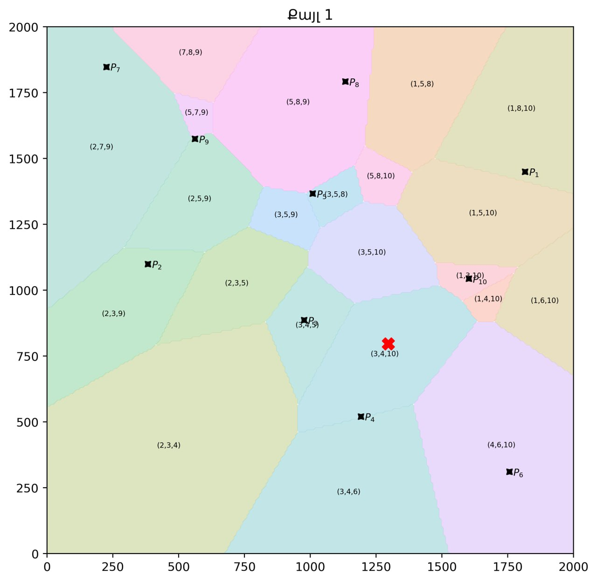{width="4.949384295713036in" height="4.821782589676291in"}

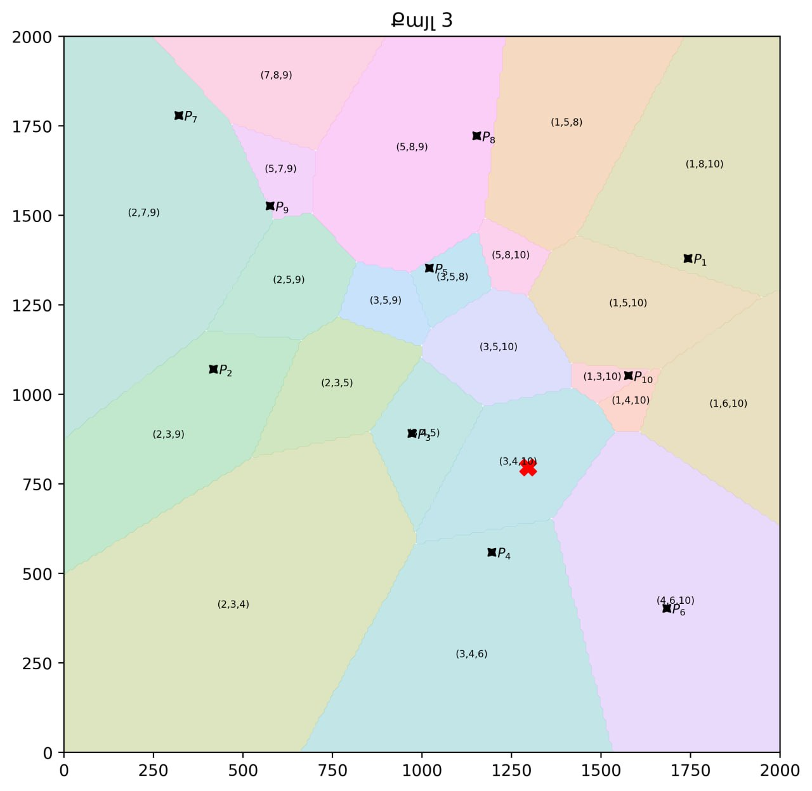{width="4.941066272965879in" height="4.81367782152231in"}

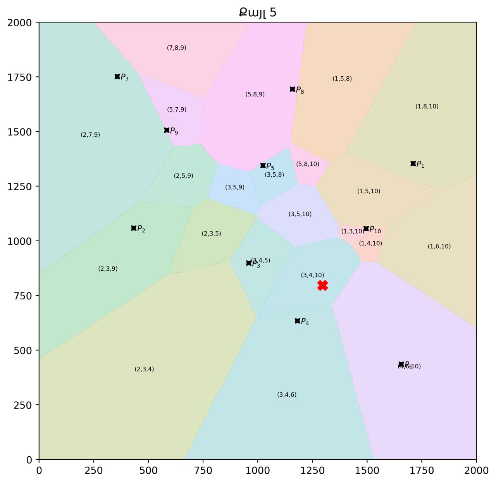{width="4.792080052493438in" height="4.668531277340333in"}

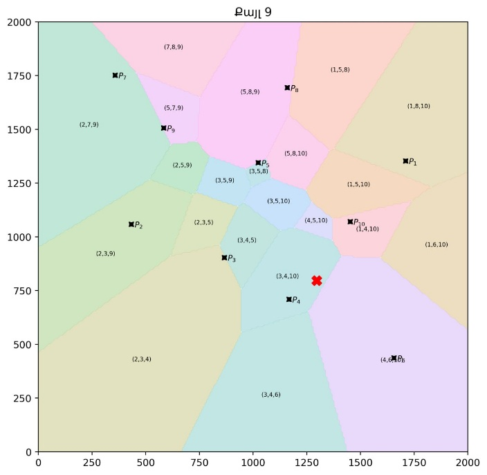{width="4.9603958880139984in" height="4.832509842519685in"}

*Նկար 2.18 -- Խնդրի լուծման ընթացքի քայլերը։*

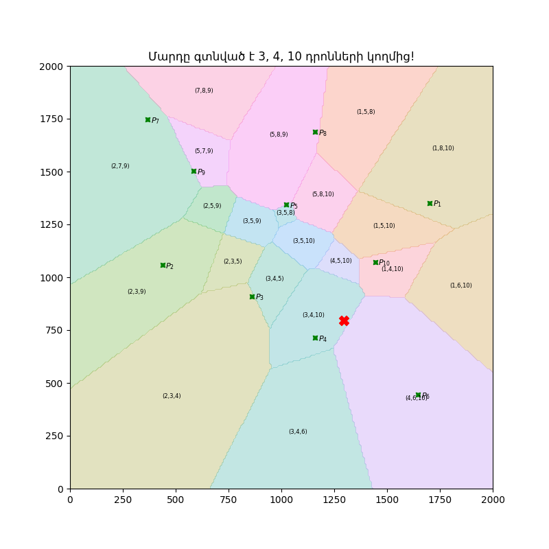{width="5.811882108486439in" height="5.663366141732284in"}

*Նկար 2.19 -- Խնդրի լուծման արդյունքը՝ դրոնները հայտնաբերեցին մարդուն։*

# ԳԼՈՒԽ 3․ ԱՌԱՋԱՐԿՎԱԾ ԽՆԴԻՐՆԵՐԻ ԼՈՒԾՈՒՄՆԵՐԸ

**Խնդիր 3**

import matplotlib.pyplot as plt

import numpy as np

import sympy as sp

x, y = sp.symbols(\"x y\")

signal_points = \[(2, 2), (10, 2), (6, 6), (2, 6), ((5, 0), (5, 5))\]

def is_point(p):

    return isinstance(p\[0\], (int, float))

def is_segment(s):

    return isinstance(s\[0\], tuple)

def dist(M, Q):

    if is_segment(Q):

        x0, y0 = M

        (x1, y1), (x2, y2) = Q

    elif is_segment(M):

        x0, y0 = Q

        (x1, y1), (x2, y2) = M

    else:

        return (M\[0\] - Q\[0\]) \*\* 2 + (M\[1\] - Q\[1\]) \*\* 2

    dx = x2 - x1

    dy = y2 - y1

    t = ((x0 - x1) \* dx + (y0 - y1) \* dy) / (dx\*\*2 + dy\*\*2)

    if isinstance(t, np.ndarray):

        t = np.clip(t, 0, 1)

    elif isinstance(t, sp.Expr):

        t = sp.Max(0, sp.Min(1, t))

    else:

        t = max(0, min(1, t))

    proj_x = x1 + t \* dx

    proj_y = y1 + t \* dy

    return (x0 - proj_x) \*\* 2 + (y0 - proj_y) \*\* 2

def plot_points_and_lines(points):

    for i, p in enumerate(points):

        if is_point(p):

            ax.scatter(p\[0\], p\[1\], color=\"green\", s=40)

            ax.text(

                p\[0\] + 0.15,

                p\[1\] - 0.15,

                f\"\$P\_{{{i+1}}}\$\",

                fontweight=\"bold\",

                fontsize=8,

            )

        else:

            ax.plot(\[p\[0\]\[0\], p\[1\]\[0\]\], \[p\[0\]\[1\], p\[1\]\[1\]\], color=\"green\", linewidth=2)

            ax.text(

                p\[0\]\[0\] + 0.15,

                p\[1\]\[0\] + 0.15,

                f\"\$P\_{{{i+1}}}\$\",

                fontweight=\"bold\",

                fontsize=8,

            )

def get_valid_pairs(res):

    valid_pairs_set = set()

    for i in range(res):

        for j in range(res):

            distances = \[\]

            for idx, obj in enumerate(signal_points):

                d = dist((X\[i, j\], Y\[i, j\]), obj)

                distances.append((d, idx))

            distances.sort()

            pair = tuple(sorted(\[distances\[0\]\[1\], distances\[1\]\[1\]\]))

            valid_pairs_set.add(pair)

    return list(valid_pairs_set)

def get_boundary_equations(data, valid_pairs):

    equations = {}

    n = len(data)

    for pair in valid_pairs:

        i, j = pair

        boundary_equations = \[\]

        for k in range(n):

            if k == i or k == j:

                continue

            boundary_equations.append(dist((x, y), data\[i\]) - dist((x, y), data\[k\]))

            boundary_equations.append(dist((x, y), data\[j\]) - dist((x, y), data\[k\]))

        equations\[(i, j)\] = boundary_equations

    return equations

def plot_diagram(equations):

    areas = \[\]

    keys = list(equations.keys())

    colors = plt.cm.tab10(np.linspace(0, 1, len(keys)))

    for i, key in enumerate(keys):

        mask = np.ones_like(X, dtype=bool)

        for expr in equations\[key\]:

            f = sp.lambdify((x, y), expr, \"numpy\")

            Z = f(X, Y)

            mask &= Z \<= 0

        if np.any(mask):

            ax.contourf(

                X, Y, mask.astype(int), levels=\[0.5, 1.5\], colors=\[colors\[i\]\], alpha=0.3

            )

            center_x = np.mean(X\[mask\])

            center_y = np.mean(Y\[mask\])

            ax.text(

                center_x,

                center_y,

                f\"({key\[0\]+1}, {key\[1\]+1})\",

                fontsize=6,

                ha=\"center\",

                va=\"center\",

            )

            areas.append(mask.sum())

fig, ax = plt.subplots()

ax.set_aspect(\"equal\")

plot_points_and_lines(signal_points)

xs = \[\]

ys = \[\]

for obj in signal_points:

    if is_point(obj):

        xs.append(obj\[0\])

        ys.append(obj\[1\])

    else:

        xs.extend(\[obj\[0\]\[0\], obj\[1\]\[0\]\])

        ys.extend(\[obj\[0\]\[1\], obj\[1\]\[1\]\])

pad = 3

xmax = max(xs)

ymax = max(ys)

xmin = min(xs)

ymin = min(ys)

xMin, xMax = min(xmin, ymin), xmax + pad

yMin, yMax = min(xmin, ymin), ymax + pad

res = 800

xs = np.linspace(xMin, xMax, res)

ys = np.linspace(yMin, yMax, res)

X, Y = np.meshgrid(xs, ys)

validPairs = get_valid_pairs(res)

equations = get_boundary_equations(signal_points, validPairs)

plot_diagram(equations)

plt.title(\"Երկրորդ կարգի Վորոնովի դիագրամ\", fontsize=12)

plt.show()

**Խնդիր 4.**

import matplotlib.pyplot as plt

from matplotlib.animation import FuncAnimation

import seaborn as sns

import numpy as np

import sympy as sp

import math

x, y = sp.symbols(\"x y\")

dt = 0.5

class Drone:

    def \_\_init\_\_(self, id, pos):

        self.id = id

        self.pos = np.array(pos, dtype=float)

        self.k = 0.3

        self.found = False

def dist(M, Q):

    return (M\[0\] - Q\[0\]) \*\* 2 + (M\[1\] - Q\[1\]) \*\* 2

def get_points(count, min_distance, min_val, max_val, compare_points=None):

    if compare_points is None:

        compare_points = \[\]

    random_points = set()

    while len(random_points) \< count:

        x_point = np.random.randint(min_val, max_val)

        y_point = np.random.randint(min_val, max_val)

        valid_position = True

       

        for existing_x, existing_y in random_points:

            distance = math.sqrt(dist((existing_x, existing_y), (x_point, y_point)))

            if distance \< min_distance:

                valid_position = False

                break

        if valid_position:

            for existing_x, existing_y in compare_points:

                distance = math.sqrt(dist((existing_x, existing_y), (x_point, y_point)))

                if distance \< min_distance:

                    valid_position = False

                    break

        if valid_position:

            random_points.add((x_point, y_point))

    return random_points

def plot_points(points, ax, color=\"black\"):

    for i, p in enumerate(points):

        ax.scatter(p\[0\], p\[1\], color=color, s=40, marker=(4, 1, 45))

        ax.text(p\[0\] + 15, p\[1\] - 15, f\"\$P\_{{{i+1}}}\$\", fontweight=\"bold\", fontsize=8)

def get_valid_pairs(res, points, X, Y):

    distances = np.zeros((res, res, len(points)))

    for idx, obj in enumerate(points):

        distances\[:, :, idx\] = dist((X, Y), obj)

    closest_three = np.sort(np.argsort(distances, axis=2)\[:, :, :3\], axis=2)

    unique_rows = np.unique(closest_three.reshape(-1, 3), axis=0)

    return \[tuple(row) for row in unique_rows\]

def get_boundary_equations(data, valid_pairs):

    equations = {}

    n = len(data)

    for pair in valid_pairs:

        i, j, m = pair

        boundary_equations = \[\]

        for k in range(n):

            if k == i or k == j or k == m:

                continue

            boundary_equations.append(dist((x, y), data\[i\]) - dist((x, y), data\[k\]))

            boundary_equations.append(dist((x, y), data\[j\]) - dist((x, y), data\[k\]))

            boundary_equations.append(dist((x, y), data\[m\]) - dist((x, y), data\[k\]))

        equations\[(i, j, m)\] = boundary_equations

    return equations

def plot_diagram(equations, ax, X, Y):

    keys = list(equations.keys())

    cell_data = {}

    colors = sns.color_palette(\"husl\", len(keys))

    for i, key in enumerate(keys):

        mask = np.ones_like(X, dtype=bool)

        for expr in equations\[key\]:

            f = sp.lambdify((x, y), expr, \"numpy\")

            Z = f(X, Y)

            mask &= Z \<= 0

        if np.any(mask):

            ax.contourf(

                X, Y, mask.astype(int), levels=\[0.5, 1.5\], colors=\[colors\[i\]\], alpha=0.3

            )

            cx, cy = np.mean(X\[mask\]), np.mean(Y\[mask\])

            cell_data\[key\] = (cx, cy)

            ax.text(

                cx, cy, f\"({key\[0\]+1},{key\[1\]+1},{key\[2\]+1})\", fontsize=6, ha=\"center\"

            )

    return cell_data

def search_person(drone_objects):

    found_person = False

    for d in drone_objects:

        if np.linalg.norm(d.pos - person_pos) \<= 300:

            found_person = True

            break

    if found_person:

        indices = np.argsort(

            \[np.linalg.norm(do.pos - person_pos) for do in drone_objects\]

        )\[:3\]

        for idx, drone in enumerate(drone_objects):

            if idx in indices:

                drone.k = 6

                drone.found = True

            else:

                drone.k = 0.001

                drone.found = False

    else:

        for drone in drone_objects:

            drone.k = 0.5

            drone.found = False

    return found_person

random_points = get_points(count=10, min_distance=400, min_val=0, max_val=2000)

drones = list(random_points)

drone_objects = \[Drone(i, p) for i, p in enumerate(drones)\]

person_points = get_points(count=1, min_distance=300, min_val=400, max_val=1650, compare_points=drones)

person_pos = list(person_points)\[0\]

res = 600

xs = np.linspace(0, 2000, res)

ys = np.linspace(0, 2000, res)

X, Y = np.meshgrid(xs, ys)

fig1, ax1 = plt.subplots(figsize=(8, 8))

ax1.set_aspect(\"equal\")

ax1.set_title(\"Սկզբնական դիրքը\")

plot_points(drones, ax1, \"blue\")

ax1.scatter(person_pos\[0\], person_pos\[1\], color=\"red\", marker=\"X\", s=100)

valid_pairs1 = get_valid_pairs(res, drones, X, Y)

eqs1 = get_boundary_equations(drones, valid_pairs1)

cell_results = plot_diagram(eqs1, ax1, X, Y)

res = 300

xs = np.linspace(0, 2000, res)

ys = np.linspace(0, 2000, res)

X, Y = np.meshgrid(xs, ys)

Ti_sum = np.zeros((len(drones), 2))

counts = np.zeros(len(drones))

for key, center in cell_results.items():

    for idx in key:

        Ti_sum\[idx\] += center

        counts\[idx\] += 1

for i in range(len(drones)):

    if counts\[i\] \> 0:

        Ti = Ti_sum\[i\] / counts\[i\]

        k = drone_objects\[i\].k

        drone_objects\[i\].pos = Ti + (drone_objects\[i\].pos - Ti) \* math.exp(-k \* dt)

fig2, ax2 = plt.subplots(figsize=(8, 8))

def update_diagram(frame):

    ax2.clear()

    ax2.set_xlim(0, 2000)

    ax2.set_ylim(0, 2000)

    ax2.set_aspect(\"equal\")

    ax2.set_title(f\"Քայլ {frame + 1}\")

    curr_positions = \[tuple(d.pos) for d in drone_objects\]

    v_pairs = get_valid_pairs(res, curr_positions, X, Y)

    eqs = get_boundary_equations(curr_positions, v_pairs)

    current_cell_centers = plot_diagram(eqs, ax2, X, Y)

    Ti_sum = np.zeros((len(drone_objects), 2))

    counts = np.zeros(len(drone_objects))

    for key, center in current_cell_centers.items():

        for idx in key:

            Ti_sum\[idx\] += center

            counts\[idx\] += 1

    person_not_found = search_person(drone_objects)

    arrived = 0

    for i in range(len(drone_objects)):

        d = drone_objects\[i\]

        if counts\[i\] \> 0:

            Ti = Ti_sum\[i\] / counts\[i\]

            if not person_not_found and frame \> 30:

                search_radius = 300

                offset_x = math.sin(frame \* 0.08 + d.id) \* search_radius

                offset_y = math.cos(frame \* 0.05 + d.id) \* search_radius

                target = np.clip(Ti + np.array(\[offset_x, offset_y\]), 100, 1900)

            else:

                target = Ti

            if d.found and np.linalg.norm(d.pos - target) \< 10:

                arrived += 1

            d.pos = target + (d.pos - target) \* math.exp(-d.k \* dt)

    if arrived \>= 3:

        active_drones = \[d.id + 1 for d in drone_objects if d.found\]

        drones_names = \", \".join(map(str, active_drones))

        ax2.set_title(f\"Մարդը գտնված է {drones_names} դրոնների կողմից!\")

        plot_points(\[tuple(d.pos) for d in drone_objects\], ax2, \"green\")

        ax2.scatter(person_pos\[0\], person_pos\[1\], color=\"red\", marker=\"X\", s=100)

        animation.event_source.stop()

        return

   

    plot_points(\[tuple(d.pos) for d in drone_objects\], ax2, \"black\")

    ax2.scatter(person_pos\[0\], person_pos\[1\], color=\"red\", marker=\"X\", s=100)

    \# plt.savefig(f\"frames/frame\_{frame:03d}.png\", dpi=400, bbox_inches=\'tight\')

animation = FuncAnimation(fig2, update_diagram, frames=150, interval=200, repeat=False)

\# animation.save(\'frames/drone_search.gif\', writer=\'pillow\', fps=50)

plt.show()

ՀԱՅԱՍՏԱՆԻ ԱԶԳԱՅԻՆ ՊՈԼԻՏԵԽՆԻԿԱԿԱՆ ՀԱՄԱԼՍԱՐԱՆ (ՀԻՄՆԱԴՐԱՄ)

«Լեռնամետալուրգիայի և քիմիական տեխնոլոգիաների» ինստիտուտ

> «Քիմիական տեխնոլոգիաներ, բնապահպանություն և կենսագործունեության անվտանգություն» ամբիոն
>
> ԱՎԱՐՏԱԿԱՆ ԱՇԽԱՏԱՆՔԻ ԱՌԱՋԱԴՐԱՆՔ

«ԿԵՆՍԱԳՈՐԾՈՒՆԵՈՒԹՅԱՆ ԱՆՎՏԱՆԳՈՒԹՅՈՒՆ» ԲԱԺՆԻՑ

> Ինստիտուտ [ԿՄ և Ֆ\_\_\_\_\_\_\_\_\_\_\_\_\_\_\_\_\_\_\_\_\_\_\_\_\_\_\_\_\_\_\_\_\_\_\_\_\_\_\_\_\_\_\_]{.underline}
>
> Խումբ [ՄԹ 240]{.underline}
>
> Ուսանող [Սարդարյան Սուսաննա Հարությունի]{.underline}
>
> Խորհրդատու [Սերգեյ Սամվելի Խաչատրյան ասիստենտ, տ․գ․թ․]{.underline}
>
> ԵՐԵՎԱՆ 2026
>
> ԱՌԱՋԱԴՐԱՆՔԻ ԹԵՄԱ

[Վորոնովի դիագրամի կիրառումը վտանգավոր գործոնի (փոշի) աղբյուրներով փակ տարածքում, օդափոխության համակարգի օպտիմալ իրականացման համար]{.underline}

ԱՌԱՋԱԴՐՎՈՂ ԳՐԱԿԱՆՈՒԹՅՈՒՆ

1\. Խալաթյան Ռ.Պ., Սարգսյան Ս.Հ, Խիզանցյան. Կ.Մ. - Կենսագործունեու-թյան անվտանգություն: Մեթոդականձեռնարկ: ՀԱՊՀ Երևան-Ճարտարագետ 2022-280 էջ:

2\. Ջուհարյան Օ.Ա., Սաղաթելյան Ա.Կ. --Կենսագործունեության անվտան-գություն.-Եր.: ՀՀԳԱԱ Էկոլոգանոոսֆերային հետազոտությունների կենտրոնի հրատ., 2005, 187էջ:

3\. Семехин Ю.Г. -- Безопасность жизнедеятельности. Учебник / Под общ. ред. д. тех. наук, проф. Б.Ч. Месхи -- М.: ИНФРА -- М: Академцентр, 2018.- 288.

4\. Михайлов Ю. М. - Охрана труда в офисе; М.: Издательство Аьфа-- Пресс, 2010.- 256с.

5\. Русак О.Х. и другие -- Безопасность жизнедеятельности. Санкт-Петербург, 2011.

Առաջադրանքը տրված է ["03".12. 25]{.underline}

> Խորհրդատու՝ [Սերգեյ Սամվելի Խաչատրյան ասիստենտ, տ.գ]{.underline}.թ.

# ԳԼՈՒԽ 4. ՎՈՐՈՆՈՎԻ ԴԻԱԳՐԱՄԻ ԿԻՐԱՌՈՒՄԸ ՎՏԱՆԳԱՎՈՐ ԳՈՐԾՈՆԻ (ՓՈՇԻ) ԱՂԲՅՈՒՐՆԵՐՈՎ ՓԱԿ ՏԱՐԱԾՔՈՒՄ, ՕԴԱՓՈԽՈՒԹՅԱՆ ՀԱՄԱԿԱՐԳԻ ՕՊՏԻՄԱԼ ԻՐԱԿԱՆԱՑՄԱՆ ՀԱՄԱՐ {#գլուխ-4.-վորոնովի-դիագրամի-կիրառումը-վտանգավոր-գործոնի-փոշի-աղբյուրներով-փակ-տարածքում-օդափոխության-համակարգի-օպտիմալ-իրականացման-համար}

Փակ արտադրական և գրասենյակային տարածքներում վնասակար գործոնների վերահսկումը հանդիսանում է կենսագործունեության անվտանգության հիմնարար խնդիրներից մեկը։ Օդում կախված փոշին դասվում է առավել տարածված և առողջության համար վտանգավոր գործոնների շարքին, քանի որ այն կարող է առաջացնել շնչառական համակարգի խանգարումներ, մասնագիտական հիվանդություններ, ալերգիկ ռեակցիաներ և աշխատունակության նվազում \[1\], \[2\], \[3\]։

Արտադրական միջավայրում օդի որակի ապահովման հիմնական տեխնիկական միջոցներից է արդյունավետ օդափոխության համակարգի նախագծումն ու շահագործումը \[4\], \[5\], \[6\]։ Սակայն բազմաղբյուր աղտոտման պայմաններում օդի հոսքերի ճիշտ կազմակերպումը պահանջում է տարածական վերլուծություն և մաթեմատիկական մոդելավորում։ Այս համատեքստում նպատակահարմար է կիրառել Վորոնովի դիագրամը՝ որպես տարածքի բաժանման և վտանգի գոտիների վերլուծության գործիք։

Փոշին հանդիսանում է պինդ մասնիկների դիսպերս համակարգ, որը կախված վիճակում առկա է օդում։ Այն կարող է լինել անօրգանական (մետաղական, սիլիկատային), օրգանական կամ խառը բնույթի։ Փոշու մասնիկների չափը, քիմիական կազմը և կոնցենտրացիան որոշում են դրա վտանգավորության աստիճանը \[1\], \[2\]։

Փոշու ազդեցության հիմնական հետևանքներն են՝

- շնչառական ուղիների գրգռում,

- թոքերի քրոնիկական հիվանդություններ,

- ֆիբրոգեն ազդեցություն,

- աշխատունակության և արտադրողականության նվազում \[3\], \[5\]։

Փակ տարածքներում աղտոտիչների բաշխումը սովորաբար անհամասեռ է, քանի որ կախված է օդի հոսքերի ուղղությունից, աղբյուրների տեղակայությունից և տարածքի երկրաչափությունից \[4\]։ Հետևաբար անհրաժեշտ է գնահատել ոչ միայն փոշու միջին կոնցենտրացիան, այլև դրա տարածական բաշխումը։

Օդափոխության համակարգի հիմնական նպատակը վնասակար նյութերի հեռացումն է և մաքուր օդի մատակարարումը՝ պահպանելով նորմատիվային թույլատրելի սահմանները \[5\]։

Օդափոխության արդյունավետությունը պայմանավորված է հետևյալ գործոններով․

- օդի հոսքի արագությամբ,

- ներմուծման և արտածման բացվածքների տեղադրմամբ,

- տարածքի բարձրությամբ և ծավալով,

- աղտոտման աղբյուրների դիրքով \[4\]։

Միայն օդափոխության ծավալի մեծացումը բավարար չէ համակարգի արդյունավետությունը բարձրացնելու համար․ անհրաժեշտ է ապահովել օդի հոսքերի ռացիոնալ բաշխում և նվազեցնել «մեռած գոտիների» առաջացումը \[3\], \[5\]։

Այս խնդիրը կարելի է դիտարկել որպես օպտիմալացման խնդիր, որտեղ անհրաժեշտ է գտնել օդափոխիչների տեղադրման այնպիսի սխեմա, որը նվազագույնի կհասցնի վտանգավոր գործոնի տարածական կոնցենտրացիան։

Փակ տարածքում փոշու տարածումը կարելի է գնահատել հեռավորության ֆունկցիայի միջոցով։ Եթե յուրաքանչյուր աղբյուր ունի ինտենսիվություն $w_{i}$, ապա կարելի է սահմանել կշռված հեռավորություն․

$$d_{w}(x,p_{i}) = \frac{d(x,p_{i})}{w_{i}}.$$

Երկրորդ կարգի մոտեցման դեպքում տարածքի յուրաքանչյուր կետի ռիսկը կարելի է գնահատել հետևյալ ֆունկցիայով․

$$R(x) = \frac{1}{d_{1}} + \frac{1}{d_{2}},$$

որտեղ $d_{1}$և $d_{2}$համապատասխանաբար երկու ամենամոտ աղբյուրների հեռավորություններն են։

Բարձր $R(x)$ արժեքները բնորոշ են համակցված ազդեցության գոտիներին։ Օդափոխիչների տեղադրումը նման կետերում նպաստում է առավելագույն աղտոտման հեռացմանը։Այս մոտեցումը հնարավորություն է տալիս․

- բացահայտել բարձր ռիսկային հատվածները,

- նվազեցնել ընդհանուր կոնցենտրացիայի ինտեգրալ արժեքը,

- ապահովել օդի հոսքերի հավասարաչափ բաշխում,

- բարձրացնել աշխատողների անվտանգության մակարդակը \[1\], \[5\]։

Վորոնովի երկրորդ կարգի դիագրամի կիրառումը փոշու աղբյուրներով փակ տարածքներում թույլ է տալիս կատարել տարածական վերլուծություն և ստանալ ինժեներական հիմնավորված լուծումներ օդափոխության նախագծման համար։ Մեթոդը ապահովում է.

- արտադրական միջավայրի սանիտարահիգիենիկ ցուցանիշների բարելավում,

- վտանգավոր գործոնների վերահսկման արդյունավետության բարձրացում,

- էներգախնայող լուծումների ընտրություն,

- նորմատիվ պահանջների պահպանում \[2\], \[4\], \[6\]։

Այսպիսով, մաթեմատիկական մոդելավորման և կենսագործունեության անվտանգության սկզբունքների համադրումը հնարավորություն է տալիս ստեղծել գիտականորեն հիմնավորված օդափոխության օպտիմալ համակարգեր՝ ուղղված աշխատողների առողջության և անվտանգ աշխատանքի պայմանների ապահովմանը։

Երկրորդ կարգի Վորոնովի դիագրամի կառուցումը թույլ տվեց սահմանել այն գոտիները, որտեղ միաժամանակ գերակշռում է երկու փոշու աղբյուրների ազդեցությունը։ Ստացված տարածական քարտեզը ցույց տվեց, որ առավել մեծ համակցված ազդեցություն դիտվում է կենտրոնական հատվածում, որտեղ միաժամանակ ներգործում են հարակից երեք արտադրական հանգույցներ։

Դիտարկվում է 12×10 մ չափերով փակ արտադրական տարածք, որտեղ տեղակայված են 8 կետային փոշու աղբյուրներ՝ տարբեր ինտենսիվություններով.

$$S_{i} = (x_{i},y_{i},w_{i})$$

Որտեղ\` $x_{i},y_{i}$ աղբյուրի կոորդինատներն են, իսկ $w_{i}$ փոշու արտանետման ինտենսիվությունը։

Տրված են հետևյալ աղբյուրները\` (2, 2, 1.2), (10, 2, 1.0),  (6, 6, 1.5), (2, 6, 0.9), (9, 5, 1.3),

(4, 1, 0.8), (8, 7, 1.1), (1, 4, 1.0)։ Նպատակն է՝ գտնել օդափոխության համակարգի արտածման բացվածքի օպտիմալ տեղադրումը, որպեսզի նվազեցվի փոշու համակցված ազդեցությունը շնչառական գոտում։

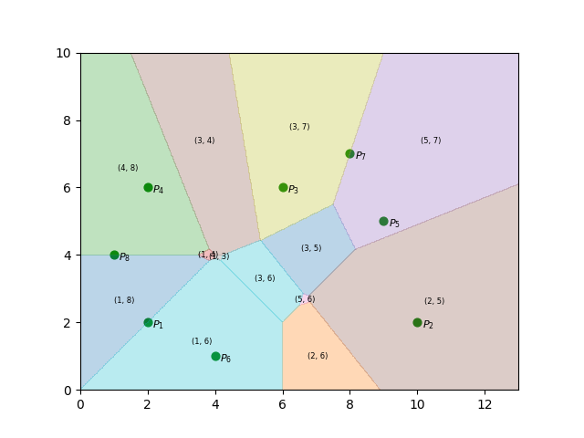{width="5.041666666666667in" height="3.9798490813648293in"}

Նկար 4.1.Երկրորդ կարգի Վորոնովի դիագրամը 8 կետային փոշային աղբյուրների համար։

Նկար 8.1. պատկերված Կանաչ կետերըը փոշու աղբյուրներն են՝ հաստոցներ, սարքավորումներ և այլն։ Գունավոր տարածքները՝ ցույց է տալիս այն տարածքը, որտեղ. տվյալ տարածքի յուրաքանչյուր կետի համար նույն երկու աղբյուրներն են ամենամոտը։ Այսինքն՝ այդ գոտիներում գործում է երկու աղբյուրների համակցված ազդեցություն։

Կառուցված երկրորդ կարգի Վորոնովի դիագրամը ցույց է տալիս փոշու աղբյուրների համակցված ազդեցության տարածական բաշխումը։ Յուրաքանչյուր գունավոր բջիջ համապատասխանում է այն տարածքին, որտեղ երկու կոնկրետ աղբյուրներ հանդիսանում են ամենամոտը և ձևավորում են գերակշռող ազդեցություն։

Դիագրամի կենտրոնական հատվածում դիտվում են փոքր մակերես ունեցող բջիջներ, ինչը վկայում է աղբյուրների խտության բարձր մակարդակի մասին։ Նման հատվածներում համակցված փոշային ազդեցությունը առավել ինտենսիվ է և պահանջում է օդափոխության համակարգի նպատակային տեղադրում։

Այսպիսով, ստացված դիագրամը թույլ է տալիս սահմանել առավել ռիսկային գոտիները և հիմնավորել օդափոխության բացվածքների օպտիմալ տեղադրումը։

Ցույց տանք նաև մաթեմատիկորեն ընտրենք կենտրոնական հատվածի ներկայացուցիչ $P = (7,5)$ կետը։ Հաշվելով հեռավորությունը հետևյալ բանաձևով․

$$d = \sqrt{\left( x - x_{i})^{2} + (y - y_{i})^{2} \right.\ }$$

Հաշվենք հեռավորությունը (6, 6) և (9,5) կետերից․

$$d_{1} = \sqrt{\left( 7 - 6)^{2} + (5 - 6)^{2} \right.\ } = \sqrt{1 + 1} = \sqrt{2} = 1.41$$

$$d_{2} = \sqrt{\left( 7 - 9)^{2} + (5 - 5)^{2} \right.\ } = \sqrt{4} = 2
$$Ռիսկը (7,5) կետի համար կստանանք․

$${R(7,5) = \frac{1}{1.41} + \frac{1}{2}
}{R(7,5) = 0.709 + 0.5
}{R(7,5) = 1.209
}$$Ընտրենք անկյունային հատվածի ներկայացուցիչ $Q = (1,1)$ կետը և հաշվենք հեռավորությունը (2,2) և (4,10) կետերից.

$${d_{1} = \sqrt{\left( 1 - 2)^{2} + (1 - 2)^{2} \right.\ } = \sqrt{1 + 1} = \sqrt{2} = 1.41
}{d_{2} = \sqrt{\left( 1 - 4)^{2} + (1 - 1)^{2} \right.\ } = \sqrt{9} = 3}$$

Ռիսկը (1,1) կետի համար կստանանք․

$${R(1,1) = \frac{1}{1.41} + \frac{1}{3}
}{R(1,1) = 0.709 + 0.333
}{R(1,1) = 1.042}$$

Կատարված հաշվարկները և վերլուծությունը ցույց են տալիս, քանի որ $R(7,5) > R(1,1)$*  
*կենտրոնական հատվածում համակցված փոշային ազդեցությունը ավելի բարձր է, քան անկյունային հատվածում։

**Եզրակացություն**

Կատարված հաշվարկները և տարածական վերլուծությունը ցույց են տալիս, որ արտադրական տարածքում 8 փոշու աղբյուրների դեպքում երկրորդ կարգի Վորոնովի դիագրամի կիրառումը հանդիսանում է օդափոխության համակարգի տեղադրման տեխնիկապես հիմնավորված միջոցառում։

Ստացված արդյունքները ցույց են տալիս, որ․

- տարածքի կենտրոնական հատվածում ձևավորվում են բարձր ռիսկային գոտիներ,

- համակցված ազդեցության արժեքը առավելագույն է այն կետերում, որտեղ երկու աղբյուրների հեռավորությունները նվազագույն են,

- ռիսկի ֆունկցիայի արժեքները կենտրոնական գոտում գերազանցում են ծայրամասային հատվածների ցուցանիշները, աղբյուրների խտության աճը բերում է ազդեցության ինտենսիվության մեծացման։

Հետևաբար երկրորդ կարգի Վորոնովի դիագրամի կիրառումը փակ արտադրական տարածքներում հանդիսանում է նորմատիվային պահանջներին համապատասխան և ինժեներականորեն հիմնավորված լուծում, որն ուղղված է փոշու համակցված ազդեցության նվազեցմանը, օդափոխության համակարգի օպտիմալ տեղադրմանը և աշխատողների առողջության պաշտպանության բարձրացմանը։

**ՀԱՅԱՍՏԱՆԻ ԱԶԳԱՅԻՆ ՊՈԼԻՏԵԽՆԻԿԱԿԱՆ ՀԱՄԱԼՍԱՐԱՆ (ՀԻՄՆԱԴՐԱՄ)**

[Էներգետիկայի և Էլեկտրատեխնիկայի ինստիտուտ]{.underline}

[«Ջերմաէներգետիկա և շրջակա միջավայրի պաշտպանություն»]{.underline}

[ամբիոն]{.underline}

**ԱՎԱՐՏԱԿԱՆ ԱՇԽԱՏԱՆՔԻ ԱՌԱՋԱԴՐԱՆՔ**

«ԲՆԱՊԱՀՊԱՆՈՒԹՅՈՒՆ» ԲԱԺՆԻՑ

> Մասնագիտություն՝ [Ինֆորմատիկա (համակարգչային գիտություն)]{.underline}
>
> Կրթական ծրագիր՝ [Ինֆորմատիկա և կիրառական մաթեմատիկա]{.underline}
>
> Ինստիտուտ/Ֆակուլտետ՝ [ԿՄ և Ֆ ֆակուլտետ]{.underline}
>
> Խումբ՝ [ՄԹ 240]{.underline}
>
> Ուսանող՝ [Սարդարյան Սուսաննա]{.underline}
>
> Խորհրդատու՝ [Կոստանյան Գ.Ռ.]{.underline}

**ԵՐԵՎԱՆ 2026**

**ԱՌԱՋԱԴՐԱՆՔԻ ԹԵՄԱ**

**Վորոնոյի դիագրամների և տեսողական սարքերի կիրառումը բնապահպանական խնդիրների լուծման համար**

**ԱՌԱՋԱԴՐՎՈՂ ԳՐԱԿԱՆՈՒԹՅՈՒՆ**

1.  Մարուխյան Ա.Դ., Գրիգորյան Կ.Ա.: Ավարտական աշխատանքի \<\<Բնապահպանություն\>\> բաժնի կատարման և ձևակերպման ուղեցույց: Երևան, Ճարտարագետ 2019.

2.  Василенко М.А. Нейронные сети в решении экологических проблем развития транспортных услуг // «Инновации и инвестиции» N 4, 2023г.

3.  Лозоватский И. М.: Использование графов для моделирования геоинформационных систем в экологии. // <https://cyberleninka.ru/article/n/ispolzovanie-grafov-dlya-modelirovaniya-geoinformatsionnyh-sistem-v-ekologii>

4.  Arya S., Malamatos T., and [D. M. Mount](https://hy.wikipedia.org/w/index.php?title=David_Mount&action=edit&redlink=1), [Space-Efficient Approximate Voronoi Diagrams](http://www.cs.ust.hk/faculty/arya/pub/stoc02.pdf), Proc. 34th ACM Symp. on Theory of Computing (STOC 2002), pp. 721--730.

5.  [Mark de Berg](https://hy.wikipedia.org/w/index.php?title=Mark_de_Berg&action=edit&redlink=1)*, *[Marc van Kreveld](https://hy.wikipedia.org/w/index.php?title=Marc_van_Kreveld&action=edit&redlink=1)*, *[Mark Overmars](https://hy.wikipedia.org/w/index.php?title=Mark_Overmars&action=edit&redlink=1)*, and *[Otfried Schwarzkopf](https://hy.wikipedia.org/w/index.php?title=Otfried_Schwarzkopf&action=edit&redlink=1)* (2008). Computational Geometry (Third edition ed.). *[Springer-Verlag](https://hy.wikipedia.org/w/index.php?title=Springer-Verlag&action=edit&redlink=1)*. *[ISBN](https://hy.wikipedia.org/wiki/ISBN_(identifier))* *[9783540779742](https://hy.wikipedia.org/wiki/%D5%8D%D5%BA%D5%A1%D5%BD%D5%A1%D6%80%D5%AF%D5%B8%D5%B2:%D4%B3%D6%80%D6%84%D5%A1%D5%B5%D5%AB%D5%B6%D5%A1%D5%B2%D5%A2%D5%B5%D5%B8%D6%82%D6%80%D5%B6%D5%A5%D6%80%D5%A8/9783540779742)*.* 7.4 Farthest-Point Voronoi Diagrams. Includes a description of the algorithm.

6.  *Skyum, Sven (1991). «A simple algorithm for computing the smallest enclosing circle». Information Processing Letters 37(1991)121--125.* , Contains a simple algorithm to compute the farthest-point Voronoi diagram.

7.  <https://upperator.ru/ecology>

Առաջադրանքը տրված է՝ 11.11.2025 թ.

Խորհրդատու՝ Գ.Ռ.Կոստանյան

# ԳԼՈՒԽ 5. ՎՈՐՈՆՈՅԻ ԴԻԱԳՐԱՄՆԵՐԻ և ՏԵՍՈՂԱԿԱՆ ՍԱՐՔԵՐԻ ԿԻՐԱՌՈՒՄԸ ԲՆԱՊԱՀՊԱՆԱԿԱՆ ԽՆԴԻՐՆԵՐԻ ԼՈՒԾՄԱՆ ՀԱՄԱՐ {#գլուխ-5.-վորոնոյի-դիագրամների-և-տեսողական-սարքերի-կիրառումը-բնապահպանական-խնդիրների-լուծման-համար}

Ժամանակակից բնապահպանական խնդիրների արդյունավետ լուծումը հնարավոր է միայն բազմամասնագիտական մոտեցման պայմաններում, որտեղ համադրվում են բնական գիտությունների, ինժեներական էկոլոգիայի և տեղեկատվական համակարգերի մեթոդները։ Բնապահպանական մենեջմենթի և էկոլոգիական անվտանգության ապահովման արդի փուլում շրջակա միջավայրում տեղի ունեցող գործընթացների խորքային ուսումնասիրությունը պահանջում է թվային և մաթեմատիկական գործիքակազմի անհապաղ ներդրում:

Տեսողական համակարգերը (վիդեոմոնիթորինգի ստացիոնար կայաններ, ջերմացույցներ, անօդաչու թռչող սարքեր) այսօր կարևորագույն դեր են խաղում բնապահպանական տվյալների հավաքագրման, ներկայացման և վերլուծության գործընթացում։ Դրանք թույլ են տալիս անընդհատ վերահսկել հսկայական տարածքներ, ֆիքսել էկոլոգիական խախտումները (ապօրինի ծառահատումներ, որսագողություն, հրդեհներ) և հավաքագրված բարդ տվյալները ներկայացնել հասկանալի և ինտուիտիվ ձևով՝ քարտեզների, գրաֆիկների և տարբեր տեսողական մոդելների միջոցով։

Մաթեմատիկական մոդելավորումը բնապահպանության ոլորտում հնարավորություն է տալիս նկարագրել իրական էկոհամակարգերը մաթեմատիկական հարաբերությունների միջոցով և ուսումնասիրել դրանց վարքը տարբեր, հաճախ՝ ճգնաժամային պայմաններում։ Այս մեթոդի օգնությամբ հնարավոր է գնահատել շրջակա միջավայրի վրա տարբեր գործոնների ազդեցությունը, ինչպես նաև կանխատեսել էկոլոգիական համակարգերի զարգացման հնարավոր սցենարները, ինչը կարևորագույն նախապայման է էկոլոգիական փորձաքննության և բնական ռեսուրսների կայուն կառավարման համար։

Բնապահպանական խնդիրների ուսումնասիրության ժամանակ մեծ նշանակություն ունեն գեոինֆորմացիոն համակարգերը (GIS) և գրաֆների տեսությունը, որոնք նախատեսված են տարածական տվյալների հավաքագրման և վերլուծության համար։ GIS համակարգերը հնարավորություն են տալիս տարբեր տեսողական սարքերից և սենսորներից ստացված տվյալները միավորել միասնական քարտեզագրական հարթակում՝ թույլ տալով տեսողականորեն գնահատել վտանգի տարածման արեալը:

- **Տեսողական սարքերի և արհեստական բանականության (ԱԲ) համակցված կիրառությունը էկոլոգիայում**

Լայնածավալ բնական համակարգերում զուտ տեսախցիկների տեղադրումը բավարար չէ, քանի որ հավաքագրվող տեսանյութերի հսկայական ծավալը մարդկային ռեսուրսով անհնար է վերլուծել իրական ժամանակում: Այդ իսկ պատճառով արդի ինժեներական էկոլոգիայում տեսողական համակարգերը սերտորեն ինտեգրվում են արհեստական ինտելեկտի և նեյրոնային ցանցերի տեխնոլոգիաների հետ։

Նեյրոնային ցանցերը թույլ են տալիս ավտոմատացնել տեսողական տվյալների մշակումը: Օրինակ, անտառային տարածքներում տեղադրված խելացի տեսախցիկները ունակ են վայրկյանների ընթացքում ճանաչել ծխի սյուները, անտառային հրդեհի օջախները կամ ապօրինի ծառահատում իրականացնող անձանց՝ անմիջապես ահազանգ ուղարկելով կառավարման կենտրոն:

Բացի այդ, տեսողական համակարգերը և նեյրոցանցերը անփոխարինելի են տրանսպորտային միջոցների էկոլոգիական վերահսկողության գործում։ Հայտնի է, որ ավտոտրանսպորտը հանդիսանում է շրջակա միջավայրի (օդային ավազանի և հողային ծածկույթի) աղտոտման հիմնական աղբյուրներից մեկը։ Խելացի տեսախցիկները կարող են ֆիքսել արգելոցներ կամ հատուկ պահպանվող կանաչ գոտիներ ապօրինի մուտք գործող ծանրաքաշ մեքենաները, վերլուծել տրանսպորտային հոսքերը և մոդելավորել դրանց արտանետումների ազդեցությունը բնական միջավայրերի էկոլոգիական վիճակի վրա:

Ավելին, էկոլոգիական սուր ճգնաժամերի կամ դժվարամատչելի վայրերի ուսումնասիրության համար, որտեղ ստացիոնար տեսախցիկներ հնարավոր չէ տեղադրել, ակտիվորեն կիրառվում են ռոբոտատեխնիկական միջոցներ և անօդաչու թռչող սարքեր (ԱԹՍ)։ Համալրված լինելով բարձր ճշգրտության օպտիկական սարքերով՝ դրանք կարող են իրականացնել տարածքի արագ պարեկություն, գնահատել հրդեհի մակերեսը կամ հայտնաբերել վտանգավոր թափոնների ապօրինի կուտակումները վերևից:

- **Վորոնոյի դիագրամների տեսական նշանակությունը տեսադիտարկման ցանցերի օպտիմալացման գործում**

Տարածական տվյալների վերլուծության ընթացքում հաճախ անհրաժեշտ է լինում մոդելավորել տվյալ տարածքում գտնվող օբյեկտների ազդեցության գոտիները, գնահատել դիտարկման կայանների տեղաբաշխման արդյունավետությունը կամ հայտնաբերել համակարգի «կույր գոտիները»: Այսպիսի խնդիրների լուծման համար իդեալական հաշվարկային գործիք են Վորոնոյի դիագրամները, որոնք մանրամասն ուսումնասիրվել են սույն դիպլոմային աշխատանքի մաթեմատիկական բաժնում: Վորոնոյի դիագրամը տվյալ տարածության դասավորման հատուկ տեսակ է, օրինակ՝  [մետրային տարածություն](https://hy.wikipedia.org/w/index.php?title=%D5%84%D5%A5%D5%BF%D6%80%D5%A1%D5%B5%D5%AB%D5%B6_%D5%BF%D5%A1%D6%80%D5%A1%D5%AE%D5%B8%D6%82%D5%A9%D5%B5%D5%B8%D6%82%D5%B6&action=edit&redlink=1), կախված է տրված օբյեկտների (ենթաբազմությունների) ընտանիքից ունեցած հեռավորությունից տարածությյան մեջ։ 

Բնապահպանական մոնիթորինգում Վորոնոյի դիագրամների կիրառության տեսական մոդելավորումը իրականացվում է հետևյալ ուղղություններով.

Ա) Ցանցի տրոհում և պարտականությունների բաշխում

Բ) Էկոլոգիապես խոցելի (կույր) գոտիների տեսական որոշումը

Գ) Բարձր կարգի դիագրամներ և վտանգի խաչաձև վավերացում

Տարածական մոդելավորման ժամանակ հաճախ պահանջվում է հաշվի առնել ոչ միայն մեկ ամենամոտ օբյեկտը, այլ նաև մի քանի մոտակա դիտակետերի համատեղ աշխատանքը։ Եթե մեկ տեսախցիկը ֆիքսում է անտառային հրդեհի ծուխ, այն ստանում է միայն ուղղության վեկտոր, բայց ոչ օջախի ճշգրիտ հեռավորությունը և կոորդինատը: Հրդեհի օջախի տրիանգուլյացիայի համար համակարգին անհրաժեշտ են տվյալներ առնվազն ևս երկու տեսախցիկներից: Այստեղ կիրառվում են աշխատանքում ուսումնասիրված k-րդ կարգի Վորոնոյի դիագրամները: Նախապես հաշվարկված բարձր կարգի դիագրամները համակարգին թույլ են տալիս ակնթարթորեն իմանալ վտանգի գոտուն հաջորդ 2 ամենամոտ տեսախցիկների ինդեքսները և ավտոմատ կերպով թեքել դրանք դեպի օջախը՝ խուսափելով կեղծ ահազանգերից:

- **Տեսողական սարքերի և մոնիթորինգային ցանցերի էլեկտրամագնիսական անվտանգությունը**

Էլեկտրամագնիսական դաշտերի երկարատև և ինտենսիվ ազդեցությունը կարող է էկոլոգիական լուրջ խնդիրներ հարուցել կենսահամակարգերի համար: Գիտական և կենսաբանական հետազոտությունները ցույց են տալիս, որ գերբարձրհաճախային ճառագայթման և հզոր բջջային աշտարակների անմիջական մերձակայքում կարող են գրանցվել կենդանական աշխարհի վարքագծային շեղումներ։ Մասնավորապես, ուժեղ ԷՄ դաշտերը կարող են խաթարել միջատների (հատկապես մեղուների) տարածական կողմնորոշումը, ապակողմնորոշել չվող թռչունների միգրացիոն համակարգերը և բացասական նյարդաբանական էֆեկտներ ունենալ մանր անտառային կաթնասունների վրա։

Այս ռիսկերը մինիմալացնելու նպատակով նախագծվող տեսադիտարկման և սենսորային ցանցերում պարտադիր է պահպանել էլեկտրամագնիսական անվտանգության հետևյալ կանոնները.

**Ցածր էներգիայի տեխնոլոգիաների գերակայություն.** Տեսողական մոնիթորինգին զուգահեռ, տարածքում դիրքի տեղորոշման և սենսորային ազդանշանների համար նախապատվությունը տրվում է BLE (Bluetooth Low Energy) տեխնոլոգիային: Դրա ճառագայթման հզորությունը անհամեմատ փոքր է ստանդարտ հաղորդիչներից և համարվում է էկոլոգիապես անվտանգ:

**Ազդանշանի իմպուլսային ռեժիմ.** Որպեսզի անտառային գոտին չենթարկվի մշտական ճառագայթային «աղմուկի», տեսախցիկները չպետք է անընդհատ վիդեոհոսք հեռարձակեն: ԱԲ ալգորիթմների շնորհիվ դրանք տվյալները կենտրոն պետք է փոխանցեն միայն շարժում, ապօրինի տրանսպորտ կամ անոմալիա (օրինակ՝ ծուխ) ֆիքսելու դեպքում (motion-triggered սկզբունքով): Սա կտրուկ կնվազեցնի ճառագայթման ակտիվ ժամանակահատվածը:

**Անվտանգ տեղակայում և գոտիավորում.** Տեսախցիկների հիմնական կայմերը, սերվերային հանգույցները և հզոր կապի անտենաները պետք է տեղադրվեն կենդանիների հիմնական բնադրման գոտիներից հեռու՝ հիմնվելով նախնական ՇՄԱԳ (շրջակա միջավայրի վրա ազդեցության գնահատում) փորձաքննության վրա։

Ամփոփելով նշենք, որ տեղեկատվական տեխնոլոգիաների, մաթեմատիկական մոդելավորման և տարածական վերլուծության մեթոդների համատեղ կիրառումը հնարավորություն է տալիս ռացիոնալ և ծախսարդյունավետ ուսումնասիրել բնապահպանական համակարգերը: Վորոնոյի դիագրամները և դրանց բարձր կարգի ածանցյալները հանդիսանում են օբյեկտիվ մաթեմատիկական գործիք գլոբալ բնապահպանական տեսադիտարկման ցանցերի օպտիմալացման, տեսադաշտի բաշխման և ճգնաժամային արձագանքման համար: Տեխնիկական և ռոբոտատեխնիկական միջոցների խելամիտ կիրառումը՝ զուգորդված արհեստական բանականության , էլեկտրամագնիսական անվտանգության նորմերի պահպանման և թափոնների ճիշտ կառավարման հետ, ապահովում է էկոլոգիական մոնիթորինգի խնդիրների կայուն և ժամանակակից լուծում:

# ԳՐԱԿԱՆՈՒԹՅԱՆ ՑԱՆԿ

1.  Марк де Берг, Отфрид Чонг, Марк Ван Кревельд, Марк Овермарс, Вычислительная Геометрия, Алгоритмы и приложения, 3-е изд. Пер. с англ. -- М:ДМК пресс 2017, - 438с

2.  Franco P. Preparata, Michael I. Shamos. *Computational Geometry: An Introduction*. --- Springer-Verlag, 1985.

3.  Guoguan Li, Enxu Geng, Zhouyang Ye, Yongjun Xu, Jinzhao Lin, Yu Pang. Indoor Positioning Algorithm Based on the improved RSSI Distance Model, Sensors 2018, 18, 2820

4.  Lee D. T \"*Two-dimensional Voronoi diagrams in the Lp metric*.\" J. Ass. Comput. Mach., pp 604-618, Oct. 1980
