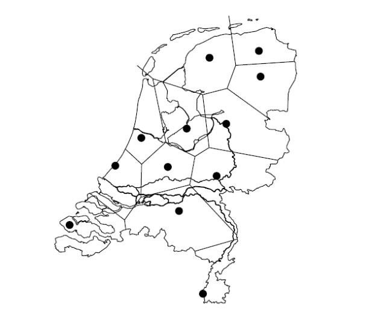
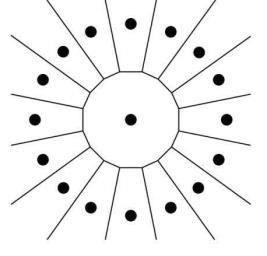
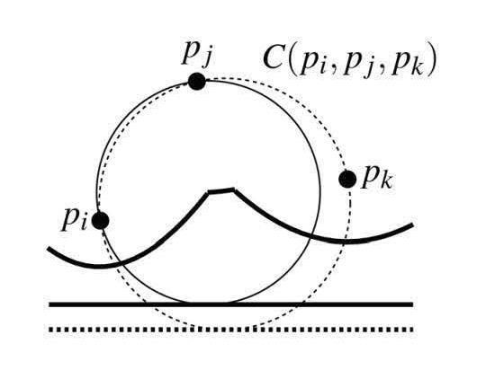
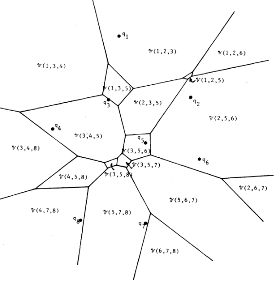

**ԳԼՈՒԽ 1․ ՎՈՐՈՆՈՎԻ ԴԻԱԳՐԱՄ**

1.  **Նախնական հասկացություններ**

Ենթադրենք, սուպերմարկետների ցանցի զարգացման խորհրդատվական հանձնաժողովի
կողմից կան պլաններ նոր խանութ բացել որոշակի վայրում: Կանխատեսելու համար,
թե արդյոք նոր խանութը շահութաբեր կլինի, պետք է գնահատել, թե քանի
հաճախորդ կգրավի այն: Դա անելու համար պետք է կառուցել պոտենցիալ գնորդների
վարքագծային մոդել. ինչպե՞ս է մարդը որոշում, թե որտեղ գնալ գնումների:
Նմանատիպ հարց է ծագում սոցիալական աշխարհագրության մեջ, երբ
ուսումնասիրվում է երկրի տնտեսական գործունեությունը. ինչպիսինն է
քաղաքների առևտրային տարածքը: Ավելի վերացական, մենք ունենք բազմաթիվ
սպասարկման կենտրոններ, որոնք առաջարկում են ապրանքներ կամ
ծառայություններ, և յուրաքանչյուր սպասարկման կենտրոնի համար մենք
ցանկանում ենք իմանալ, թե որտեղ են ապրում այն մարդիկ, ովքեր ապրանքներ կամ
ծառայություններ են գնում այդ կենտրոնից: Խնդիրն ուսումնասիրելու համար
ներմուծենք հետևյալ պարզեցնող ենթադրությունները.

{width="3.525in" height="2.8333333333333335in"}

*Նկար 1.1.*

Հոլանդիայի տասներկու նահանգների մայրաքաղաքների առևտրային գոտիները, որոնք
կանխատեսվել են Վորոնովի մոդելի միջոցով.

- Բոլոր կենտրոններն առաջարկում են նույն ապրանքները կամ ծառայությունները
  նույն գնով;

- Ապրանքի կամ ծառայության ձեռքբերման արժեքը հավասար է դրա գնին գումարած
  դեպի կենտրոն ուղևորության արժեքը;

- Մինչև կենտրոն ուղևորության արժեքը հավասար է դրանից էվկլիդեսյան

> հեռավորությանը՝ բազմապատկած միավոր հեռավորության վրա ծախսված ֆիքսված
> արժեքի գնով;

- գնորդները ձգտում են նվազագույնի հասցնել ապրանքների կամ
  ծառայությունների գնման ծախսերը:

Սովորաբար, այս ենթադրությունները լիովին բավարարված չեն լինում. որոշ
կենտրոններում ապրանքները կարող են ավելի էժան լինել, քան մյուսներում, և
մի կետից մյուսը ճանապարհորդության արժեքը պարտադիր չէ, որ համեմատական
լինի նրանց միջև էվկլիդեսյան հեռավորությանը: Բայց նկարագրված մոդելը
մոտավոր տալիս է կոպիտ մոտարկում դեպի սպասարկման կենտրոնների առևտրային
գոտիները։ Այն տարածքները, որտեղ բնակիչների վարքագիծը տարբերվում է մոդելի
կողմից կանխատեսածից, կարող է ենթարկվել ավելի սերտ հետազոտության՝
հասկանալու համար, թե որն է շեղումների առաջացման պատճառը: \[2\]

Մեզ հետաքրքրում է այս մոդելի երկրաչափական մեկնաբանությունը: Ձևակերպված
ենթադրությունները դրդում են ամբողջ դիտարկվող տիրույթի բաժանումը
տարածաշըրջանների՝ սպասարկման կենտրոնների առևտրային գոտիների, այնպես, որ
մի շրջանի բնակիչները գնումներ են կատարում նույն կենտրոնում: Մեր
ենթադրություններից բխում է, որ մարդն ուղղակի ապրանք է գնում մոտակա
կենտրոնում՝ իրավիճակը բավականին մոտ է իրականին։ Սա նշանակում է, որ տվյալ
կենտրոնի առևտրային տարածքը բաղկացած է բոլոր կետերից, որոնց համար այս
կենտրոնը ցանկացած այլ կենտրոնից ավելի մոտ է: Վերևում պատկերված նկարում
սպասարկման կենտրոնները Նիդերլանդների տասներկու նահանգների մայրաքաղաքներն
են:

Մոդելը, որում յուրաքանչյուր կետ պատկանում է մոտակա սպասարկման կենտրոնին,
կոչվում է Վորոնովի մոդել, իսկ այս մոդելի կողմից առաջացած բաժանումը
կոչվում է Վորոնովի դիագրամ կենտրոնների հավաքածուի համար: Վորոնովի
դիագրամից մենք կարող ենք տարբեր տեղեկություններ քաղել կենտրոնների
առևտրային տարածքների և դրանց փոխհարաբերությունների մասին: Օրինակ, եթե
երկու կենտրոնների շրջաններն ունեն ընդհանուր սահման, ապա, ամենայն
հավանականությամբ, այդ կենտրոնները մրցում են սահմանամերձ գնորդների համար։

Վորոնովի դիագրամը ամենուր է: Մենք նկարագրեցինք դրա կիրառությունը
սոցիալական աշխարհագրության մեջ, սակայն կան կիրառություններ ֆիզիկայի,
աստղագիտության, ռոբոտաշինության և շատ այլ առարկաների մեջ: Վորոնովի
դիագրամները սերտորեն կապված են մեկ այլ կարևոր երկրաչափական կառուցվածքի՝
Դելոնի եռանկյանացման հետ: Այս գլխում մենք կսահմանափակվենք հարթության վրա
մի շարք կետերի Վորոնովի դիագրամի հիմնական հատկություններով և դրանց
կառուցումներով:

Ալգորիթմների բարդության, ինչպես նաև խնդիրների լուծման բարդության ստորին
գնահատականների համար, օգտագործվում է O -- սիմվոլիկան: Դիցուք g -- ն և f
-- ը ոչ բացասական ամբողջ թվերի բազմության վրա որոշված ոչ բացասական
ֆունկցիաներ են: Այդ դեպքում

g(n) = O(f(n))

Գրառումը նշանակում է, որ գոյություն ունեն C և N~o~ \> 0 հաստատուններ
այնպես, որ g(n) ≤ C • f(n) տեղի ունի բոլոր n ≥ N~0~ համար: O սիմվոլը\`
օգտագործվում է ֆունկցիայի աճի արագության վերին գնահատականների համար:
Օրինակ\` an+b= Օ(n) (կարելի է վերցնել C=a+1 և N~o~ = b);

g(n) = Ω(f(n)) գրառումը նշանակում է, որ գոյություն ունեն C և N~o~ \> 0
հաստատուներ այնպես, որ

g(n) ≥ C • f(n)

տեղի ունի բոլոր n ≥ N~0~ համար: Ω սիմվոլը օգտագործվում է ֆունկցիայի աճի
արագության ստորին գնահատականների համար:

g(n) = θ(f(n)) գրառումը նշանակում է, որ գոյություն ունեն C~1~, C~2~ և
N~o~ \> 0 հաստատուներ այնպես, որ

C~1~f(n) ≤ \|g(n)\| ≤ C~2~f(n)

տեղի ունի բոլոր n ≥ N~0~ համար: Կարելի է ցույց տալ որ g(n) = θ(f(n)) այն
և միայն այն դեպքում, երբ g(n) = O(f(n)) և g(n) = Ω(f(n)):

**1.2. Սահմանումը և հիմնական հատկությունները**

Երկու p և q կետերի միջև էվկլիդյան հեռավորությունը նշանակենք dist(p,q):

Հարթության վրա գործում է հետևյալ բանաձևը.

𝑑𝑖𝑠𝑡(𝑝, 𝑞) ≔ √(𝑝~𝑥~ − 𝑞~𝑥~)^2^ + (𝑝~𝑦~ − 𝑞~𝑦~)^2^

Դիցուք P ≔ {p~1~, p~2~, ... , p~n~} բազմությունը n կետերի բազմություն է
հարթության վրա; այդ կետերը կլինեն սպասարկման կենտրոնները։ Սահմանենք P
բազմության Վորոնովի դիագրամը՝ որպես հարթության բաժանում n բջիջների՝
մեկական p~i~ - ի յուրաքանչյուր կենտրոնի համար, օժտված այն հատկությամբ,
որ q կետը պատկանում է p~i~ կենտրոնին համապատասխանող բջիջին, այն և միայն
այն դեպքում, երբ dist(q, p~i~) \< dist(q, p~j~) ցանկացած p~i~ ∈ P, j ≠ i
կետի համար. P բազմության Վորոնովի դիագրամը կնշանակենք Vor(P)-ով:
Արտահայտությունների մեջ թույլատրելով որոշակի ազատություն, երբեմն
կօգտագործենք «Vor(P) կամ Վորոնովի գծապատկեր» տերմինը՝ նշելով միայն
տրոհման կողերն ու գագաթները: Օրինակ, երբ ասում ենք, որ Վորոնովի դիագրամը
կապակցված է, նկատի ունենք, որ կողերի և գագաթների միավորումը կազմում է
կապակցված բազմություն։ p~i~ կենտրոնին համապատասխանող Vor(P) բջիջը
նշանակվում է V(p~i~); մենք այն կանվանենք Վորոնովի բջիջ 𝑝~𝑖~ -ի համար
(գլխի սկզբում ներկայացված տերմինաբանության մեջ V(p~i~) - ն p~i~ -ի
կենտրոնի առևտրային գոտին է):

Այժմ ավելի ուշադիր նայենք Վորոնովի դիագրամին: նախ և առաջ ուսումնասիրենք
Վորոնովի մեկ բջիջի կառուցվածքը: Հարթության երկու p և q կետերի համար p -
ի և q -- ի միջնուղղահայաց է կոչվում ̅^pq̅̅^̅ հատվածի միջնակետով անցնող և
դրան ուղղահայաց ուղիղը: Միջնուղղահայացը հարթությունը բաժանում է երկու
կիսահարթությունների։

Նշանակենք h(p, q) այն բաց կիսհարթությունը,որը պարունակում է p - ն, իսկ
h(q, p) - ով բաց կիսհարթությունը, որը պարունակում է q - ն։ Նկատենք, որ
r∈ h(p, q) այն և միայն այն դեպքում երբ dist(r, p) \< dist(r, q): Սրանից
հետևում է հետևյալ դիտողությունը.

{width="1.7409722222222221in"
height="1.6277777777777778in"}Դիտողություն 1.1. 𝑉(𝑝~𝑖~) = ⋂~1≤𝑗≤𝑛,𝑗≠𝑖~
ℎ(𝑝~𝑖~, 𝑝~𝑗~) .

Այսպիսով, V(p~i~) -ն n - 1 կիսահարթությունների հատումն է, և, հետևաբար,
ուռուցիկ բազմանկյուն տիրույթ է (հնարավոր է անսահմանափակ) առավելագույնը
n - 1 գագաթներով և

առավելագույնը n - 1 կողերով։

Ի՞նչ տեսք ունի Վորոնովի ամբողջական դիագրամը: Մենք հենց նոր տեսանք, որ
գծապատկերի յուրաքանչյուր բջիջ ներկայացնում է մի քանի կիսահարթությունների
հատում, ուստի Վորոնովի դիագրամը ուղղագիծ կողերով հարթ տրոհում է: Որոշ
կողեր հատվածներ են, մյուսները՝ ճառագայթեր։ Եթե բոլոր կենտրոնները համագիծ
չեն, ապա չեն լինի կողեր, որոնք ամբողջական գծեր են:

{width="2.0243055555555554in"
height="1.5409722222222222in"}Թեորեմ 1.1. Դիցուք P - ն հարթության վրա, n
կետեր պարունակող բազմություն է (կենտրոններ): Եթե բոլոր կենտրոնները
համագիծ են, ապա Վորոնովի դիագրամը բաղկացած է n-1 զուգահեռ ուղիղներից.
Հակառակ դեպքում Vor(P) կապակցված է, իսկ դրա կողերը հատվածներ կամ
ճառագայթներ են։

Ապացույց. Թեորեմի առաջին մասի ապացույցը հեշտ է, ուստի ենթադրենք, որ ոչ
բոլոր կենտրոններն են համագիծ.

{width="1.4375in" height="1.225in"}Նախ
ցույց տանք, որ Vor(P)-ի կողերը կամ հատվածներ են կամ ճառագայթներ: Մենք
արդեն գիտենք, որ Vor(P)-ի կողերը ուղիղ գծերի մասեր են, մասնավորապես
երկու կենտրոնների միջնուղղահայացներ: Ենթադրենք հակառակը, որ Vor(P)
դիագրամի e կողը ամբողջական ուղիղ է: Դիցուք e-ն ընկած է 𝑉(𝑝~𝑖~) և 𝑉(𝑝~𝑗~)
Վորոնովի բջիջների սահմանի վրա: Դիցուք 𝑝~𝑘~ ∈ 𝑃 մի կետ է, որը չի գտնվում
𝑝~𝑖~ -ի և 𝑝~𝑗~ -ի հետ նույն ուղղի վրա: Բայց այդ դեպքում e -- ի այն մասը,
որն ընկած է ℎ(𝑝~𝑘~, 𝑝~𝑗~) -- ի մեջ, չի կարող լինել 𝑉(𝑝~𝑗~) -- ի սահմանի
վրա, քանի որ; այն ավելի մոտ է 𝑝~𝑘~- ին, քան 𝑝~𝑗~ - ին: Եկանք
հակասության:

Մնում է ապացուցել, որ Vor(P)-ն կապակցված է։ Եթե դա այդպես չլիներ, ապա
գոյություն կունենար Վորոնովի 𝑉(𝑝~𝑖~) բջիջ, որը դիագրամը կբաժաներ երկու
մասի: Քանի որ Վորոնովի բջիջները ուռուցիկ են, 𝑉(𝑝~𝑗~) - ն բաղկացած կլինի
երկու զուգահեռ ուղիղով սահմանափակված շերտից: Բայց մենք հենց նոր
ապացուցեցինք, որ Վորոնովի դիագրամի կողերը չեն կարող լինել ամբողջական
ուղիղեր: Եկանք հակասության:

Այժմ, հասկանալով Վորոնովի դիագրամի կառուցվածքը, ուսումնասիրենք դրա
բարդությունը, այսինքն՝ գնահատենք գագաթների և կողերի ընդհանուր թիվը: Քանի
որ կան n կենտրոններ, և Վորոնովի յուրաքանչյուր բջիջ ունի առավելագույնը
n - 1 գագաթ և կող, Vor(P)-ի բարդությունը վատագույն դեպքում քառակուսային
է: Այնուամենայնիվ, պարզ չէ, թե արդյոք Vor(P)-ն իսկապես կարող է ունենալ
քառակուսային բարդություն. հեշտ է կառուցել օրինակ, որտեղ Վորոնովի բջջի
բարդությունը գծային է, բայց կարո՞ղ է պարզվել, որ շատ բջիջներ ունեն
գծային բարդություն: Հետևյալ թեորեմը ցույց է տալիս, որ դա այդպես չէ, և որ
Վորոնովի բջիջի գագաթների միջին թիվը վեցից պակաս է։

Թեորեմ 1.2. n ≥ 3-ի համար հարթության n կետերի բազմության Վորոնովի
դիագրամում գագաթների թիվը չի գերազանցում (2n -- 5) - ը, իսկ կողերի թիվը
չի գերազանցում (3n -- 6) - ը։

{width="1.3381944444444445in"
height="1.2826388888888889in"}Ապացույց. Եթե բոլոր կենտրոնները համագիծ
են, ապա ապացույցը անմիջապես բխում է 2 թեորեմից, ուստի մենք կենթադրենք,
որ դա այդպես չէ: Ապացույցի համար կօգտագործենք Էյլերի բանաձևը, ըստ որի՝
𝑚~𝑣~ գագաթներով, 𝑚~𝑒~ կողերով և 𝑚~𝑓~ նիստերով միացված հարթ գրաֆի համար
գործում է հետևյալ կապը.

{width="1.5270833333333333in"
height="1.9340277777777777in"}𝑚𝑣 − 𝑚𝑒 + 𝑚𝑓 = 2

Մենք չենք կարող ուղղակիորեն կիրառել Էյլերի բանաձևը Vor(P)-ին, քանի որ
Vor(P) - ն պարունակում է կիսաանվերջ կողեր և, հետևաբար, իրական գրաֆ չէ:
Իրավիճակը շտկելու համար մենք կավելացնենք լրացուցիչ մեկ գագաթ՝ 𝑣~∞~, որը
գտնվում է \<\<Անվերջությունում\>\> և Vor(P)-ի բոլոր կիսաանվերջ կողերը
միացնենք այդ գագաթին: Այժմ մենք ունենք կապակցված հարթ գրաֆ, որի վրա
կարելի է կիրառել Էյլերի բանաձևը.Մենք ստանում ենք հետևյալ կապը 𝑛~𝑣~-ի՝
Vor(P) -- ի գագաթների քանակի, 𝑛~𝑒~ -- ի՝ Vor(P) -- ի կողերի քանակի և n
-- ի՝ նիստերի քանակաի միջև.

(𝑛~𝑣~ + 1) − 𝑛~𝑒~ + 𝑛 = 2 1.1)

Ավելին, ընդլայնված գրաֆի յուրաքանչյուր կող ունի ճիշտ երկու գագաթ, այնպես
որ, եթե գումարենք բոլոր գագաթների աստիճանները, կստանաք երկու անգամ ավելի
շատ կողեր: Քանի որ յուրաքանչյուր գագաթի աստիճանը, ներառյալ 𝑣~∞~ -ը,
առնվազն երեք է, մենք ստանում ենք.

2𝑛~𝑒~ ≥ 3(𝑛~𝑣~ + 1) (1.2)

(1.1) բանաձևի հետ միասին սա ապացուցում է թեորեմը:

{width="1.9326388888888888in"
height="1.632638888888889in"}Այս բաժինը եզրափակելու համար ներկայացնենք
Վորոնովի դիագրամի կողերի և գագաթների բնութագրիչները: Արդեն նշվել է, որ
կողերը հանդիսանում են երկու կենտրոնների միջնուղղահայացների մասեր, իսկ
գագաթները՝ դրանք միջնուղղահայացների հատման կետերն են:

Միջնուղղահայացների թիվը քառակուսիորեն է կախված կենտրոնների քանակից,
մինչդեռ Vor(P)-ի բարդությունը միայն գծային է: Հետևաբար, ոչ բոլոր
միջնուղղահայացներն են սահմանում Vor(P) կողերը, և ոչ բոլոր հատումներն են
Vor(P) գագաթները։ Հասկանալու համար, թե որ միջնուղղահայացների և դրանց
հատման կետերնեն են կազմում Վորոնովի դիագրամի տարբերակիչ բնութագրերը,
տանք հետևյալ սահմանումը. q կետի համար սահմանենք P-ի նկատմամբ ամենամեծ
դատարկ շրջանը (𝐶~𝑝~(𝑞)) որպես q - ում կենտրոն ունեցող ամենամեծ շրջան,
որը իր ներսում չի պարունակում Pից որևէ կենտրոն: Հաջորդ թեորեմը
բնութագրում է Վորոնովի դիագրամի գագաթները և կողերը:

Թեորեմ 1.3. P կետերի բազմության Վորոնովի Vor(P) դիագրամի համար ճշմարիտ
են հետևյալ պնդումները.

I.  q կետը Vor(P)-ի գագաթն է, այն և միայն այն դեպքում, երբ նրա ամենամեծ
    𝐶~𝑝~(𝑞) դատարկ շրջանի սահմանը պարունակում է երեք կամ ավելի
    կենտրոններ P-ից:

II. 𝑝~𝑖~ և 𝑝~𝑗~ կենտրոնների միջնուղղահայացով որոշվում է Vor(P) կողը, այն
    և միայն այն դեպքում, եթե դրա վրա կա q կետ այնպես, որ 𝐶~𝑝~(𝑞)- ի
    սահմանը պարունակում է երկու 𝑝~𝑖~ և 𝑝~𝑗~ կենտրոնները, և ոչ մի այլ
    կենտրոն:

Ապացույց.

I.  Ենթադրենք, որ կա q կետ այնպես, որ 𝐶~𝑝~(𝑞) - ի սահմանը պարունակում է
    երեք կամ ավելի կենտրոններ: Թող 𝑝~𝑖~, 𝑝~𝑗~ և 𝑝~𝑘~ լինեն երեք այդպիսի
    կենտրոններ: Քանի որ 𝐶~𝑝~(𝑞)- ի ներսը դատարկ է, q-ն պետք է ընկած լինի
    𝑉(𝑝~𝑖~), (𝑝~𝑗~) և 𝑉(𝑝~𝑘~) բջիջներից յուրաքանչյուրի սահմանին, իսկ q-ն
    պետք է լինի Vor(P) գագաթը:

Մյուս կողմից, Vor(P) դիագրամի յուրաքանչյուր գագաթն ընկած է առնվազն երեք

կողերի , հետևաբար առնվազն երեք Վորոնովի բջիջներում ՝ 𝑉(𝑝~𝑖~), 𝑉(𝑝~𝑗~) և
𝑉(𝑝~𝑘~): q գագաթը պետք է լինի 𝑝~𝑖~-ից, 𝑝~𝑗~-ից և 𝑝~𝑘~-ից հավասար
հեռավորությունների վրա, և չի կարող լինել q-ին ավելի մոտ մեկ այլ կենտրոն,
այլապես 𝑉(𝑝~𝑖~), 𝑉(𝑝~𝑗~) և 𝑉(𝑝~𝑘~) չեն զուգակցի q -- ում: Հետևաբար,
շրջանի ներսը, որի սահմանին ընկած են 𝑝~𝑖~, 𝑝~𝑗~ ը 𝑝~𝑘~, որևէ կենտրոն չի
պարունակում:

II. Ենթադրենք, որ գոյություն ունի q կետ, որն ունի թեորեմում նշված
    հատկությունը: Քանի որ 𝐶~𝑝~(𝑞) շրջանի ներսը որևէ կենտրոն չի
    պարունակում, և 𝑝~𝑖~ և 𝑝~𝑗~ կենտրոնները

գտնվում են դրա սահմանի վրա, ապա 𝑑𝑖𝑠𝑡(𝑞, 𝑝~𝑖~) = 𝑑𝑖𝑠𝑡(𝑞, 𝑝~𝑗~) ≤ 𝑑𝑖𝑠𝑡(𝑞,
𝑝~𝑘~) ցանկացածի 1 ≤ 𝑘 ≤ 𝑛 համար: Այստեղից հետևում է, որ q-ն ընկած է կողի
վրա կամ Vor(P) գագաթն է: Բայց թեորեմի առաջին մասից հետևում է, որ q-ն չի
կարող լինել Vor(P) գագաթ։ Այսպիսով, q-ն ընկած է Vor(P) կողի վրա, որը
որոշվում է 𝑝~𝑖~-ի և 𝑝~յ~-ի միջնուղղահայացով: Եվ հակառակը, 𝑝~𝑖~-ի և
𝑝~յ~-ի միջնուղղահայացներով որոշվում է Վորոնովի դիագրամի կողը: Այդ կողի
ներսի մասի ցանկացած q կետի ամենամեծ դատարկ շրջանի սահմանին պետք է լինեն
𝑝~𝑖~ - ն և 𝑝~𝑗~-- ն, և ոչ մի այլ կենտրոն:

**1.3.** **Վորոնովի դիագրամի հաշվարկ**

Նախորդ կետում մենք ուսումնասիրեցինք Վորոնովի դիագրամի կառուցվածքը: Հիմա
կատարենք դրա հաշվարկը։ Դիտողություն 1.1-ն առաջարկում է դա անելու հեշտ
ճանապարհ. յուրաքանչյուր 𝑝~𝑖~ կենտրոնի համար հաշվարկեք ℎ(𝑝~𝑖~, 𝑝~𝑗~)
կիսահարթությունների հատումը բոլոր 𝑗 ≠ 𝑖 - ի համար, օգտագործելով 4-րդ
գլխի ալգորիթմը: Այդ դեպքում մենք կծախսենք 𝑂(𝑛 log 𝑛) ժամանակ Վորոնովի
յուրաքանչյուր բջիջի վրա, այսինքն՝ 𝑂(𝑛^2^ log 𝑛) ժամանակ կպահանջվի
Վորոնովի ամբողջ դիագրամը հաշվարկելու համար: Հնարավո՞ր է ավելի լավ
արդյունքի հասնել: Ի վերջո, Վորոնովի դիագրամի ընդհանուր բարդությունը
միայն գծային է: Պատասխանը դրական է. ստորև նկարագրված հարթությունը
մաքրելու ալգորիթմը, որը հայտնի է որպես Ֆորչունաի ալգորիթմ (իր հեղինակի
անունով), հաշվարկում է Վորոնովի դիագրամը 𝑂(𝑛 log 𝑛)) ժամանակում \[3\]:
Ցանկություն է առաջանում գտնել էլ ավելի արագ ալգորիթմ, օրինակ՝ գծային։
Բայց սա արդեն շատ է. n իրական թվերի տեսակավորման խնդիրը կարող է բերվել
Վորոնովի դիագրամի հաշվարկման խնդրին, ուստի Վորոնովի դիագրամի հաշվարկման
ցանկացած ալգորիթմ ամենավատ դեպքում պետք է պահանջի 𝛺(𝑛 log 𝑛) ժամանակ:

Ալգորիթմում ընդունված մեթոդը՝ դա հարթության մաքրումն է՝ վերևից ներքև
իջնող ուղղի միջոցով։ Մաքրման գործընթացում մենք վերահաշվարկում ենք այն
ցուցանիշները, որոնք նկարագրում են հաշվարկվող կառուցվածքը: Ավելի ճիշտ,
վերահաշվարկվում է կառուցվածքի հետ մաքրման գծի հատման մասին
տեղեկատվությունը։ Այս տեղեկատվությունը փոխվում է միայն որոշ կետերում՝
պատահույթների կետերում \[2\]:

{width="1.4659722222222222in"
height="1.6993055555555556in"} Փորձենք այս ընդհանուր ռազմավարությունը
կիրառել հարթության մեջ գտնվող կենտրոնների 𝑃 = {𝑝~1~, 𝑝~2~, ... , 𝑝~𝑛~}
բազմության Վորոնովի դիագրամի հաշվարկի վրա։ Հարթությունը մաքրելու
գաղափարին համապատասխան, մենք հորիզոնական մաքրման 𝑙 գիծը տեղափոխում ենք
վերևից ներքև: Այդ ընթացքում մենք պետք է վերահաշվարկենք Վորոնովի դիագրամի
հատումը մաքրող գծի հետ: Ցավոք սրտի, սա այնքան էլ պարզ չէ, քանի որ 𝑙-ից
վեր գտնվող 𝑉𝑜𝑟(𝑃)-ի մասը կախված է ոչ միայն 𝑙 - ի վերևի կենտրոններից, այլ
նաև 𝑙 - ից ներքև գտնվող կենտրոններից:

Այլ կերպ ասած, երբ մաքրող գիծը հասնում է Վորոնովի 𝑉(𝑝~𝑖~) բջիջի
ամենավերին գագաթին, այն դեռ չի հանդիպել համապատասխան 𝑝~𝑖~ կենտրոնին:
Հետևաբար, մենք չունենք գագաթը հաշվարկելու համար անհրաժեշտ
տեղեկատվություն: Այդ պատճառով ստիպված ենք կիրառել հարթությունը մաքրելու
գաղափարը մի փոքր այլ կերպ. Վորոնովի գծապատկերի հատումը մաքրող գծի հետ
վերահաշվարկելու փոխարեն, մենք կպահպանենք տեղեկատվությունը Վորոնովի
դիագրամի այն հատվածի մասին, որը գտնվում է 𝑙 - ից բարձր կենտրոնների
համար, որոնք չեն կարող փոխվել 𝑙 - ից ներքև գտնվող կենտրոնների պատճառով:

Նշանակենք 𝑙^+^ այն փակ կիսհարթությունը, որը գտնվում է 𝑙 -- ի վերևում։
Վերևում գտնվող Վորոնովի դիագրամի ո՞ր մասն այլևս չի կարող փոխվել: Այլ
կերպ ասած, 𝑞 ∈ 𝑙^+^ ո՞ր կետերի համար մենք ճշգրիտ գիտենք դրանց մոտակա
կենտրոնը: Հեռավորությունը 𝑞 ∈ 𝑙^+^ կետից մինչև 𝑙 -- ի տակ գտնվող
ցանկացած կենտրոն ավելի մեծ է, քան 𝑞 - ից մինչև 𝑙 հեռավորությունը:
Հետևաբար, 𝑞-ին ամենամոտ կենտրոնը չի կարող լինել 𝑙 - ից ցածր, եթե 𝑞 -- ն
գտնվում է 𝑝~𝑖~ ∈ 𝑙^+^ -ի որոշ կենտրոնից ոչ ավել քան 𝑙 - ից 𝑞
հեռավորությունն է։ Կետերի տեղը, որոնք գտնվում են ավելի մոտ 𝑝~𝑖~ ∈ 𝑙^+^
կենտրոնին, քան 𝑙 - ին, սահմանափակվում է պարաբոլով: Հետևաբար, կետերի
երկրաչափական տեղը, որոնք գտնվում են 𝑙 - ի վերևում ինչ-որ կենտրոնին ավելի
մոտ, քան ինքնին 𝑙 - ին, սահմանափակված են պարաբոլների աղեղներով:
Պարաբոլների աղեղների այս հաջորդականությունը կանվանենք կոտրվածքների գիծ։
կոտրվածքների գիծը կարելի է պատկերացնել այլ կերպ: Մաքրող գծի վերևում
գտնվող յուրաքանչյուր 𝑝~𝑖~ կենտրոն սահմանում է ամբողջական 𝛽~𝑖~ պարաբոլ:
Կոտրվածքների գիծը ֆունկցիայի գրաֆիկ է, որը յուրաքանչյուր x կոորդինատի
համար ընդունում է մի արժեք, որը համընկնում է, բոլոր այդպիսի պարաբոլների
ամենացածր կետին:

Դիտողություն 1.2. Կոտրվածքների գիծը x-մոնոտոն է, այսինքն, յուրաքանչյուր
ուղղահայաց գիծ հատում է այդ ուղիղը մեկ կետում:

{width="1.6402777777777777in"
height="1.6in"}Հեշտ է տեսնել, որ մեկ պարաբոլը կարող է մի քանի անգամ
հանդիպել կոտրվածքների գծում: Իսկ քանի անգամ կդիտարկենք ավելի ուշ։
Միևնույն ժամանակ նշենք, որ կոտրման կետերը տարբեր պարաբոլների աղեղների
միացման տողում, որոնք կազմում են կոտրվածքների գիծը, գտնվում են Վորոնովի
դիագրամի կողերի վրա: Եվ սա պատահական համընկնում չէ. կոտրման կետերը
ճշգրիտ գծում են Վորոնովի դիագրամը՝ մաքրման գծի ներքև իջնելու հետ մեկտեղ:
Կոտրվածքների գծի այս հատկությունները հեշտ է ապացուցել տարրական
երկրաչափական մեթոդներով:

Հետևաբար, նրա փոխարեն, որպեսզի հաշվենք 𝑙 -ի հետ 𝑉𝑜𝑟(𝑃) − ի հատումը, երբ
մաքրման գիծը իջնում է ներքև, մենք կհաշվենք կոտրվածքների գիծը: Մենք չենք
պահպանի կոտրցածքների գիծը բացահայտ, քանի որ այն անընդհատ փոխվում է, երբ
𝑙 շարժվում է: Մի պահ մի կողմ թողնենք այն հարցը, թե ինչպես կարելի է
ներկայացնել կոտրվածքների գիծը, և նախ հասկանանք, թե երբ և ինչպես է
փոխվում նրա միացյալ կառուցվածքը։ Դա տեղի է ունենում, երբ հայտնվում է նոր
պարաբոլի աղեղ, և երբ հին աղեղը վերածվում է կետի և անհետանում:

Նախ հաշվի առնենք նոր աղեղի հայտնվելու պատահույթը կոտրվածքների գծի վրա:

Առաջին հերթին, դա կարող է տեղի ունենալ, երբ մաքրող 𝑙 գիծը հասնի նոր
կենտրոնի: Սկզբնական պահին այդ կենտրոնով որոշված պարաբոլը վերասեռված է և
ունի զրոյական լայնություն. այն ուղղահայաց հատված է, որը կապում է նոր
կենտրոնը կոտրվածքների գծի հետ։ մաքրման գծի ներքև իջնելու հետ մեկտեղ, նոր
պարաբոլը ընդլայնվում է: Նոր պարաբոլի այն մասը, որը գտնվում է հին
կոտրվածքների գծից ներքև, այժմ դառնում է նոր կոտրվածքների գծի մաս: Այս
գործընթացը ցույց է տրված Նկ.2.2.:

Նոր կենտրոնի հետ մաքրման գծի հանդիպումը կանվանենք կենտրոնային իրադարձու-
թյուն։

{width="6.6930555555555555in"
height="1.7520833333333334in"}{width="2.402083333333333in"
height="1.707638888888889in"}Ի՞նչ է տեղի ունենում Վորոնովի դիագրամի հետ
կենտրոնային իրադարձության պահին: Հիշենք, որ կոտրման կետերը գծում են
Վորոնովի դիագրամի կողերը: Կենտրոնային իրադարձության պահին հայտնվում են
երկու նոր կոտրման կետեր և սկսում են գծել կողերը: Սկզբնական պահին այս
կոտրման կետերը համընկնում են, այնուհետև շեղվում են տարբեր
ուղղություններով՝ գծելով նույն կողը։ Սկզբում այս կողը միացված չէ
Վորոնովի դիագրամի մաքրող գծի վերևում գտնվող հատվածին։ Բայց ավելի ուշ,
մենք կտեսնենք, թե կոնկրետ երբ է, աճող կողը բախվում մեկ այլ կողին և
միանում գծապատկերի մնացած մասերին:

*Նկար. 1.2.*

Կոտրվածքների գծի վրա նոր աղեղ է հայտնվում, քանի որ նոր կենտրոն է
հանդիպել:

Այսպիսով, մենք հիմա տեսնում ենք, թե ինչ է տեղի ունենում կենտրոնային
իրադարձության պահին. նոր աղեղ է հայտնվում կոտրվածքների գծի վրա և սկսվում
է Վորոնովի դիագրամի նոր կողի գծագրումը: Կարո՞ղ է այլ կերպ նոր աղեղ
առաջանալ կոտրվածքների գծի վրա: Ոչ, չի կարող \[2\]։

Լեմմա 1.1. կոտրվածքների գծի վրա նոր աղեղի հայտնվելու միակ պատճառը
կենտրոնային իրադարձությունն է:

{width="2.8430555555555554in"
height="1.625in"}Ապացույց. Ենթադրենք հակառակը, որ

արդեն գոյություն ունեցող 𝛽~𝑗~ պարաբոլը, որը որոշվում է 𝑝~𝑗~ - ի
կենտրոնով, սեղմվում է կոտրվածքների գծի մեջ: Սա կարող է տեղի ունենալ
երկու ճանապարհով.

Առաջին հնարավորությունն այն է, որ 𝛽~𝑗~ - ն սեղմված է ինչ-որ պարաբոլի
𝛽~𝑖~ աղեղի մեջտեղում: Այն պահին, երբ դա տեղի է ունենում, 𝛽~𝑖~ - ն ու
𝛽~𝑗~ - ն շոշափվում են, այսինքն՝ ունենում են ուղիղ մեկ ընդհանուր կետ.
Դիցուք 𝑙~𝑦~ - ով նշանակենք մաքրող գծի 𝑦 կոորդինատը շփման պահին: Եթե 𝑝~𝑗~
≔ (𝑝~𝑗,𝑥~; 𝑝~𝑗,𝑦~), ապա 𝛽~𝑗~ պարաբոլը նկարագրվում է հետևյալ հավասարմամբ՝

{width="3.5416666666666665in"
height="0.30833333333333335in"}

{width="2.3569444444444443in"
height="1.957638888888889in"}𝛽~𝑖~ - ի հավասարումը, իհարկե, տրվում է
նույն ձևով։ Օգտվելով այն հանգամանքից, որ 𝑝~𝑗,𝑦~ և 𝑝~𝑖,𝑦~ 𝑙~𝑦~ - ից մեծ
են, հեշտ է ցույց տալ, որ 𝛽~𝑖~ - ն և 𝛽~𝑗~ - ն չեն կարող ունենալ միայն մեկ
հատման կետ: Հետևաբար, 𝛽~𝑗~ պարաբոլը չի կարող սեղմվել մեկ այլ պարաբոլի՝
𝛽~𝑖~ աղեղի մեջտեղում:

Երկրորդ հնարավորությունն այն է, որ 𝛽~𝑗~ - ն սեղմված է երկու աղեղների
միջև:

Ենթադրենք այս աղեղները 𝛽~𝑖~ և 𝛽~𝑘~ պարաբոլների մասեր են: q-ով նշանակենք
𝛽~𝑖~ - ի և 𝛽~𝑘~ - ի հատման կետը, որտեղ 𝛽~𝑗~ - ն նոր է հայտնվում
կոտրվածքների գծի վրա, և ենթադրենք, որ 𝛽~𝑖~ - ն գտնվում է q-ից ձախ
կողմում կոտրվածքների գծի վրա, 𝛽~𝑘~ - ն՝ qից աջ, ինչպես նկ. 1.3. Հետևաբար
գոյություն ունի C շրջան, որը անցնում է 𝑝~𝑖~ , 𝑝~𝑗~ և 𝑝~𝑘~ պարաբոլները
սահմանող կենտրոններով: Այս շրջանագիծը շոշափում է ինչ-որ մաքրող 𝑙 գծին:
Եթե մենք սկսենք շփման կետից և շարժվենք ժամացույցի սլաքի ուղղությամբ, ապա
կետերը կտեղակայվեն C շրջանագծի վրա 𝑝~𝑖~, 𝑝~𝑗~, 𝑝~𝑘~ կարգով, քանի որ մենք
ենթադրում էինք, որ 𝛽~𝑗~ -ն սեղմված է 𝛽~𝑖~ և 𝛽~𝑘~ աղեղների միջակայքում:
Դիտարկենք մաքրող ուղիղ գծի անսահման փոքր տեղաշարժը դեպի ներքև՝
պահպանելով C շրջանագծի շոշափումը 𝑙 - ի հետ (տես նկ. 1.3): Այդ դեպում չի
կարող լինել, որ C-ի ներսում չլինի մեկ կենտրոն, և այն դեռ անցնում է 𝑝~𝑗~
-- ով. կամ 𝑝~𝑖~, կա՛մ 𝑝~𝑘~ կգտնվեն ներսում: Հետևաբար, q-ի բավական փոքր
շրջակայքում 𝛽~𝑗~ պարաբոլը չի կարող դառնալ կոտրվածքների գծի մաս, երբ
մաքրող գիծն

իջնում է, քանի որ կամ 𝑝~𝑖~ - ն կամ 𝑝~𝑘~ - ն ավելի մոտ կլինեն 𝑙 - ին, քան
𝑝~𝑗~ - ին:

{width="5.683333333333334in"
height="1.9416666666666667in"}

*Նկար 1.3*

Իրավիճակը անմիջապես այն պահից առաջ, երբ 𝛽~𝑗~-ը պետք է դառնար
կոտրվածքների գծի մի մասը, և շրջանի վիճակը, երբ մաքրող ուղիղ գիծն ավելի է
իջնում:

Այս լեմմայից անմիջապես բխում է, որ պարաբոլիկ աղեղների թիվը կոտրվածքների
գծում չի գերազանցում 2n - 1-ը. յուրաքանչյուր հանդիպող կենտրոն առաջացնում
է մեկ նոր աղեղ և առաջացնում է առավելագույնը մեկ գոյություն ունեցող աղեղի
բաժանումը երկուսի, և աղեղը չի կարող հայտնվել որևէ այլ կերպ:

Իրադարձությունների երկրորդ տեսակը հարթության մաքրման ալգորիթմում
գոյություն ունեցող աղեղի վերածումն է կետի և հետագա անհետացումը, ինչպես
Նկ. 1.4. -- ում: Թող 𝛼′-ն լինի անհետացող աղեղը, իսկ 𝛼-ն և 𝛼′′ − ը 𝛼′-ին
կից երկու աղեղ՝ դրա անհետացմանը նախորդող պահին: 𝛼 և 𝛼′′ աղեղները չեն
կարող լինել նույն պարաբոլի մասեր. այս հնարավորությունը կարող է բացառվել
այնպես, ինչպես 1.6-ի ապացույցի առաջին հնարավորությունը: Հետևաբար երեք
աղեղները 𝛼, 𝛼′ և 𝛼′′ սահմանվում են 𝑝~𝑖~, 𝑝~𝑗~ և 𝑝~𝑘~ տարբեր
կենտրոններով: Այն պահին, երբ 𝛼′-ն անհետանում է, այս կենտրոններով
սահմանված պարաբոլները ունեն ընդհանուր q կետ: Այս կետը հավասարահեռ է 𝑙
տողից և երեք կենտրոններից յուրաքանչյուրից: Հետևաբար, 𝑝~𝑖~, 𝑝~𝑗~ և 𝑝~𝑘~
կետերով անցնում է մի շրջանգիծ՝ որի կենտրոնը q-ն է, որի ամենացածր կետը
գտնվում է 𝑙-ի վրա: Այս շրջանագծի ներսում չեն կարող լինել Վորոնովի
դիագրամի և ոչ մի կենտրոն. այդպիսի կենտրոնը կլիներ q -- ին ավելի մոտ քան
q -- ն\` 𝑙 -- ին, իսկ դա հակասում է այն փաստին, որ q -- ն գտնվում է
կոտրվածքների գծի վրա։ Սա չպետք է զարմացնի, քանի որ մենք վերևում նշեցինք,
որ կոտրվածքների գծի վրա գտնվող կոտրման կետերը գծում են Վորոնովի դիագրամի
կողերը: Այսպիսով, երբ աղեղը անհետանում է կոտրցածքների գծից և երկու
կոտրման կետերը միանում են, դիագրամի կողերը նույնպես պետք է համընկնեն:
Մենք կանվանենք որպես շրջանագծի իրադարձություն այն իրադարձությունը, երբ
մաքող գիծը հասնում է շրջանագծի ամենացածր կետին, որն անցնում է երեք
կենտրոններով, որոնք սահմանում են հարևան աղեղները կոտրվածքների գծի վրա:
Վերևում ասվածից բխում է հետևյալ լեմման.

{width="5.608333333333333in"
height="1.95in"}

*Նկար 1.4*

*Կոտրվածքների գծից աղեղի անհետացումը.*

Լեմմա 1.2. Աղեղը կարող է անհետանալ կոտրվածքների գծից միայն շրջանագծի
իրադարձության արդյունքում:

{width="1.9548611111111112in"
height="1.6611111111111112in"}Այսպիսով, այժմ մենք գիտենք, թե երբ և
ինչպես է փոխվում կոտրվածքների գծի կոմբինատոր կառուցվածքը. կենտրոնական
իրադարձության պահին հայտնվում է նոր աղեղ, իսկ շրջանագծի իրադարձության
պահին գոյություն ունեցողը անհետանում է։ Մենք նաև գիտենք, թե ինչպես է դա
կապված կառուցված Վորոնովի դիագրամի հետ. կենտրոնական իրադարձության պահին
սկսում է աճել նոր կող, իսկ շրջանագծի իրադարձության պահին երկու աճող

կողեր հանդիպում են և կազմում գագաթ: Մնում է ընտրել տվյալների հարմար
կառուցվածքներ՝ մաքրման գործընթացում անհրաժեշտ տեղեկատվությունը պահելու
համար: Մեր նպատակն է հաշվարկել Վորոնովի դիագրամը, ուստի մեզ անհրաժեշտ է
կառուցվածք, որը կպահի այն մասը, որն արդեն հաշվարկված է: Անհրաժեշտ կլինի
նաև երկու \<\<ստանդարտ\>\> տվյալների կառուցվածքներ, որոնք օգտագործվում
են հարթության մաքրման ցանկացած ալգորիթմում. Իրադարձությունների
հերթականություն և կառուցվածք, որը ներկայացնում է մաքրող գծի վիճակը: Այս
դեպքում երկրորդ կառուցվածքը կպարունակի կոտր- վածքների գծի ներկայացումը:
Ստորև նկարագրված է տվյալների բոլոր կառուցվածքների իրականացումը:

- {width="1.8722222222222222in"
  height="1.5916666666666666in"}Կպահենք Վորոնովի կառուցված դիագրամը
  սովորական տվյալների կառուցվածքում, որն օգտագործվում է միջնորմների
  համար՝ կողերի կրկնակի կապակցված ցանկում: Բայց Վորոնովի դիագրամը
  ճշմարիտ բաժանում չէ նախկինում սահմանված իմաստով. նրա որոշ կողեր

ճառագայթներ են կամ ուղիղներ, և անհնար է դրանք ներկայացնել կողերի կրկնակի
կապակցված ցանկում: Կառուցման ընթացքում դա խնդիր չէ, քանի որ ստորև
նկարագրված կոտրվածքների գծի ներկայացումը թույլ կտա արդյունավետ կերպով
հասնել կրկնակի կապակցված ցանկի կարևոր մասերին: Բայց երբ մենք ավարտենք
կառուցումը, մենք կցանկանայինք ունենալ իրական կրկնակի կապակցված կողերի
ցանկ: Դա անելու համար մենք կավելացնենք պատկերը սահմանափակող մեծ
ուղղանկյուն, բավական մեծ, որպեսզի պարունակի Վորոնովի դիագրամի բոլոր
գագաթները: Այդ դեպքում վերջնական տրոհումը բաղկացած կլինի սահմանափակող
ուղղանկյունից և դրա ներսում գտնվող Վորոնովի դիագրամի մասից \[1,3\]:

- Մենք կներկայացնենք կոտրվածքների գիծը որպես հավասարակշռված երկուական
  որոնման 𝑇 ծառ; սա լինելու է վիճակի կառուցվածք. Դրա տերևները
  հաջորդականությամբ համապատասխանում են x-մոնոտոն կոտրվածքների գծի
  աղեղներին. ձախ տերևը ներկայացնում է ամենաձախ աղեղը, հաջորդ տերևը
  ներկայացնում է ձախից երկրորդ աղեղը և այլն: Յուրաքանչյուր 𝜇 տերևում
  պահպանվում է կենտրոն, որը սահմանում է այդ տերևով ներկայացված աղեղը: 𝑇
  -ի ներքին հանգույցները ներկայացնում են կոտրման կետերը կոտրվածքների
  գծում: կոտրման կետը պահվում է ներքին հանգույցում՝ որպես կենտրոնների
  դասավորված բազմություն 〈𝑝~𝑖~, 𝑝~𝑗~〉, որտեղ 𝑝~𝑖~-ն որոշում է կոտրման
  կետից ձախ պարաբոլը, իսկ 𝑝~𝑗~-ն՝ դրանից աջ: Կոտրվածքների գծի այս
  ներկայացմամբ մենք կարող ենք 𝑂(𝑙𝑜𝑔 𝑛) ժամանակում գտնել նոր կենտրոնի
  վերևում գտնվող աղեղը: Ներքին հանգույցում մենք պարզապես համեմատում ենք
  նոր կենտրոնի x-կոորդինատները և կոտրման կետը, վերջինս հաշվարկվում է
  հաստատուն ժամանակում՝ հաշվի առնելով կենտրոնների դասավորվածությունը և
  մաքրող գծի դիրքը: Նշենք, որ պարաբոլները բացահայտորեն չեն պահպանվում:
  𝑇-ում մենք նաև պահպանում ենք ցուցիչներ դեպի երկու այլ տվյալների
  կառուցվածքներ, որոնք օգտագործվում են մաքրման գործընթացում:
  Յուրաքանչյուր տերևային հանգույցում, որը ներկայացնում է 𝑎 աղեղը,
  պահվում է մեկ ցուցիչ դեպի իրադարձության հերթում եղող հանգույցը,
  մասնավորապես այն, որը ներկայացնում է շրջանի իրադարձությունը, որի
  դեպքում 𝑎-ն անհետանում է: Այս ցուցիչը զրոյական է, եթե չկա շրջանի
  իրադարձություն, որը պետք է անհետանա, կամ եթե այդ իրադարձությունը դեռ
  տեղի չի ունեցել: Վերջապես, յուրաքանչյուր ներքին v հանգույց պահպանում է
  ցուցիչը դեպի կիսակող Վորոնովի դիագրամի կողերի կրկնակի կապակցված
  ցանկում: Ավելի ճիշտ, 𝑣-ն պահում է ցուցիչը կողի կիսակողերից մեկի վրա,
  որը գծված է 𝑣-ով ներկայացված կոտրման կետով:

- Իրադարձությունների հերթականությունը 𝑄-ն իրականացվում է առաջնահերթ
  հերթականության միջոցով, որտեղ իրադարձության առաջնահերթությունը նրա
  𝑦կոորդինատն է: Հերթականությունը պահպանում է առաջիկա
  իրադարձությունները, որոնք արդեն հայտնի են: Կենտրոնի իրադարձության
  դեպքում մենք պարզապես պահում ենք հենց կենտրոնը: Իսկ շրջանագծի
  իրադարձության համար մենք պահում ենք շրջանագծի ամենացածր կետը և ցուցիչը
  դեպի 𝑇 -- ի տերևային հանգույց, որը ներկայացնում է այն աղեղը, որը
  կանհետանա իրադարձության կատարման պահին:

Կենտրոնների բոլոր իրադարձությունները նախապես հայտնի են, շրջանների
իրադարձությունները՝ ոչ։ Եվ դա բերում է մնացած վերջին խնդրին\` շրջանի
իրադարձությունների հայտնաբերման:

{width="1.8215277777777779in"
height="1.4930555555555556in"}Մաքրման գործընթացքում կոտրվածքների գծի
տոպոլոգիական կառուցվածքը փոխվում է յուրաքանչյուր իրադարձության հետ:
Երբեմն հայտնվում են հարևան աղեղների նոր եռյակներ, երբեմն էլ անհետանում
են գոյություն ունեցողները։ Մեր ալգորիթմը պետք է ապահովի, որ կոտրվածքների
գծի ցանկացած երեք հարակից աղեղների համար, որոնք սահմանում են շրջանագծի
պոտենցիալ՝ իրադարձություն, այդ իրադարձությունը կտեղադրվի 𝑄
հերթականության մեջ: Այստեղ կան երկու նրբություններ: Նախ, կարող են լինել
հարևան եռյակներ, որոնց համար երկու կոտրման կետեր չեն համընկնում,
այսինքն՝ շարժվում են այնպիսի ուղղություններով, որոնք բացառում են
ապագայում հանդիպումը: Դա տեղի է ունենում, երբ կոտրման կետերը շարժվում են
հատման կետից հեռու տանող միջնուղղահայացի երկայնքով: Այս դեպքում եռյակը
չի սահմանում շրջանագծի պոտենցիալ՝ իրադարձություն: Երկրորդ, նույնիսկ եթե
եռակի կոտրման կետերը համընկնեն, համապատասխան շրջանագծի իրադարձությունը
կարող է տեղի չունենալ. դա տեղի է ունենում, երբ եռյակը անհետանում է
(օրինակ, կոտրվածքների գծի վրա նոր կենտրոնի առաջացման դեպքում) նախքան
իրադարձությունը տեղի ունենալը: Նման իրադարձությունը մենք կանվանենք կեղծ
ահազանգ։

Այսպիսով, ահա թե ինչ է անում ալգորիթմը: Յուրաքանչյուր իրադարձության
ժամանակ այն ստուգում է հարևան աղեղների բոլոր նոր հայտնված եռյակները:
Օրինակ՝ կենտրոնական իրադարձության պահին կարող են ձևավորվել երեք նոր
եռյակներ՝ մեկում նոր աղեղը գտնվում է ձախ կողմում, մյուսում՝ մեջտեղում,
իսկ երրորդում՝ աջ կողմում։ Եթե նման նոր եռյակն ունի կոտրման կետեր, ապա
իրադարձությունը տեղադրվում է 𝑄 հերթականության մեջ: Նկատի ունենանք, որ
կենտրոնական իրադարձության դեպքում եռյակը, որի մեջտեղում է նոր աղեղը,
երբեք չի հանգեցնում շրջանագծի իրադարձության, քանի որ ձախ և աջ եռյակի
աղեղները պատկանում են միևնույն պարաբոլին, և, հետևաբար, կոտրման կետերը
պետք է տարբերվեն: Հաջորդը, յուրաքանչյուր անհետացող եռյակի համար
ստուգվում է, թե արդյոք դրան համապատասխան իրադարձությունը գտնվում է Q
հերթականության: Եթե այո, ապա իրադարձությունը կեղծ ահազանգ է և հանվում է
հերթից: Դա հեշտ է անել՝ օգտագործելով 𝑇 - ի տերևներում պահված ցուցիչները,
որոնք համընկնում են 𝑄 հերթականության համապատասխան իրադարձություններին:

Լեմմա 1.3. Վորոնովի դիագրամի յուրաքանչյուր գագաթ հայտնաբերվում է
շրջանագծի իրադարձության միջոցով:

Ապացույց. Վորոնովի դիագրամի q գագաթի համար 𝑝~𝑖~, 𝑝~𝑗~ և 𝑝~𝑘~ - ն այն
երեք կենտրոններն են, որոնցով անցնում է 𝐶(𝑝~𝑖~, 𝑝~𝑗~, 𝑝~𝑘~) շրջանագիծը,
որի ներսում ոչ մի կենտրոն չի պարունակվում: Ըստ թեորեմ 1.3-ի, գոյություն
ունեն այդպիսի շրջանագծի երեք կենտրոններ: Պարզության համար դիտարկենք
միայն այն դեպքը, երբ 𝐶(𝑝~𝑖~, 𝑝~𝑗~, 𝑝~𝑘~) շրջանագծի վրա այլ կենտրոններ
չկան, և դրա ամենացածր կետը չի համընկնում 𝑝~𝑖~, 𝑝~𝑗~ և 𝑝~𝑘~ կետերից որևէ
մեկի հետ: Առանց ընդհանրությունը խախտելու, կարելի է ենթադրել, որ 𝐶(𝑝~𝑖~,
𝑝~𝑗~, 𝑝~𝑘~) -- ի ներքևի կետից ժամացույցի սլաքի ուղղությամբ շարժվելով,
մենք կհանդիպենք 𝑝~𝑖~, 𝑝~𝑗~, 𝑝~𝑘~ կենտրոնները հենց այս հերթականությամբ:

{width="2.0284722222222222in"
height="1.5777777777777777in"}Մենք պետք է ցույց տանք, որ նախքան մաքրող
գիծը կհասնի 𝐶(𝑝~𝑖~, 𝑝~𝑗~, 𝑝~𝑘~) ներքևի կետին, կոտրվածքների գծի վրա կան
𝑎, 𝑎′ և 𝑎′′ աղեղներ, որոնք որոշվում են 𝑝~𝑖~, 𝑝~𝑗~, 𝑝~𝑘~ կենտրոններով:
Միայն այս դեպքում տեղի ունի շրջանագծի իրադարձությունը։

Դիտարկենք մաքրող գծի դիրքը 𝐶(𝑝~𝑖~, 𝑝~𝑗~, 𝑝~𝑘~) ներքևի կետից անվերջ փոքր
հեռավորության վրա: Քանի որ այլ կենտրոններ չկան ոչ 𝐶(𝑝~𝑖~, 𝑝~𝑗~, 𝑝~𝑘~)
շրջանագծի վրա, ոչ էլ դրա ներսում, գոյություն ունի 𝑝~𝑖~ և 𝑝~𝑗~ միջով
անցնող շրջանագիծ, որը շոշափում է մաքրող գծին և ներսում ոչ մի կենտրոն չի
պարունակում: Հետևաբար, կոտրվածքների գծի վրա կան հարակից աղեղներ, որոնք
որոշվում են 𝑝~𝑖~ և 𝑝~𝑗~ կենտրոններով: Նման ձևով, կոտրվածքների գծի վրա
կան հարակից աղեղներ, որոնք որոշվում են 𝑝~𝑗~ և 𝑝~𝑘~ կենտրոններով: Հեշտ է
տեսնել, որ երկու աղեղները, որոնք որոշվում են 𝑝~𝑗~ կենտրոնով, իրականում
համընկնում են, իսկ այստեղից հետևում է, որ կոտրվածքների գծի վրա կան երեք
հարակից աղեղներ, որոնք որոշվում են 𝑝~𝑖~, 𝑝~𝑗~ և 𝑝~𝑘~ կենտրոններով:
Հետևաբար, շրջանագծի համապատասխան իրադարձությունը եղել է 𝑄ում հենց այն
տեղի ունենալուց առաջ, ինչը նշանակում է, որ Վորոնովի դիագրամի վերին մասը
որոշվել է:

Այժմ մենք կարող ենք մանրամասն նկարագրել հարթությունը մաքրելու ալգորիթմը։
Նկատի ունենանք, որ բոլոր իրադարձությունները մշակվելուց և 𝑄
հերթականությունը դատարկվելուց հետո կոտրվածքների գիծը դեռ չի անհետացել:
Կան կոտրման կետեր, որոնք համապատասխանում են Վորոնովի դիագրամի կիսաանվերջ
կողերին։ Ինչպես արդեն նշվեց, կիսաանվերջ կողերը չեն կարող ներկայացված
լինել կողերի կրկնակի կապակցված ցանկում, ուստի մենք պետք է ավելացնենք
սահմանափակող ուղղանկյուն, որին կարելի է կցել այս կողերը: Ստորև
ներկայացված է ալգորիթմի վերին մակարդակի պսեվդոկոդը:

Ալգորիթմ VoroniDiagram(P)

Մուտք. Հարթության կետերի(կենտրոնների) Р ∶= {𝑝~1~, . . . , 𝑝~𝑛~}
բազմությունը։

Ելք. Vor(P)-ի Վորոնովի դիագրամը սահմանափակող ուղղանկյան ներսում, որը
ներկայացված է որպես «𝐷» կողերի կրկնակի կապված ցանկ:

1.  Նախաձևավորենք իրադարձությունների 𝑄 հերթը, որը պարունակում է
    > կենտրոնների բոլոր իրադարձությունները, նախաձևավորենք դատարկ վիճակի
    > կառուցվածքը 𝑇 և կողերի կրկնակի կապակցված դատարկ ցուցակը:

2.  While 𝑄 դատարկ չէ

3.  do առանձնացնել 𝑄-ից ամենամեծ y-կոորդինատով իրադարձությունը

4.  If այս միջոցառումների կենտրոնը 𝑝~𝑖~ -- ն է

5.  then HandleSiteEvent(𝑝~𝑖~)

6.  else HandleCircleEvent(y), որտեղ y -- ը 𝑇 - ի տերևային հանգույցն է,
    որը ներկայացնում է անհետացող աղեղը

7.  𝑇-ում մնացած ներքին հանգույցները համապատասխանում են Վորոնովի

դիագրամի կիսաանվերջ կողերին։ Հաշվել սահմանափակող ուղղանկյունը, որը
պարունակում է Վորոնովի դիագրամի բոլոր գագաթները դրա ներսում, և այս
ուղղանկյունը կցել կիսաանվերջ կողեր՝ համապատասխանաբար փոփոխելով կողերի
կրկնակի կապակցված ցանկը։

8.  Անցնել կիսակողերը կրկնակի կապակցված ցանկում՝ դրանցից և դրանցում

բջիջների մուտքեր և ցուցիչներ ավելացնելու համար:

Իրադարձությունների մշակման ընթացակարգերը սահմանվում են հետևյալ կերպ.

**HandleSiteEvent(pi)**

1.  Եթե 𝑇-ն դատարկ է, ապա մտցնել 𝑝~𝑖~ - ն դրա մեջ (այսպես՝ 𝑇-ն բաղկացած
    կլինի մեկ տերևային հանգույցից, որը պահում է 𝑝~𝑖~ -- ն) և վերադառնալ:
    Հակառակ դեպքում, հետևել 2-5 քայլերին:

2.  Փնտրեք 𝑇-ում a աղեղ, որը խիստ բարձր է 𝑝~𝑖~-ից: Եթե 𝑎-ն ներկայացնող
    տերևային հանգույցն ունի 𝑄-ի շրջանագծի իրադարձության ցուցիչ, ապա այդ
    իրադարձությունը կեղծ ահազանգ է և պետք է հեռացվի 𝑄-ից:

3.  𝑎-ն ներկայացնող տերևային հանգույցը փոխարինեք երեք տերևով ենթածառով:
    Միջին տերևը պահում է նոր կենտրոնական 𝑝~𝑖~-ն, իսկ մյուս երկուսը
    պահում են կենտրոնական 𝑝~𝑗~- ն , որը նախկինում պահվում էր 𝑎 -- ի հետ:
    Պահպանեք 〈𝑝~𝑗~, 𝑝~𝑖~〉 և 〈𝑝~𝑖~, 𝑝~𝑗~〉

զույգերը, որոնք ներկայացնում են նոր կոտրման կետերը երկու նոր ներքին
հանգույցներում: Անհրաժեշտության դեպքում վերաբալանսավորել 𝑇.

4.  Վորոնովի դիագրամը նկարագրող կառուցվածքում ստեղծենք 𝑉(𝑝~𝑖~) և 𝑉(𝑝~𝑗~)
    բաժանող կողերի համար նոր կիսակողային գրառումներ, որոնք կգծվեն երկու
    նոր կոտրման կետերով:

5.  Ստուգել հարևան աղեղների եռյակը, որում 𝑝~𝑖~-ին համապատասխանող նոր
    աղեղը գտնվում է ձախ կողմում, և որոշել, թե արդյոք կոտրման կետերը
    համընկնում են: Եթե այո, ապա տեղադրել նոր շրջանագծի իրադարձություն
    𝑄-ում և ավելացնել ցուցիչներ 𝑇 հանգույցի և Q տարրի միջև: Նույնը անել
    այն եռյակի համար, որի աջ կողմում նոր աղեղն է:

**HandleCircleEvent(y)**

1.  𝑇-ից հանել y տերևային հանգույցը, որը ներկայացնում է անհետացող 𝑎
    աղեղը: Թարմացրել կրկնօրինակը, որոնք ներկայացնում են ներքին
    հանգույցների կոտրման կետերը: Անհրաժեշտության դեպքում
    վերաբալանսավորել T-ն: Հեռացնել 𝑄ից 𝑎-ի հետ կապված բոլոր շրջանագծի
    իրադարձությունները. դրանք կարելի է գտնել՝ օգտագործելով 𝑦-ին նախորդող
    𝑇 հանգույցից և դրան հաջորդող ցուցիչները: (Շրջանագծի իրադարձությունը,
    որում 𝑎-ն միջին աղեղն է, ներկայումս մշակվում է և արդեն հեռացվել է
    𝑄-ից):

2.  Իրադարձությունն առաջացրած շրջանագծի կենտրոնը որպես գագաթային մուտք,
    ավելացնել կրկնակի կապակցված «𝐷» կողերի ցանկին, որում պահվում է
    կառուցվելիք Վորոնովի դիագրամը: Ստեղծել երկու կիսակողային գրառումներ,
    որոնք համապատասխանում են կոտրվածքների գծի նոր կոտտրման կետին:
    Սահմանել ցուցիչներ նրանց միջև: Կցել բոլոր երեք նոր գրառումները տրված
    գագաթով ավարտվող կիսակողի գրառումներին:

3.  Ստուգել հարևան աղեղենրի նոր եռյակը, որում նախկին ձախ 𝑎 հարևանը միջին
    աղեղն է, և որոշել, թե արդյոք այս եռյակի երկու կոտրման կետերը
    համընկնում են: Եթե այո, ապա տեղադրել համապատասխան շրջանագծի
    իրադարձությունը 𝑄-ի մեջ և ցուցիչներ դնել 𝑄-ի նոր իրադարձության և դրա
    համապատասխան տերևային հանգույցի միջև: Նույնը անել եռյակի համար, որի
    միջին աղեղը նախկին աջ հարևանն է:

Լեմմա1.4. Նկարագրված ալգորիթմի իրականացման ժամանակը 𝑂(𝑛 𝑙𝑜𝑔 𝑛) է, իսկ
սպառված հիշողության չափը՝ 𝑂(𝑛):

Ապացույց. 𝑇 ծառի և իրադարձությունների 𝑄 հերթի վրա պարզունակ
գործողությունները, մասնավորապես տարրի տեղադրումն ու հեռացումը, պահանջում
են 𝑂(log 𝑛) ժամանակ: Պարզունակ գործողությունները կողերի կրկնակի
կապակցված ցանկի վրա պահանջվում է հաստատուն ժամանակ: Իրադարձությունը
կարգավորելու համար մենք կատարում ենք նման պարզունակ գործողություններ,
ուստի մենք դրա վրա ծախսում ենք 𝑂(log 𝑛) ժամանակ: Ակնհայտ է, որ ընդհանուր
առմամբ կան n կենտրոնային իրադարձություններ: Ինչ վերաբերում է շրջանագծի
իրադարձություններին, նշենք, որ յուրաքանչյուր նման մշակված իրադարձություն
սահմանում է 𝑉𝑜𝑟(𝑃) գագաթ: Հիշեցնենք, որ կեղծ ահազանգերը մշակելուց առաջ
հանվում են 𝑄-ից: Դրանք ստեղծվում և ջնջվում են մեկ այլ՝ իրական
իրադարձության մշակման ժամանակ, և դրանց վրա ծախսված ժամանակը հաշվի է
առնվում այս իրադարձության մշակման ժամանակում։ Հետևաբար, մշակված
շրջանագծի իրադարձությունների թիվը չի գերազանցում 2n--5 - ը: Ժամանակի և
հիշողության չափի գնահատումները ապացուցված են:

Մինչ այս կետի վերջնական արդյունքը նշելը, հարկ է մի քանի խոսք ասել
վերասեռված դեպքերի մասին։

{width="2.0in"
height="1.7618055555555556in"}Ալգորիթմը մշակում է իրադարձությունները
վերևից ներքև, ուստի այն դեպքերը, երբ երկու կամ ավելի իրադարձություններ
տեղի են ունենում նույն հորիզոնական գծի վրա, վերասեռված են: Դա տեղի է
ունենում, օրինակ, երբ մի քանի կենտրոններ ունեն նույն 𝑦-կոորդինատները:
Նման իրադարձությունները կարող են մշակվել ցանկացած հաջորդականությամբ,
քանի դեռ դրանց 𝑥կոորդինատները տարբեր են, ուստի նման դեպքերում
անորոշությունը կարող է կամայականորեն լուծվել: Բայց եթե դա տեղի է
ունենում ալգորիթմի հենց սկզբում, այսինքն, եթե առաջին և երկրորդ
կենտրոնական իրադարձությունների 𝑦 կոորդինատները նույնն են, ապա անհրաժեշտ
է հատուկ ծրագիր, քանի որ դեռ ոչ մի աղեղ չկա, որը կգտնվի երկրորդ
կենտրոնից վերև: Հիմա ենթադրենք, որ իրադարձությունների կետերը համընկնում
են։ Օրինակ, շրջանագծի մի քանի համընկնող իրադարձություններ տեղի են
ունենում, երբ նույն շրջանագծի վրա ընկած են չորս կամ ավելի կենտրոններ և
այնպիսին, որ այդ շրջանագծի ներսում կենտրոն չկա: Այս շրջանագծի կենտրոնը
Վորոնովի դիագրամի գագաթն է՝ որի աստիճանը առնվազն 4 է: Նման վերասեռված
դեպքերը լուծելու համար հնարավոր կլիներ գրել հատուկ ծրագիր, բայց դա
ամենևին էլ անհրաժեշտ չէ: Ի՞նչ կլինի, եթե թույլ տանք, որ ալգորիթմը
վերամշակի նման իրադարձությունները կամայական կարգով: 4-րդ աստիճանի գագաթ
առաջացնելու փոխարեն, այն պարզապես նույն կետում կառաջացնի 3 աստիճանի
երկու գագաթ և նրանց միջև զրոյական երկարությամբ կող: Ցանկության դեպքում,
նման վերասեռված կողերը կարող են հեռացվել հետմշակման փուլում:

Բացի իրադարձությունների մշակման կարգի ընտրության հետ կապված
վերասեռվածությունից, մենք պետք է հաշվի առնենք նաև իրադարձությունների
մշակման վերասեռվածությունը: Դա տեղի է ունենում, երբ մշակվող 𝑝~𝑖~
կենտրոնը գտնվում է կոտրվածքների գծի կոտրման կետի տակ: Այս դեպքում
ալգորիթմը բաժանում է երկու հարևան աղեղներից մեկը և ստացված կտորների միջև
տեղադրում 𝑝~𝑖~ - ին համապատասխան աղեղը, որոնցից մեկի երկարությունը
զրոյական է։ Այս զրոյական երկարությամբ հատվածն այժմ եռյակի միջին աղեղն է,
որը սահմանում է շրջանագծի իրադարձությունը: Այս շրջանագծի ամենացածր կետը
համընկնում է 𝑝~𝑖~ − ի հետ: Ալգորիթմը ներդրում է այս շրջանագծի
իրադարձությունը իրադարձությունների 𝑄 հերթի մեջ, քանի որ կոտրվածքների գծի
վրա կան երեք հարևան աղեղներ, որոնք սահմանում են այն: Շրջանագծի այս
իրադարձությունը մշակման պահին ճիշտ է ստեղծում Վորոնովի դիագրամի գագաթը,
իսկ զրոյական երկարությամբ աղեղը կարելի է ջնջել ավելի ուշ։ Մեկ այլ
վերասեռված դեպք տեղի է ունենում, երբ երեք հարակից աղեղները կոտրվածքների
գծի վրա սահմանվում են երեք համագիծ կենտրոններով: Այս կենտրոնները չեն
սահմանում ոչ շրջանագիծ, ոչ էլ շրջանագծի իրադարձություն:

Այսպիսով, մենք գալիս ենք այն եզրակացության, որ ալգորիթմը ճիշտ է
վերարտադրում վերասեռված դեպքերը:

Թեորեմ 1.4. հարթության n կետերի բազմության Վորոնովի դիագրամը կարելի է
հաշվարկել՝ օգտագործելով հարթության մաքրման ալգորիթմը 𝑂(𝑛 𝑙𝑜𝑔 𝑛)
ժամանակում՝ 𝑂(𝑛) հիշողության ծավալով:

**1.4. Շարժվող օբյեկտի հետագծի մոդելավորումը Վորոնովի դիագրամի
օգնությամբ**

Այս աշխատանքի նպատակն է լուծել շարժվող օբյեկտի տեղաշարժման պլանավորման
խնդիրը նախնական անորոշություն ունեցող միջավայրում Վորոնովի դիագրամի
կիրառմամբ: Խնդիրը լուծելու համար իրականացվել է որոշ աշխատանքների
վերլուծություն, որի արդյունքում պարզվել է, որ խոչընդոտների անորոշ
տեղակայմամբ միջավայրում շարժվող օբյեկտի տեղաշարժման պլանավորումը
հաշվարկային առումով ծախսատար գործընթաց է։ Արդյունքում առաջարկվել է
միջավայրի քարտեզագրման ալգորիթմ՝ հիմնված շարժվող օբյեկտի վրա տեղադրված
տեղորոշիչից ստացված տեղեկատվության վրա, որը հնարավորություն է տալիս
իրական ժամանակում լուծել հետագծի պլանավորման խնդիրը: Աշխատանքում
ներկայացված են կոորդինատների խմբավորման և դրանց՝ խոչընդոտին
պատկանելիության որոշման ալգորիթմի քայլերը: Առաջարկվում է բազմանկյունների
հատման միջոցով կոորդինատների համախմբերի վերլուծության եղանակ: Դիտարկվել
է տեղորոշիչի տվյալների վերլուծության գործընթացը, երբ ստացված ինֆորմացիան
համընկնում է կոորդինատների բազայի տվյալների հետ: Դիտարկվել են
միջավայրում շարժվող օբյեկտի տեղաշարժման հիմնական ռեժիմները՝ խոչընդոտների
միջև շարժում, խոչընդոտների ձախ և աջ կողմերով շարժում, ինչպես նաև շարժում
առանց խոչընդոտների։ Աշխատանքում նաև ցույց է տրված խոչընդոտներին
շրջանցման մեխանիզմը՝ հիմնված նույն օբյեկտին պատկանող ծայրակետերի
կոորդինատների ավելացման վրա։ Դիտարկվել է խոչընդոտների միջև շարժումը
Վորոնովի դիագրամի եզրերով՝ համապատասխան ոչ լրիվ ճանապարհային քարտեզի
դեպքին: Իրականացվել են մոդելային փորձարկումներ որոշ հիմնական ռեժիմների
համար. երբ խոչընդոտը տեղակայված է թիրախի մոտ, ինչպես նաև միջավայրում
խոչընդոտների հավասարաչափ բաշխման դեպքում։ Ստացված արդյունքները ցույց են
տալիս առաջարկվող ալգորիթմների արդյունավետությունը՝ խոչընդոտներով
միջավայրում շարժվող օբյեկտի անվտանգ տեղափոխման խնդրի լուծման համար:

**1.4.1. Ներածություն**

Անկախ շարժվող օբյեկտների հետագծերի մոդելավորման մեթոդները կարելի է
բաժանել երկու մեծ խմբերի\` ինտելեկտուալ և գրաֆ-վերլուծական: Մեթոդների
առաջին խումբը ներառում է մեթոդներ՝ հիմնված նեյրոցանցային մոտեցումների և
ոչ հստակ տրամաբանության վրա \[1--4\]: Երկրորդ խմբին պատկանում են
պոտենցիալ դաշտերի մեթոդը, Վորոնովի դիագրամների կիրառմամբ մեթոդները,
ինչպես նաև շարժվող օբյեկտի իներցիոն հատկությունները հաշվի առնող
մեթոդները \[5--7\]։ Երկրորդ խմբի մեթոդներում այս կամ այն չափով
օգտագործվում են գրաֆների տեսությունը և շարժվող օբյեկտների տեղաշարժի
օրենքների անալիտիկական նկարագրությունը, ուստի դրանք կարելի է անվանել
գրաֆ-վերլուծական մեթոդներ։ Այս մեթոդների ուսումնասիրությունը գիտական
հետաքրքրություն է ներկայացնում, քանի որ դրանք սովորաբար հիմք են
հանդիսանում ավելի բարդ համակցված մեթոդների մշակման համար, որոնք
ընդլայնում են բազային մեթոդների հնարավորությունները և ապահովում են
շարժվող օբյեկտի անվտանգ տեղաշարժը միջավայրերում՝ խոչընդոտների նախապես
անհայտ տեղակայմամբ։ Վորոնովի դիագրամները հետագծի պլանավորման խնդրի
լուծման համար նախնական անորոշությամբ միջավայրում սկսել են կիրառվել
համեմատաբար վերջերս։ Դա պայմանավորված է նրանով, որ նման ալգորիթմների
իրագործումը նախկինում հաշվարկային առումով ոչ արդյունավետ էր՝ մեծ ծավալի
երկրաչափական հաշվարկների անհրաժեշտության պատճառով։ Աշխատանքում
առաջարկվում են միջավայրի քարտեզագրման ալգորիթմ՝ հաշվարկները նվազեցնելու
նպատակով, և հետագծի պլանավորման մեթոդ՝ շարժվող օբյեկտի համար
խոչընդոտների նախապես անհայտ տեղակայմամբ միջավայրում՝ Վորոնովի դիագրամի
կիրառմամբ։

**1.4.2. Խնդրի ձևակերպում**

Պետք է կազմակերպել շարժվող օբյեկտի (ՇՕ) տեղաշարժը A(x~0~, y~0~) կետից
դեպի B(x~1~, y~1~) կետ խոչընդոտներով միջավայրում։ Բացակայում է
խոչընդոտների դիրքի և ձևի մասին նախնական ինֆորմացիան։ ՇՕ--ի սենսորային
ենթահամակարգը իրենից ներկայացնում է սահմանափակ հեռահարությամբ առաջ նայող
տեղորոշիչ։ Տեղորոշիչը պարբերաբար ժամանակի ընթացքում ձևավորում է
արտացոլված ճառագայթների ինտենսիվությունների հավաքածու։ Տեղորոշիչի
դիագրամի դիտման անկյունը կազմում է --45°-ից +45° ՇՕ-ի երկայնական առանցքի
նկատմամբ, իսկ գործողության առավելագույն հեռավորությունը՝ 5 մետր: Որպես
ՇՕ դիտարկվել է անիվներով սայլակ (մոդելը՝ \[8\]), իսկ որպես կարգավորիչ՝
դիրքային կարգավորիչ \[9\]։ Մշակված մեթոդի արդյունավետության
վերլուծության համար անհրաժեշտ է ստեղծել ՇՕ-ի տեղաշարժի պլանավորիչ՝
համակցված դիրքային կարգավորիչի հետ: Մոդելավորման յուրաքանչյուր քայլում
պլանավորիչը պետք է ձևավորի աշխատանքային կոորդինատների տարածությունում
հետագծերի համար անհրաժեշտ պահանջներ՝ գծային եւ քառակուսային ձևերի
գործակիցների տեսքով \[9\]։

**1.4.3. Վորոնովի դիագրամի կիրառմամբ հետագծերի պլանավորման վերաբերյալ
հայտնի լուծումների վերանայում**

Վորոնովի դիագրամը n կետերով (կենտրոններով) հարթության բաժանումն է
ուռուցիկ բազմանկյունների բազմությունների (բջիջների), այնպես, որ դրանցից
յուրաքանչյուրը պարունակում է մեկ կենտրոն, և այդ բազմանկյան ցանկացած կետ
ավելի մոտ է իր կենտրոնին, քան որևէ այլ կենտրոնին։ Դիտարկենք կետերի *S*
բազմությունը և որևէ *p* կետ: Այդ դեպքում *p*-ին համապատասխան Վորոնովի
դիագրամի բջիջը սահմանվում է որպես կիսահարթությունների հատում, որոնք
առաջանում են *\[p, s\]* հատվածների միջնուղղահայացներով և որոնք
պարունակում են *p* կետը։

Համաձայն \[10\]-ի՝ հետագծերի կառուցման դասական երկրաչափական մոտեցումները
կարելի է բաժանել երկու հիմնական խմբի՝ ըստ բջիջների բաժանման մեթոդ \[11\]
և ճանապարհային քարտեզի մեթոդ \[12\]։

Առաջին մեթոդում տեղաշարժման համար ազատ տարածության ($C_{f}$)
նկարագրության համար կիրառվում են չհատվող բջիջներ։ Բաժանումը կարող է
լինել ճշգրիտ կամ մոտավոր: Մոտավոր բաժանման դեպքում տարածությունը
բաժանվում է այնքան ժամանակ, մինչև յուրաքանչյուր բջիջ ամբողջությամբ
չհայտնվի $C_{f}$ ազատ տարածության մեջ կամ ամբողջությամբ խոչընդոտի
ներսում։ Բաժանման գործընթացը դադարում է նախօրոք տրված ճշտությանը
հասնելու դեպքում։ Ճշգրիտ բաժանումը աշխատում է ավելի արագ, քան մոտավորը,
սակայն ստացվող հետագծերը լինում են ավելի երկար։

Ճանապարհային քարտեզի մեթոդում \[12\] տեղաշարժման համար ազատ տարածության
կապակցվածությունը նկարագրվում է գրաֆների միջոցով։ Այս մեթոդն ունի մի
քանի տարբերակ, որոնցից ամենատարածվածը ճանապարհային քարտեզի հավանականային
մեթոդն է \[13\]։

Լայնորեն կիրառվում են նաև ճանապարհային քարտեզի մեթոդները՝ հիմնված
տեսանելիության գրաֆների վրա՝ կարճագույն ուղին գտնելու համար, և Վորոնովի
դիագրամների վրա՝ առավել ազատ ուղին գտնելու համար։

Եթե համեմատենք վերջին երկու ալգորիթմների հաշվարկային բարդությունը, ապա
Վորոնովի դիագրամը կառուցվում է *O(n*log*n)* ժամանակում (ցանցի n
հանգույցների դեպքում), մինչդեռ տեսանելիության գրաֆի կառուցումը նույն
քարտեզի վրա պահանջում է ոչ պակաս, քան *O(n^2^)* ժամանակ։

Նշված թերությունը կարող է վերացվել հետագծի հարթեցման հատուկ մեթոդների
կիրառմամբ \[14\]։ Աշխատանք \[6\]-ում համատեղվել են Վորոնովի դիագրամը,
տեսանելիության գրաֆը և պոտենցիալ դաշտերի մեթոդը՝ առավել անվտանգ և
ամենակարճ հետագծերի միջև փոխզիջման հասնելու համար: Այդ դեպքում ստացվող
ուղին թեև կարճ է միայն Վորոնովի դիագրամի հիման վրա ստացվածից, բայց
օպտիմալ չէ։

Քանի որ Վորոնովի դիագրամի կառուցումը բազմանկյունների բազմության վրա
ժամանակատար և բարդ գործընթաց է, \[15\]-րդ աշխատանքում բազմանկյունների
տեսքով խոչընդոտները մոտարկվել են դրանց կողմերին գտնվող կետերով և
կառուցվել են դիագրամներ այդ կետերով։ Այն կողմերը, որոնք հատում էին
խոչընդոտները, հեռացվել են։ Սկզբում ստեղծվել է Դելոնեի եռանկյունացումը
\[16\], իսկ այնուհետև դրա հիման վրա կառուցվել է Վորոնովի դիագրամը *O(n)*
ժամանակում։

Դելոնեի եռանկյունացման կառուցման համար կիրառվել է պատահական ինկրեմենտալ
ալգորիթմ, որը հնարավորություն է տալիս նոր կետեր ավելացնել՝ առանց ամբողջ
եռանկյունացումը փոխելու։

Եռանկյունացումը կառուցելու գործընթացը սկսվում է այնպիսի եռանկյան
ստեղծմամբ, որը պարունակում է բոլոր մոտարկող կետերը, ընդ որում այդ
եռանկյան անկյունային կետերը չպետք է գտնվեն եռանկյունացման ներքին
եռանկյունները նկարագրող շրջանակների ներսում: Ընդհանուր ընդգրկող
եռանկյունը կառուցելուց հետո կետերը հերթով ավելացվում են եռանկյունացմանը։
Յուրաքանչյուր նոր կետի ավելացումից հետո կատարվում են անհրաժեշտ
տոպոլոգիական փոփոխություններ՝ Դելոնեի եռանկյունացման հատկությունները
պահպանելու նպատակով։

Դելոնեի եռանկյունացման կառուցումից հետո հաջորդ քայլը ճանապարհային
քարտեզի գեներացումն է՝ եռանկյունացման մեջ սկզբնական և թիրախային կետերի
ավելացմամբ։ Ճանապարհային քարտեզը գեներացվում է Վորոնովի դիագրամի այն
կողմերի հեռացման միջոցով, որոնք գտնվում են խոչընդոտներից նվազագույն
անվտանգության շառավղի կրկնապատիկից պակաս հեռավորության վրա (2*C~min~*)։
Սակայն եթե Վորոնովի դիագրամը կառուցվում է միայն խոչընդոտների կետերով,
ապա ստացված ճանապարհային քարտեզը կլինի ոչ ամբողջական։

Նկ. 1-ում ներկայացված են ոչ ամբողջական (ա) և ամբողջական (բ) ճանապարհային
քարտեզների օրինակներ։ Ամբողջական ճանապարհային քարտեզ ստանալու խնդիրը
կարելի է լուծել, եթե խոչընդոտների գագաթների համար կառուցվի դրանք
ընդգրկող շրջանակ և այն ընդլայնվի առնվազն 2*C~min~* չափով բոլոր
ուղղություններով։ Այնուհետև կառուցվում է Վորոնովի դիագրամը խոչընդոտները
մոտարկող կետերով և ընդգրկող շրջանակի կետերով։ Վորոնովի նման դիագրամի
հիման վրա ստացվում է ամբողջական ճանապարհային քարտեզը, որի մի հատվածը
ցույց է տրված նկար 1-ի բ-ում։

{width="6.6930555555555555in"
height="1.6076388888888888in"}

ա բ

*Նկար 1. Ոչ ամբողջական և ամբողջական ճանապարհային քարտեզներ*

Ստացված ամբողջական ճանապարհային քարտեզի ամենակարճ ճանապարհը կարող է նաև
զգալիորեն տարբերվել օպտիմալից՝ խոչընդոտի ուռուցիկության պատճառով: Խնդիրը
լուծելու համար ընդգրկող շրջանակը մոտարկող կետերը մոտեցվում են խոչընդոտի
մոտակա կետին՝ ոչ պակաս, քան 2*C~min~* հեռավորությամբ \[15\]։ Վորոնովի
դիագրամը կառուցվում է խոչընդոտները մոտարկող կետերով և ձգված շրջանակի
կետերով։ Եթե անհրաժեշտ է սահմանել նոր սկզբնական և թիրախային կետեր, ապա
նախորդները դինամիկ կերպով հեռացվում են եռանկյունացումից։

\[15\]-րդ աշխատանքում առաջարկվել է պարզ մոտեցում՝ ճանապարհային քարտեզի
կարճագույն ուղու երկարությունը կրճատելու համար։ Ուղու յուրաքանչյուր v~i~
(i={1,...,n-2}) գագաթի համար ստուգվում է՝ արդյոք *v~i~v~i+2~* հատվածի
հեռավորությունը մոտակա խոչընդոտից փոքր կամ հավասար է *C~min~*։ Եթե
պայմանը կատարվում է, ապա *v~i+1 ~*գագաթը հեռացվում է ուղուց և որոնման
գործընթացը շարունակվում է։ Ուղու երկարության կրճատումից հետո
իրականացվում է հետագծի հարթեցում՝ Շտեյների կետերի օգնությամբ \[17\]։

Ընդհանուր առմամբ, առաջարկվող մեթոդը հնարավորություն է տալիս ստանալ
հետագիծ, որը օպտիմալ է անվտանգության և երկարության տեսանկյունից։ Սակայն
այդ մեթոդը, մի քանի կրկնվող ալգորիթմների առկայության պատճառով, ունի ցածր
հաշվարկային արդյունավետություն, իսկ *C~min~*​ պարամետրի ընտրության
տրամաբանությունը ակնհայտ չէ։

Աշխատանք \[18\]-ում Վորոնովի դիագրամի կառուցման համար կիրառվել է
սահմանների ընդլայնման ալգորիթմ։ Թեև տվյալ աշխատանքը ուղղված էր
տեղանքային քարտեզի ուսումնասիրությանը, այլ ոչ թե նպատակային կետի
ուղղությամբ տեղաշարժին, որոշ մոտեցումներ կարող են օգտագործվել
խոչընդոտների արդյունավետ շրջանցման համար:

Գոյություն ունեն նաև մոտեցումներ, որոնք ոչ միայն համակցում են Վորոնովի
դիագրամները այլ մեթոդների հետ, այլև փոփոխում են հենց դիագրամը,
մասնավորապես՝ շարժական ռոբոտի հետագծի պլանավորման մեթոդը՝ անհայտ
միջավայրում՝ ընդհանրացված Վորոնովի գրաֆի հիման վրա \[19\]։

**1.4.4. Միջավայրի քարտեզագրման ալգորիթմ**

Տեղորոշիչից ստացվող տվյալները չմշակված տեսքով թույլ չեն տալիս կառուցել
Վորոնովի դիագրամը առանց մեծածավալ հաշվարկների։ Իրոք, ՇՕ--ի տեղաշարժի
յուրաքանչյուր փուլում տեղորոշիչից ստացվող բազմաթիվ կոորդինատներ առանց
լուրջ մշակման հնարավորություն չեն տալիս գնահատելու դրանց
պատկանելությունը տարբեր խոչընդոտների և դրանց տեղակայումը ՇՕ-ի նկատմամբ։

Այդ պատճառով, անորոշ պայմաններում տեղաշարժի արդյունավետ պլանավորման
համար անհրաժեշտ է իրականացնել միջավայրի քարտեզագրում, որը պետք է կատարվի
ՇՕ--ի տեղաշարժի գործընթացի հետ համընթաց։

Ամենապարզ, սակայն ամենաանարդյունավետ մոտեցումը տեղորոշիչի բոլոր
տվյալների պահպանումն է և կոորդինատների ամբողջական հավաքագրումը՝ որոշելու
համար դրանց պատկանելիությունը այս կամ այն խոչընդոտին։ Սակայն
տեղեկատվության կուտակման հետ միասին անհրաժեշտ է գործ ունենալ մեծ ծավալի
տվյալների հետ, ինչը թույլ չի տալիս միաժամանակ ապահովել քարտեզագրումը և
ՇՕ-ի տեղաշարժի կազմակերպումը։ Այս աշխատանքում առաջարկվող քարտեզագրման
գործընթացի էությունը ցուցադրված է նկ. 2-ում։ Քարտեզագրման գործընթացում
կարելի է առանձնացնել մի քանի փուլ։

Քայլ 1. Տեղորոշիչից տվյալների ստացում և կոորդինատների խմբավորում՝
ամբողջական հավաքագրման գործընթացում կետերի միջև հեռավորությունների
վերլուծության միջոցով, ինչպես նաև այդ ամենին զուգահեռ ավելորդ տվյալների
վերացում՝ այն կետերի կոորդինատների հեռացման միջոցով, որոնց նորման ∥r∥\<δ
է հարևան կետերի նկատմամբ (նկ. 3)։ Արդյունքում ստացվում է բջիջների
զանգված՝ ՇՕ--ի տեսադաշտում գտնվող օբյեկտների կոորդինատներով։

{width="6.6930555555555555in"
height="3.921527777777778in"}

> *Նկար 2.* *Քարտեզագրման գործընթացի բացատրություն*

{width="4.42125in" height="2.075757874015748in"}

*Նկար 3.* *Ավելորդ ինֆորմացիայի վերացում*

Քայլ 2. ՇՕ--ի տեսադաշտում գտնվող օբյեկտների կոորդինատներով բջիջների
զանգվածի և արդեն հայտնի բոլոր օբյեկտների կոորդինատներով բջիջների բազայի
միավորում:

Քայլ 3. Կապերի վերլուծություն միևնույն կամ տարբեր օբյեկտներին պատկանող
կոորդինատների համախմբերի միավորման համար, որոնք ՇՕ-ին թույլ չեն տալիս
նրանց միջև շարժում կատարել:

Դիտարկենք, թե ինչպես է տեղորոշիչից ստացվող տեղեկատվությունը համադրվում
բոլոր հայտնի օբյեկտների կոորդինատների բջիջների բազայում արդեն առկա
տեղեկատվության հետ, որը պատկերված է նկար 4-ում։ Նկ. 4-ի ա-ում
ներկայացված է դեպք, երբ տեղորոշիչից ստացված և միևնույն օբյեկտին պատկանող
կետերի կոորդինատները հատվում են բազայում եղած կոորդինատների հետ։

{width="6.510416666666667in"
height="2.232638888888889in"}

*Նկար 4.* *Օբյեկտի նոր և արդեն հայտնի կոորդինատների փոխադարձ
դասավորվածության հնարավոր տարբերակներ*

Նկ. 4 (բ)-ում ցուցադրված է դեպք, երբ նույն օբյեկտին պատկանող կետերի նոր
և արդեն հայտնի կոորդինատները իրար հետ չեն հատվում։

Հաշվարկային ծախսերը նվազեցնելու և կոորդինատների ամբողջական հավաքագրումից
խուսափելու նպատակով 3-րդ քայլը անհրաժեշտ է իրականացնել երկու փուլով։
Առաջին դեպքի համար տեղեկատվության միավորման նպատակով յուրաքանչյուր
օբյեկտի համար ամբողջական բջիջների զանգվածից կառուցվում է բազմանկյուն և
որոնվում է դրանց զույգ-զույգ հատումը, որը կարող է իրականացվել
Ուայլեր--Աթերտոնի \[20\] կամ Բենթլի--Օտմանի \[21\] ալգորիթմներով։ Եթե
բազմանկյունների զույգը ունի գոնե մեկ ընդհանուր կետ, ապա կոորդինատների
երկու համախմբերը միավորվում են։ Երկրորդ դեպքի համար տեղեկատվության
միավորման համար կարելի է օգտվել տեղորոշիչի տվյալների ներկայացման
առանձնահատկությունից. կոորդինատների զանգվածում տվյալները դասավորված են
ձախից աջ։ Այսպիսով, ընթացիկ իրավիճակի կոորդինատներով բջիջների զանգվածում
յուրաքանչյուր օբյեկտի կոորդինատները դասավորված են ձախից աջ: Հետևաբար
բավական է համեմատել յուրաքանչյուր համախմբերի զույգի ծայրակետերի
կոորդինատների միջև հեռավորությունների նորմերը և որոշել պատկանելիությունը
մեևնույն կամ տարբեր օբյեկտներին, ինչը ցույց է տրված նկար 5-ում։

Քայլ 3-ի ավարտից հետո բոլոր հայտնի օբյեկտների կոորդինատների բազայի
տվյալները թարմացվում են։

Կոորդինատների ամբողջական հավաքագրման վերացումը տվյալների մեծածավալ
զանգվածներում դարձնում է այս ալգորիթմը հաշվարկային առումով արդյունավետ և
թույլ է տալիս կիրառել այն իրական ժամանակում՝ ՇՕ-ի տեղաշարժի մոդելավորման
ընթացքում։

{width="5.166666666666667in"
height="1.7352668416447945in"}

*Նկար 5.* *Նույն օբյեկտին պատկանող կոորդինատների համախմբերի
վերլուծության նկարազարդում*

**1.4.5. Մոդելավորման ալգորիթմ Վորոնովի դիագրամի կիրառմամբ**

ՇՕ--ի հետագծի մոդելավորման ալգորիթմի իրագործման համար դիտարկենք
խոչընդոտներով միջավայրում տեղաշարժի ռեժիմները, որոնք ցույց են տրված նկար
6-ում։

{width="5.7108245844269465in" height="1.85in"}

{width="5.606513560804899in"
height="1.775in"}

*Նկար 6.* *Խոչընդոտներով միջավայրում շարժման ռեժիմները*

\<\<Շարժում առանց խոչընդոտների\>\> ռեժիմը կազմակերպվում է այն դեպքում,
երբ ՇՕ--ի տեսադաշտում խոչընդոտներ չկան։ Այս դեպքում դեպի նպատակ շարժումը
կարող է կազմակերպվել նպատակի համար ձգողական պոտենցիալ սահմանելով, ինչպես
պոտենցիալ դաշտերի մեթոդում \[5\]։

Դիտարկենք \<\<շարժում խոչընդոտների աջ կամ ձախ կողմից\>\> ռեժիմի
կազմակերպումը։ Խոչընդոտի տեղը որոշելուց և ՇՕ--ին ամենամոտ խոչընդոտը
գտնելուց հետո ընտրվում է այդ խոչընդոտի ծայրակետը։ Խոչընդոտի ձախ կողմից
շարժման դեպքը պատկերված է նկար 7-ում: i-րդ խոչընդոտի ձախ կողմից
շրջանցման դեպքում ընտրվում են i-րդ համախմբի առաջին կետի (x, y)
կոորդինատները, իսկ աջ կողմից շրջանցման դեպքում՝ վերջին կետի
կոորդինատները։ Այնուհետև տրվում է կոորդինատների փոփոխություն՝ (x+γ, y−γ)
և (x−γ, y+γ):

{width="3.3030304024496937in"
height="2.295122484689414in"}

*Նկար 7.* *Շարժում խոչընդոտի ձախ կողմից*

Ստացված երկու կետերից ընտրվում է խոչընդոտից առավել հեռու գտնվող կետը
(x',y'), և ՇՕ--ն ուղղվում է դեպի այդ կետը։ Այսպիսով ապահովվում է
խոչընդոտի անվտանգ շրջանցումը։

Նկար 8-ում ցուցադրված է \<\<շարժում խոչընդոտների միջև\>\> ռեժիմը -
ներկայացված են երեք հաջորդական քայլեր՝ K−1, K, K+1։ Շարժումը կարելի է
ներկայացնել հետևյալ քայլերով․

Քայլ 1. Խոչընդոտների այն կետերի (x~1~, y~1~), (x~2~, y~2~) կոորդինատների
որոնում, որոնք առավել մոտ են ՇՕ-ին։

Քայլ 2. Միմյանց մոտ կետերը միացնող հատվածի միջնակետի (x~0~, y~0~)
​կոորդինատների որոնում։

Քայլ 3. Շարժում դեպի (x~0~, y~0~) կետը:

{width="5.433767497812774in"
height="2.3560608048993874in"}

*Նկար 8.* *Շարժում խոչընդոտների միջև*

Ամեն քայլում (x~0~, y~0~) կետը պատկանում է Վորոնովի դիագրամի երկու
բազմանկյունների ընդհանուր կողին, որոնք պարունակում են խոչընդոտներից
յուրաքանչյուրը։ Սա համընկնում է ոչ ամբողջական ճանապարհային քարտեզի
դեպքին, քանի որ ՇՕ--ն շարժվում է նախնական անորոշության պայմաններում։
Հետագիծը ավելի հարթ դարձնելու նպատակով այս ռեժիմում կարելի է կազմակերպել
ՇՕ--ի տեղաշարժը շրջանագծի աղեղով։

**1.4.6. ՇՕ-ի տեղաշարժի պլանավորիչի ուսումնասիրություն**

Մշակված ալգորիթմները իրագործվել են MatLab միջավայրում։ Դիտարկվել է
տեղաշարժը (0, 0) կետից դեպի (20,20) կետը։ Խոչընդոտները ներկայացվել են
միավոր շառավղով շրջանագծերի տեսքով։ Մոդելավորման արդյունքները ցուցադրված
են նկար 9-ում: Հետազոտվել են հետևյալ ռեժիմները. խոչընդոտների միջև
շարժման ռեժիմ (ա), շարժում խոչընդոտների ձախ կողմից (բ), շարժում
խոչընդոտների աջ կողմից (գ), նպատակի՝ խոչընդոտին մոտ գտնվելու դեպք (դ),
միջավայրում խոչընդոտների հավասարաչափ բաշխման դեպք (ե)։

{width="4.461767279090114in"
height="2.0984853455818024in"}

{width="4.692656386701662in"
height="2.1666666666666665in"}

{width="2.6439391951006126in"
height="2.040699912510936in"}

*Նկար 9.* *ՇՕ-ի տեղաշարժի մոդելավորման արդյունքներ*

Արդյունքների վերլուծությունը ցույց է տալիս, որ միջավայրի քարտեզագրում
չկատարելու դեպքում, երբ միջավայրում առկա են մի քանի խոչընդոտներ,
հեղինակներին չի հաջողվել կազմակերպել ՇՕ--ի տեղաշարժը իրական ժամանակում՝
մեծածավալ հաշվարկային ծախսերի պատճառով։ Միջավայրի նախնական քարտեզագրումը
զգալիորեն բարձրացնում է արդյունավետությունը, քանի որ այն կարող է
իրականացվել պլանավորման գործընթացի հետ համընթաց։ Տեղաշարժի բոլոր
հիմնական ռեժիմները հաջողությամբ իրագործվել են։ Ընդ որում բոլոր
օրինակներում ռոբոտի սենսորի և որևէ խոչընդոտի միջև նվազագույն
հեռավորությունը հետագծում կազմել է ոչ պակաս, քան 0.44 մ, իսկ ՇՕ--ի միջին
արագությունը եղել է 1.19 մ/վ։

**1.4.7. Եզրակացություններ**

Ստացված տվյալների վերլուծությունը ցույց է տալիս, որ անորոշությունները
նվազեցնելու նպատակով միջավայրի քարտեզագրումը հնարավորություն է տալիս
իրագործել ՇՕ--ի տեղաշարժի պլանավորիչը Վորոնովի դիագրամների կիրառմամբ՝
ցածր հաշվարկային ծախսերով։ Առաջարկված քարտեզագրման ալգորիթմը կարող է
իրականացվել պլանավորման գործընթացի հետ միաժամանակ և կիրառվել նաև
միջավայրի հետազոտման խնդիրների լուծման համար՝ շարժվող օբյեկտների
օգնությամբ։ Արդյունքների համեմատությունը պոտենցիալ դաշտերի մեթոդի
արդյունքների հետ (աշխ. \[22\]) ցույց է տվել, որ մշակված ալգորիթմի
կիրառումը ապահովում է տեղաշարժի բարձր անվտանգություն՝ ՇՕ-ի ավելի մեծ
արագությամբ տեղաշարժի պայմաններում, ընդ որում հետագծի երկարացման չափը չի
գերազանցում 10%-ը։
